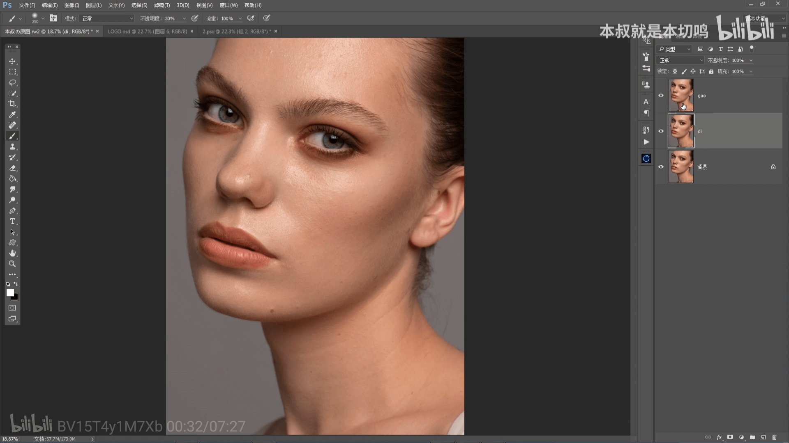
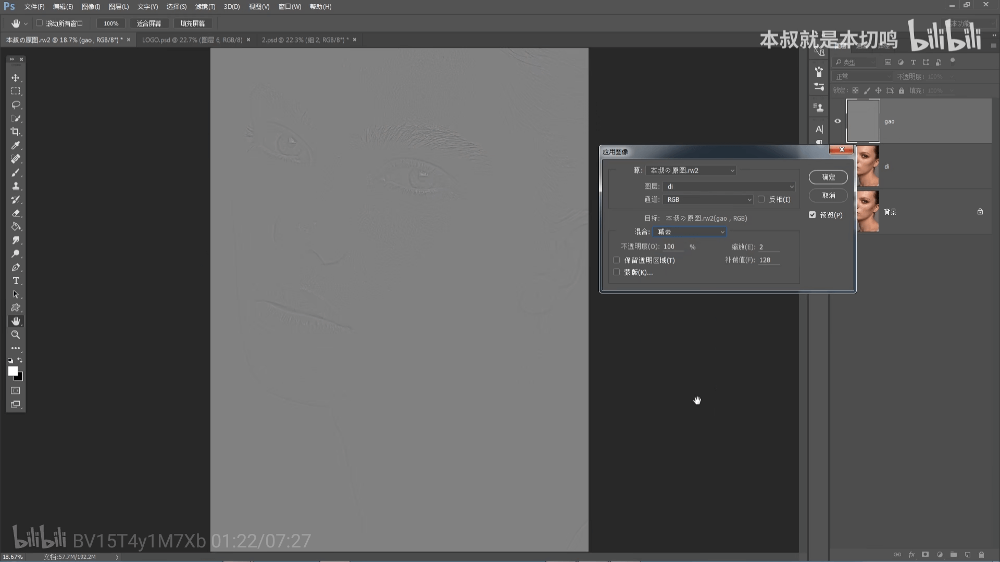
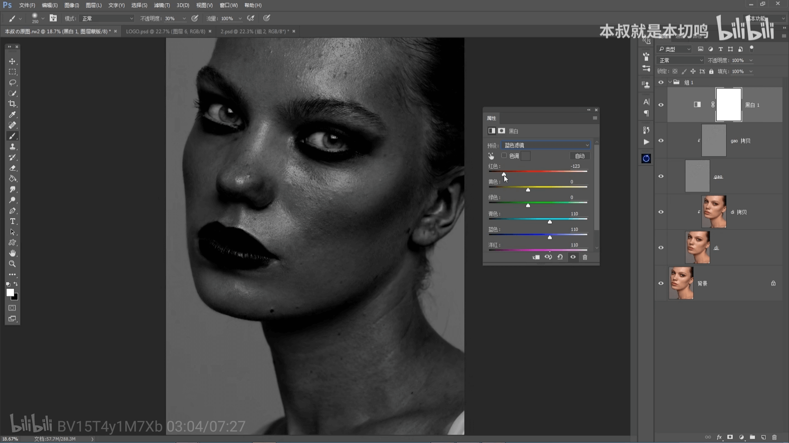

# 高低频磨皮

1. ctrl + j 复制2个图层，一个叫高频层，一个叫低频层。高频层： 人物脸部的细节，毛孔和质感。低频层：明暗色块，肤色过度分布等。

   

2. 隐藏高频层，先处理低频层。点击滤镜，然后使用模糊 - 高斯模糊，选择半径，模糊到痘痘质感颗粒被模糊到为止。

3. 切换高频层，编辑 - 应用图像，应用图像面板里选择低频层，然后混合选择减去，缩放为2，补偿值为128。这时候就可以看到一些细节已经被分割出来了，然后把高频层混合模式改成线性光。

   

4. 按住shift键进行多选（对于程序员驾轻就熟了），然后 ctrl + g 就可以把图层合并成组。为了防止操作太多破坏原来的低频层和高频层，ctrl+j再复制一层，两个层**之间**点击 alt + 鼠标左键进行向下切入，高频和低频都如此操作。这个时候我们会发现皮肤非常锐，那是因为复制了高频层的线性光混合模式，所以需要把高频层拷贝的混合模式改为正常。

5. 为了操作的时候更容易观察面部明暗过度和瑕疵，需要建立黑白观察层。点击右下角（一半黑一半白的图标）建立一个黑白，然后在黑白里面有一个预设，我们改为自带的蓝色滤镜。更改他的红色值越往左，瑕疵越明显。

   

6. 接下来回到低频层拷贝，把面部的明暗过度和不均匀色块涂抹干净，用到混色器画笔工具。画笔设置：选择清理画笔，左上角画笔设置可以选上每次描边后清理画笔，其他例如潮湿，混合，流量等都定在20%左右。涂抹的时候可以进行顺时针和逆时针的涂抹，涂抹完过度不正确的区域。我们可以暂时关闭黑白层查看效果，切换显示低频层拷贝查看前后对比

7. 直接在低频层拷贝后方建立蒙版（图层面板下方方块里面有个圆的就是蒙版创建），切换到正常画笔，使用黑色前景色（20%透明度左右），把消耗太多的区域修复回来。

8. 接下来回到高频层拷贝，修复瑕疵，使用图章工具（说白了就是吸取其他地方来替换瑕疵部分，使用污点修复工具也是一样的，记住污点修复尺寸要调小）。要求较高的话可以一个痘一个痘的修复，要求低点的话，图章工具放大然后透明度调低（30%）去大面积覆盖。

9. 如果还想更进一步，ctrl + alt + shift + e 盖印图层，然后在这个图层上使用我们的磨皮插件，之后再降低这个盖印图层的透明度（4-50%）

10. 也还可以继续盖印，使用camera raw调色。

