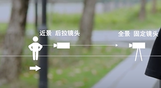
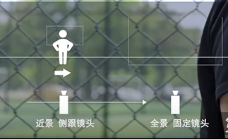
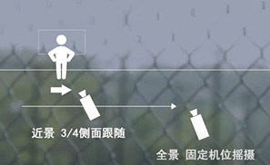
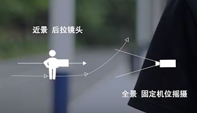
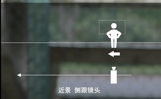

1. 后拉镜头 + 固定镜头：人物朝镜头走来，镜头后来，然后同一轴线上切一个全景镜头，人物在中央。

   

2. 侧面跟拍 + 侧面固定镜头：侧面跟拍然后切换固定全景

   

3.  3/4侧面跟拍 + 固定摇镜头：人物与镜头同时移动，然后切换全景镜头，人物继续移动，镜头跟摇。

   

4. 后拉镜头 + 固定摇镜头：后拉镜头拍摄一个改变方向的人的时候，第二个固定镜头可以通过跟摇人物走出画面。拍摄改变方向的人物动态。

   

5. 侧面跟拍 + 背面镜头：第一个镜头侧面跟拍，结尾时候留下一半空旷画面，下一个固定镜头只拍摄人物离开镜头向画面中间跑去。

   

6. 全景跟拍 + 固定镜头：第一个镜头全景跟拍向前走，在切换到反拍的近景固定镜头。人物反方向进入然后停下。

