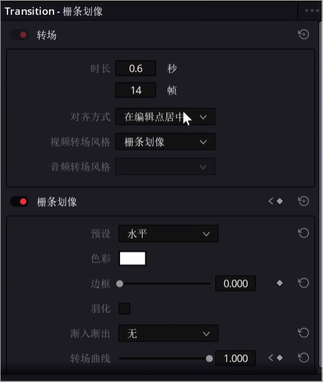
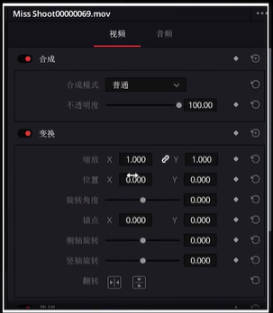
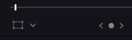
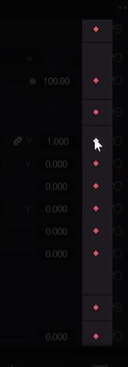
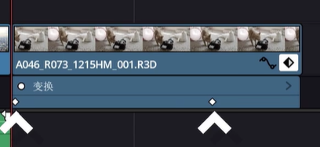
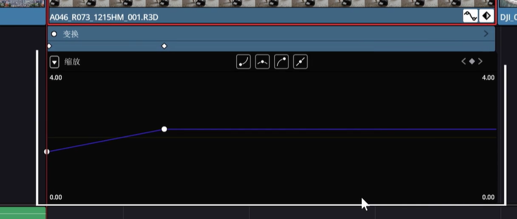
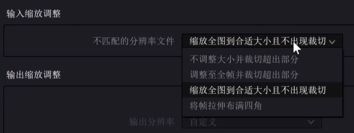
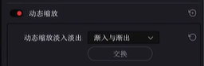
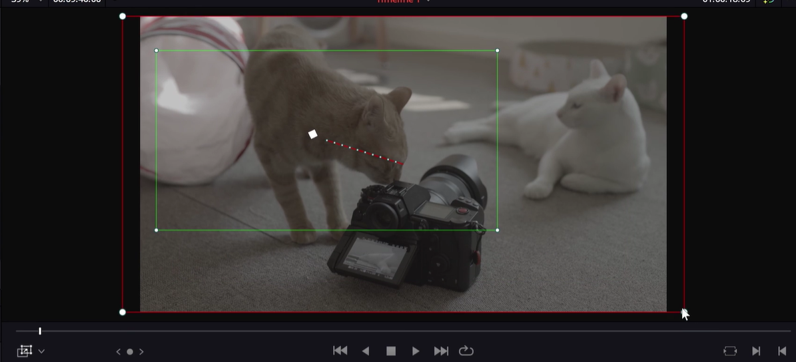

# 添加效果与关键帧

剪辑面板添加效果：点击特效库，选择对应的效果拖到对应的片段上即可。转场也是同一个面板，需要你拖到两个片段之间（划像），可以拖动缩放转场改变效果的时间。

点击转场本身即可看到控制界面。

点击片段可以控制片段：

拖动输入都可以更改变换数值，按住alt键再拖动数值变化会变慢。

使用预览监视器左下角按钮可以手动拖拽来实现变换。旁边的向下箭头点击可以切换裁切面板（也可以直接在监视器右侧面板直接操作裁切）

## 关键帧

表面这段时间内数值要从多少变化到多少。

点击每个数值后面菱形标志就可以设置关键帧。拖动播放头然后修改数值后点击菱形就可以添加关键帧。

点击片段上面的菱形标志，即可查看打下的关键帧：

上面白色的菱形就是我们打的关键帧了，可以根据情况拖动关键帧改变动画的速度和时长。

#### 线性和非线性移动

视频并不总是线性的移动，这个时候我们菱形旁边的曲线按钮就派上用场了，点击这个按钮，我们就可以进行曲线控制。

可以使用上方三个曲线图标进行变化，也可以手动拖动曲线上面的拉杆进行变化。

可以看到曲线左上角有个下拉按钮，里面可以选择曲线编辑器显示多少参数，我们可以选择我们需要显示的参数在曲线上显示。

#### 批处理

我们不可能总是一个个去处理这些关键帧效果，这时候就需要我们进行批处理。

只需要选中当前片段，ctrl + c 就能复制当前片段，然后选中想要复制的片段（按住左键可以选中多个片段），右键粘贴属性（alt + v），会出现一个面板，在里面我们可以选择复制过去什么属性。

##### 素材缩放批处理

如果导入的素材长宽比不一致，这样黑边会不停的动，一个个调整又是大工程。

顶部工具栏，点击文件 - 项目设置：

点击调整到全帧，所有素材都会自动缩放和裁切。

##### 动态缩放

经常会有用一张图做成视频的情况，但是打关键帧特别傻，因为一般这种视频都是一张图在做缩放。达芬奇有个很方便的功能就是动态缩放，在检查器激活以后，画面就会自动打好关键帧进行缩放。当然我们也可以在下拉菜单选择变速效果。

如果想调整缩放位置和大小，我们可以回到监视器左下角的动态缩放：

然后我们就可以通过调整两个框来调整缩放的位置和大小了。

### 插件推荐

1. 红巨星宇宙（redgiant universe）：一年1400，比较贵，有许多的特效。
2. filmConvert：调色插件，大量的预设，进行胶片模拟。

