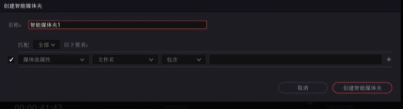
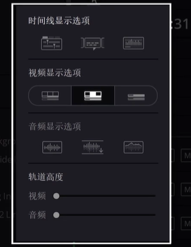
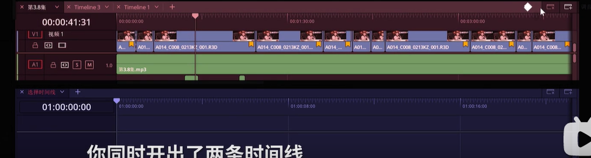
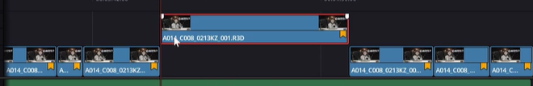
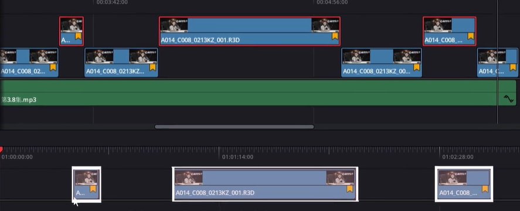

自媒体视频分为 a-roll 和 b-roll，a-roll 就是你主要内容部分，b-roll 就是帮助你理解核心内容而加上去的画面。

### 如何快速挑选 a-roll 和 b-roll？

这就需要达芬奇的智能媒体夹功能，点击智能媒体夹面板，右键创建智能媒体夹：

他就是一个自定义高级搜索，可以在项目里筛选出同一天，同一个场景的素材。

我们在筛选素材的时候可以在媒体池右侧下拉栏里选择需要的媒体信息，填写我们的媒体信息。然后我们在创建智能媒体夹的时候，选择筛选条件，达芬奇会自动给我们挑选出符合描述的文件。

### 旗标

如果是vlog这样的小工程，没必要细致的描述，这个时候我们更适合使用旗标功能。右键素材直接就可以打上不同颜色的旗标来进行区分，智能媒体夹里也可以进行旗标的筛选，只需要记住旗标颜色代表的素材类型。

## 双时间线

如果我们在一条时间线上进行删改，后期很难找回。这个时候就需要用到双时间线功能了。

在这里可以选择横向堆叠时间线快速切换，然后点击时间线添加按钮，可以开启两条时间线.

两条时间线的作用：剪辑Aroll和Broll时在时间线剪辑.找到有价值的内容后.往上拉一条轨道【英文名叫Pull Up】.优点是快速区分出有价值内容.和目前还没有用过的内容.

假如说，你现在开始剪辑还是有素材被删掉了.把上面的轨道素材或者第二条轨道素材全部选中.拖到下面的时间线里面也是二号时间线里面.上面的时间线没有变化.下面时间线出来了刚才挑选的素材

现在无论在你在二号时间线怎么剪辑怎么删除，都可以回到一号时间线继续筛选内容。

这时候二号时间线的片段之间的空隙如何删除呢？

- 只需要点击编辑，然后选择删除空隙就可以删除所有空隙。

双时间线剪辑.对于自媒体的流程.非常的有效.就像是拿了一个筛子.每次都拿一个滤网，层层筛选出最好的内容而不是零散的点击一个片段来播呀！然后再去寻找.Aroll完成之后.在开启一条Broll时间线.这样双时间线的优点会更加明显.快速的回放Aroll内容.然后根据内容选择上面的时间线.搜寻对应的Broll拉下来.就是整个视频的粗剪