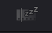
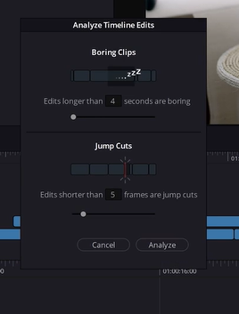

软件下方我们可以切换到快编面板。

## 1. 媒体池

快编面板的媒体池和媒体面板的差不多，我们也可以在媒体池里双击在监视器里回放素材，当我们在监视器左上角点击

我们就可以启动第三种监看模式 - 母带监看，所有素材箱里的素材都合到一起在监视器里播放：

时间线上小的白杠，帮助识别每一段素材的开头和结尾.

### 快编界面的优势

在编辑界面，我们加入一段素材，需要在媒体池选中素材，然后在素材监视器里使用按下I和O打下出入点，然后按住鼠标左键拖入时间轴。

在快编界面我们就可以在母带监看里一边播放一边按下I和O打上出入点，点击插入即可加入时间线：

**在媒体池改变他的排序方式，母带里的顺序也会更新**。媒体池下拉栏-可以根据设备的机型.时间.时长.直接更改素材的排列方式。另一种排列方式，点击列表模式，选到想要排列的参数。

达芬奇还提供了很多加快预览素材的方式，比如快速预览模式：

长素材会自动加速，短素材常速播放。

## 2. 更多的插入模式

从左到右依次是：

- 智能插入：检测播放头的位置.是靠近前面还是后面.插入的时候会看到一个小的箭头.告诉你具体插入的位置是哪里.
- 付加插入：直接把片段放到时间线的尾部.
- {覆盖 叠加插入}：就是把素材放到上面的轨道等等.
- 特写功能：选中时间线上一个素材之后，点击特写.假如画面有人.达芬奇利用它的AI引擎.自动检测画面面部.只要有人脸就会进行缩放.缩放会直接跟随你的脸.

## 3. 时间线

和剪辑面板差不多，只不过是默认锁定位置，也就是时间线自己移动（就像剪映播放预览一样）。如果想自己跑时间线的话，可以在下图位置切换。

### 无聊按钮

按一下，他就会告诉你超过多久没有 b-roll 的片段是无聊的。

然后就会帮你划分出电脑觉得无聊的部分：

## 监看器

## 自动调色

选中片段按下C键，达芬奇自动帮你做好画面的色彩较正。

## 总结

快剪面板适合做一个粗剪，可以直接点击右上角快速导出。