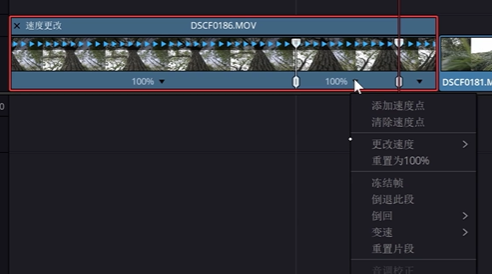

转场不止需要依靠插件的模糊和缩放，想要无缝转场还是需要我们前期运镜然后后期找寻镜头之间的联系。

## 变速方法

点击时间线上的片段，右键选择更改片段速度。

- 波纹序列：选择后，变速时后面的片段会随着你的操作前后移动。
- 倒放或者冻结帧：就是将这一帧截图然后就可以无限延长这一针。
- 音调校正：变速后声音会发生变化，可以稍微减弱变速带来的音调变化影响。
- 关键帧：选择拉伸以适配，这样的话，关键帧会自动改变适配变速。但是因为有渐入渐出，可能会产生不良影响，不推荐这么做。所以需要在变速之前，右键点击新建符合片段，把已经打好关键帧的片段封进这个复合片段，这样对于软件来说他就变成了普通的素材然后进行变速。

### 变速控制

右键素材，然后点击变速控制（或者ctrl + r），只需要移动播放头到变速位置，点击下方速度选择添加速度点：

这样就打上了一个速度的关键帧，这样你可以一个时间线上加上很多关键祯，记住需要明确了需要变速再添加。

添加了以后每个帧都有独立的速度控制，然后就可以更改速度（更改速度里的选项都是达芬奇预设的速度）。

假如预设速度没有想要的，可以直接拖动速度轴进一步的调整。

速度轴有两个拉杆，上面的沙漏图标改变的是片段的速度，下面的六边形改变的是速度影响这个片段的范围（说白了就是改变速度点的位置）。

### 缓入缓出

现在变速是线性操作，还是需要缓入缓出使得变速更加顺滑。可以右键片段打开速度曲线，只要选择渐入渐入就可以调整了。

### 解释素材

假如我们想把60帧慢放到25帧，但是无法整除，我们该如何实现帧对帧而且不会跳帧。

#### 跳帧

比如你拍摄了25帧的素材，告诉电脑50%的比例进行变速，最终结果是12.5帧。这种情况就是不能整除，就容易引发跳帧。

解释素材就是告诉电脑用每秒多少帧来播放素材。比如说60帧素材，告诉电脑是25帧进行播放，那就是2秒余10帧。相当于重新每一帧的帧率根据新的帧率进行播放。

具体操作就是：

- 在媒体池选中素材，然后右键 - 片段属性
- 然后在视频帧率里选择需要的回放帧率

### 帧采样

让变速的画面更加流畅

项目设置--主设置--帧内插--最近、帧混合、光流法

- 最近：顾名思义，面对不能整除，帧不足（比如变速后余了10帧），直接采用最近的帧进行播放。容易产生卡顿，跳帧。
- 帧混合：结合前后的帧混合出模糊的中间帧，快放的时候合适，慢放很奇怪。
- 光流算法：对比两帧的变化算出中间的帧，但是只有背景纯净比较容易算出来。

### 单个片段设定

选择片段 -- 检查器 -- 变速与缩放（运动估计-speedwarp变速）