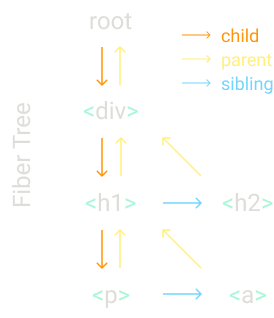

> https://pomb.us/build-your-own-react/

## JSX代码

```jsx
/**
 * const element = React.createElement(
 *  "h1",
 *  { title: "foo" },
 *  "Hello"
 * )
 * 最终返回的react元素形式是：
 * const element = {
 *  type: "h1",
 *  props: {
 *    title: "foo",
 *    children: "Hello",
 *  },
 * }
 */
const element = <h1 title="foo">Hello</h1>
const container = document.getElementById("root")
/**
 * PS: 这里的node指的是DOM
 * const node = document.createElement(element.type)
 * node["title"] = element.props.title
 * const text = document.createTextNode("")
 * text["nodeValue"] = element.props.children
 * node.appendChild(text)
 * container.appendChild(node)
 */
ReactDOM.render(element, container)
```

> 文中提到的**vanilla js**其实就是原生JS，Vanilla JS is a joke

## createElement

createElement唯一需要做的就是创建如上element一样的react元素对象

```ts
function createElement(type, props, ...children) {
  // children是rest parameter 格式，因为通常children都是一个数组。
  return {
    type,
    props: {
      ...props,
      children: children.map(child =>
        typeof child === "object"
          ? child
          : createTextElement(child)
      )
    },
  }
}

function createTextElement(text) {
  return {
    type: "TEXT_ELEMENT",
    props: {
      nodeValue: text,
      children: [],
    },
  }
}
```

children也可能是字符串或者数字类型，我们用一个特殊的节点类型包裹他们：TEXT_ELEMENT。react在没有children的情形下不是直接包裹原始值或者空数组，而是这么做是因为这么做代码更加简洁，而不是为了追求更高性能的代码。

我们自定义一个Didact代替React：

```tsx
const Didact = {
  createElement,
}

const element = Didact.createElement(
  "div",
  { id: "foo" },
  Didact.createElement("a", null, "bar"),
  Didact.createElement("b")
)


/** @jsx Didact.createElement */
const element = (
  <div id="foo">
    <a>bar</a>
    <b />
  </div>
)
// 如上给jsx添加这种注释，babel在编译JSX的时候就会使用我们的函数
```

> **@babel/plugin-transform-react-jsx**
>
> 运行时启动的时候，将会自动引入JSX编译的方法。
>
> **react-script**：会根据参数去判断执行哪种构建脚本

## render Function

```tsx
function render(element, container) {
  // TODO create dom nodes
}

const Didact = {
  createElement,
  render,
}

/** ..... */
Didact.render(element, container)

/** 首先关注添加元素，根据element.type添加元素到容器 */
function render(element, container) {
  // 注意处理文本节点
  const dom =
    element.type == "TEXT_ELEMENT"
      ? document.createTextNode("")
      : document.createElement(element.type)

  // 将element的props添加到DOM node上面去
  const isProperty = key => key !== "children"
  Object.keys(element.props)
    .filter(isProperty)
    .forEach(name => {
      dom[name] = element.props[name]
    })
  
  /** 递归调用render每一个子节点 */
  element.props.children.forEach(child =>
    render(child, dom)
  )
  
  container.appendChild(dom)
}
```

## Concurrent Mode

在上述递归回调里有一个问题：一旦我们开始渲染，我们无法中断他的渲染。假如渲染树很大的话，我们需要等待很久。对于浏览器这样优先用户输入和平滑的动画效果的情况，是很不合适的。

因此，我们将把工作分成几个小单元，完成每个小单元后，如果还有其他需要完成的事情，我们将让浏览器中断渲染。

```jsx
let nextUnitOfWork = null

function workLoop(deadline) { // deadline参数我们用它来检测还有多少时间能够执行，在浏览器重新控制之前。
  let shouldYield = false // 剩余时间是否不足
  
  // 要开始使用循环，我们需要设置第一个工作单元
  while (nextUnitOfWork && !shouldYield) {
    nextUnitOfWork = performUnitOfWork(
      nextUnitOfWork
    )
    // timeRemaining()返回一个时间DOMHighResTimeStamp, 并且是浮点类型的数值
    // 它用来表示当前闲置周期的预估剩余毫秒数
    shouldYield = deadline.timeRemaining() < 1
  }
  // 使用requestIdleCallback进行循环，会在浏览器空闲的时候执行
  // workLoop函数会接收到一个名为 IdleDeadline 的参数
  // 可以让你判断用户代理(浏览器)还剩余多少闲置时间可以用来执行耗时任务
  requestIdleCallback(workLoop)
}

// 浏览器有空闲就会检查是否有工作单元需要执行
requestIdleCallback(workLoop)

function performUnitOfWork(nextUnitOfWork) {
  // 编写一个performUnitOfWork函数，该函数不仅执行工作，还返回下一个工作单元。
}
```

react`React`不再使用`requestIdleCallback`。**现在，它使用Scheduler程序包**。

## Fibers

要组织工作单元，我们需要一个数据结构：一棵 fiber 树(`fiber tree`)。

我们将为每个元素分配一根`fiber`，并且每根`fiber`将成为一个工作单元。（fiber英文是纤维的意思）

```tsx
Didact.render(
  <div>
    <h1>
      <p />
      <a />
    </h1>
    <h2 />
  </div>,
  container
);
```

在渲染中，我们将创建`root fiber`并将其设置为`nextUnitOfWork`。剩下的工作将在`performUnitOfWork`函数上进行，我们将为每根`fiber`做三件事：

1. 将元素`element`添加到`DOM`
2. 为元素`element`的子代`children`创建`fiber`
3. 选择下一个工作单元(the next unit of work)



该数据结构的目标之一是使查找下一个工作单元变得容易。这就是为什么每个`fiber`都链接到其第一个子节点，下一个兄弟姐妹和父节点。当我们在一个`fiber`上完成了工作，如果这个`fiber`有一个`child`，那么这个`fiber`将会是下一个工作单元（the next unit of work）。如果这个`fiber`没有`child`， 用 `sibling`(兄弟) 作为下一个工作单元。

如果`fiber`既没有孩子`child`也没有兄弟姐妹`sibling`，那么我们去“叔叔”：父母的兄弟姐妹。如果父母没有兄弟姐妹，我们会不断检查父母，直到找到有兄弟姐妹的父母，或者直到找到根。如果到达根目录，则意味着我们已经完成了此渲染的所有工作。

### 修改代码

```ts
// 将render函数内创建DOM节点部分提取到这个函数里
function createDom(fiber) {
  const dom =
    fiber.type == "TEXT_ELEMENT"
      ? document.createTextNode("")
      : document.createElement(fiber.type)

  const isProperty = key => key !== "children"
  Object.keys(fiber.props)
    .filter(isProperty)
    .forEach(name => {
      dom[name] = fiber.props[name]
    })

  return dom
}

function render(element, container) {
  // TODO set next unit of work
  // 在 render 函数中，我们将nextUnitOfWork设置为 fiber tree 的根。
  nextUnitOfWork = {
    dom: container,
    props: {
      children: [element],
    },
  }
}

let nextUnitOfWork = null
```

然后，当浏览器准备就绪时，它将调用我们的`workLoop`，我们将开始在root上工作。

```ts
function workLoop(deadline) {
  let shouldYield = false
  while (nextUnitOfWork && !shouldYield) {
    nextUnitOfWork = performUnitOfWork(
      nextUnitOfWork
    )
    shouldYield = deadline.timeRemaining() < 1
  }
  requestIdleCallback(workLoop)
}

requestIdleCallback(workLoop)

function performUnitOfWork(fiber) {
  // TODO add dom node
  // TODO create new fibers
  // TODO return next unit of work
}
```

### performUnitOfWork

首先，我们创建一个新节点 `node` 并将其添加到 `DOM`。

我们在 `fibre.dom` 属性中跟踪 `DOM` 节点。然后，为每个孩子 `child` 创建一个新的 `fiber` 。

```ts
function performUnitOfWork(fiber) {
  if (!fiber.dom) {
    // 根据fiber
    fiber.dom = createDom(fiber)
  }

  if (fiber.parent) {
    fiber.parent.dom.appendChild(fiber.dom)
  }

  // TODO create new fibers
  // 然后，为每个孩子 child 创建一个新的 fiber 。
  const elements = fiber.props.children
  let index = 0
  let prevSibling = null
  while (index < elements.length) {
    const element = elements[index]
    const newFiber = {
      type: element.type,
      props: element.props,
      parent: fiber,
      dom: null,
    }
    
    // 然后将其添加到 fiber tree 中，将其设置为子代 child 或者兄弟 sibling 
    // 具体取决于它是否是第一个子代 child 。
    if (index === 0) {
      fiber.child = newFiber
    } else {
      prevSibling.sibling = newFiber
    }

    prevSibling = newFiber
    index++
  }
  // TODO return next unit of work
  if (fiber.child) {
    // requestIdleCallback会继续执行workloop，下一个目标就是fiber.child
    return fiber.child
  }
  let nextFiber = fiber
  while (nextFiber) {
    // 遍历返回兄弟节点，直到没有兄弟节点
    if (nextFiber.sibling) {
      return nextFiber.sibling
    }
    nextFiber = nextFiber.parent
  }
}
```

## Render and Commit Phase 渲染和提交阶段

还有另一个问题。

每次处理元素时，我们都会向 `DOM` 添加一个新节点。 而且，请记住，在完成渲染整个树之前，浏览器可能会中断我们的工作。 在这种情况下，用户将看到不完整的 `UI` 。 这不是我们想要的。

因此我们需要删除此处更改 DOM 的部分（此处之前是有父节点就立刻添加到父节点dom里）：

```diff
function performUnitOfWork(fiber) {

--  if (fiber.parent) {
--    fiber.parent.dom.appendChild(fiber.dom)
--  }

}
```

相反，我们将跟踪 `fiber tree` 的根 `root` 。我们称其为进行中的根或 `wipRoot` 。

```ts
function render(element, container) {
  wipRoot = {
    dom: container,
    props: {
      children: [element],
    },
  }
  // 初始化第一个工作单元
  nextUnitOfWork = wipRoot
}

// 记录下一个工作单元
let nextUnitOfWork = null
// 记录fiber root
let wipRoot = null
```

一旦完成所有工作（因为没有下一个工作单元），我们便将整个 `fiber tree` 提交给 `DOM` 。

```diff
++ function commitRoot() {
++   // TODO add nodes to dom
++ }

function workLoop(deadline) {

++ if (!nextUnitOfWork && wipRoot) {
++   commitRoot()
++ }
	
}
```

我们在 `commitRoot` 函数中这么做。在这里，我们将所有节点递归附加到 `Dom` 。

```ts
function commitRoot() {
  commitWork(wipRoot.child)
  wipRoot = null
}

function commitWork(fiber) {
  if (!fiber) {
    return
  }
  const domParent = fiber.parent.dom
  domParent.appendChild(fiber.dom)
  commitWork(fiber.child)
  commitWork(fiber.sibling)
}
```

## Reconciliation

上述我们完成了新增节点，那么更新或删除节点又如何呢？

现在要做的是将在 `render` 函数上得到的元素与我们提交给 `DOM` 的最后一棵 `fiber tree` 进行比较。

因此，在完成提交之后，我们需要保存对“我们提交给 `DOM` 的**最后一棵** `fiber tree` ”的引用。 我们称它为 `currentRoot` 。

我们还将 `alternate` 属性添加到每根 `fiber` 。 此属性是到旧 `fiber` 的链接，旧 `fiber` 是我们在上一个提交阶段向 `DOM` 提交的 `fiber` 

如下，我们在每次执行 commitRoot 的时候记录 `currentRoot` :

```diff
function commitRoot() {
   commitWork(wipRoot.child)
++ currentRoot = wipRoot
   wipRoot = null
}


function render(element, container) {
  wipRoot = {
    dom: container,
    props: {
      children: [element],
    },
++  alternate: currentRoot,
  }
  nextUnitOfWork = wipRoot
}

let nextUnitOfWork = null
++ let currentRoot = null
let wipRoot = null
```

现在，让我们从 `performUnitOfWork` 中提取创建新的 `fibers`的代码到一个新的 reconcileChildren 函数。

```diff
function performUnitOfWork(fiber) {
  if (!fiber.dom) {
    fiber.dom = createDom(fiber)
  }

++  const elements = fiber.props.children
++  reconcileChildren(fiber, elements)

  if (fiber.child) {
    return fiber.child
  }
  let nextFiber = fiber
  while (nextFiber) {
    if (nextFiber.sibling) {
      return nextFiber.sibling
    }
    nextFiber = nextFiber.parent
  }
}

++ function reconcileChildren(wipFiber, elements) {
  let index = 0
  let prevSibling = null

  while (index < elements.length) {
    const element = elements[index]

    const newFiber = {
      type: element.type,
      props: element.props,
      parent: wipFiber,
      dom: null,
    }

    if (index === 0) {
      wipFiber.child = newFiber
    } else {
      prevSibling.sibling = newFiber
    }

    prevSibling = newFiber
    index++
  }
++ }
```

我们将新的 element 数组和 old fiber 进行协调。

如下所示，我们同时遍历 old fiber 的 children （`wipRoot.alternate`）和我们需要去协调的 element 数组。

如果我们忽略了同时迭代数组和链接列表所需的所有模板。那么在此期间，我们剩下的最重要的是： `oldFiber` 和 `element` 。 `element` 是我们要渲染到 `DOM` 的东西，而 `oldFiber` 是我们上次渲染的东西。

我们需要对它们进行比较，以了解那些部分需要 `DOM` 进行更改。`React` 也使用keys，这样可以实现更好的协调。例如，它检测子元素何时更改元素数组中的位置。

```ts
function reconcileChildren(wipFiber, elements) {
  let index = 0
  let oldFiber =
    wipFiber.alternate && wipFiber.alternate.child // fiber的child是一个单链表
  let prevSibling = null

  // 这里的diff是新element数组和旧fiber一一对应进行比较
  while (
    index < elements.length ||
    oldFiber != null
  ) {
    const element = elements[index]
    let newFiber = null

    // TODO compare oldFiber to element
    const sameType =
      oldFiber &&
      element &&
      element.type == oldFiber.type

    if (sameType) {
      // TODO update the node
      // 老fiber和新element具有相同type，不修改DOM只更新props
      // 当 old fiber 和 new element 具有相同的类型 type时
      // 我们使用老fiber的type和element的props创建新的 
      // 还向 fiber 添加了一个新属性：effectTag。 稍后我们将在提交阶段使用此属性。
      newFiber = {
        type: oldFiber.type,
        props: element.props,
        dom: oldFiber.dom,
        parent: wipFiber,
        alternate: oldFiber,
        effectTag: "UPDATE",
      }
    }
    if (element && !sameType) {
      // TODO add this node
      // 不同的type并且存在新的element，直接创建新的DOM节点
      newFiber = {
        type: element.type,
        props: element.props,
        dom: null,
        parent: wipFiber,
        alternate: null,
        effectTag: "PLACEMENT",
      }
    }
    if (oldFiber && !sameType) {
      // TODO delete the oldFiber's node
      // 不同的type并且存在老fiber，需要删除DOM节点
      oldFiber.effectTag = "DELETION"
      deletions.push(oldFiber)
    }

    if (oldFiber) {
      oldFiber = oldFiber.sibling; // 遍历下一个fiber
    }

    // 给wipFiber的child添加节点
    if (index === 0) {
      wipFiber.child = newFiber;
    } else if (element) {
      prevSibling.sibling = newFiber;
    }

    prevSibling = newFiber;
    index++;
  }
}
```

上述对于需要删除节点的情况，我们没有新的 fiber ，因此我们将效果标签 effectTag 添加到oldFiber。但是，当我们将 fiber tree 提交给 DOM 时，我们是从正在进行的根 root 开始的，它没有 oldFiber，需要一个数组来跟踪要删除的节点。然后，当我们将更改提交到 `DOM` 时，我们也使用该数组中的 `fiber`：

```diff
function render(element, container) {
  wipRoot = {
    dom: container,
    props: {
      children: [element],
    },
    alternate: currentRoot,
  }
++  deletions = []
  nextUnitOfWork = wipRoot
}

let nextUnitOfWork = null
let currentRoot = null
let wipRoot = null
++  let deletions = null

function commitRoot() {
++  deletions.forEach(commitWork)
  commitWork(wipRoot.child)
  currentRoot = wipRoot
  wipRoot = null
}
```

更改 `commitWork` 函数以处理新的 `effectTags` 。如果 `fiber` 具有 `PLACEMENT` 效果标签，则与之前相同，将 `DOM` 节点附加到父 `fiber` 的节点上。如果是 `DELETION` ，则执行相反的操作，删除该子项。如果是 `UPDATE` ，我们需要使用更改的 `props` 来更新现有的 `DOM` 节点。

```ts
function commitWork(fiber) {
  if (!fiber) {
    return
  }
  const domParent = fiber.parent.dom
  domParent.appendChild(fiber.dom)
  
  /** ++++++ */
  if (
    fiber.effectTag === "PLACEMENT" &&
    fiber.dom != null
  ) {
    domParent.appendChild(fiber.dom)
  } else if (
    fiber.effectTag === "UPDATE" &&
    fiber.dom != null
  ) {
    updateDom(
      fiber.dom,
      fiber.alternate.props,
      fiber.props
    )
  } else if (fiber.effectTag === "DELETION") {
    domParent.removeChild(fiber.dom)
  }
  /** ++++++ */
  
  commitWork(fiber.child)
  commitWork(fiber.sibling)
}

/** 新增updateDom函数 */
/**
* 将 oldFiber 中的 props 与 newFiber 中的 props 进行比较，删除不再使用的 props
* 并设置新的或更改的 props 。
*/
/**
* 有种特殊情况是需要更新的是事件监听器，假设key有“on”前缀我们需要单独处理
*/
const isEvent = key => key.startsWith("on")
const isProperty = key =>
  key !== "children" && !isEvent(key)
const isNew = (prev, next) => key =>
  prev[key] !== next[key]
const isGone = (prev, next) => key => !(key in next)
function updateDom(dom, prevProps, nextProps) {
  // TODO
  // Remove old or changed event listeners
  Object.keys(prevProps)
    .filter(isEvent)
    .filter(
      key =>
        !(key in nextProps) ||
        isNew(prevProps, nextProps)(key)
    )
    .forEach(name => {
      const eventType = name
        .toLowerCase()
        .substring(2)
      dom.removeEventListener(
        eventType,
        prevProps[name]
      )
    })

  // Remove old properties
  Object.keys(prevProps)
    .filter(isProperty)
    .filter(isGone(prevProps, nextProps))
    .forEach(name => {
      dom[name] = ""
    })

  // Set new or changed properties
  Object.keys(nextProps)
    .filter(isProperty)
    .filter(isNew(prevProps, nextProps))
    .forEach(name => {
      dom[name] = nextProps[name]
    })
  
  // Add event listeners
  Object.keys(nextProps)
    .filter(isEvent)
    .filter(isNew(prevProps, nextProps))
    .forEach(name => {
      const eventType = name
        .toLowerCase()
        .substring(2)
      dom.addEventListener(
        eventType,
        nextProps[name]
      )
    })
}
```

## Function Components 函数组件

添加对函数组件的支持

```tsx
/** @jsx Didact.createElement */
function App(props) {
  return <h1>Hi {props.name}</h1>
}
const element = <App name="foo" />
const container = document.getElementById("root")
Didact.render(element, container)

/** jsx转换后 */
function App(props) {
  return Didact.createElement(
    "h1",
    null,
    "Hi ",
    props.name
  )
}
const element = Didact.createElement(App, {
  name: "foo",
})
```

函数组件有两个不同：

- 函数组件的 fiber 没有 DOM 节点（这里fiber应该说的是组件的root fiber）。
- `children` 来自于函数的调用返回，而不是直接来自于 `props`

我们检查 `fiber` 类型是否为函数，并根据结果使用其他更新函数。

在 `updateHostComponent` 中，我们执行与以前相同的操作。

```ts
function performUnitOfWork(fiber) {
  /** ++++++++++++ */
  const isFunctionComponent =
    fiber.type instanceof Function
  if (isFunctionComponent) {
    updateFunctionComponent(fiber)
  } else {
    updateHostComponent(fiber)
  }
  /** ++++++++++++ */
  if (fiber.child) {
    return fiber.child
  }
  let nextFiber = fiber
  while (nextFiber) {
    if (nextFiber.sibling) {
      return nextFiber.sibling
    }
    nextFiber = nextFiber.parent
  }
}

// 函数组件更新
function updateFunctionComponent(fiber) {
  // TODO
  const children = [fiber.type(fiber.props)]
  reconcileChildren(fiber, children)
}

// 类组件更新
function updateHostComponent(fiber) {
  if (!fiber.dom) {
    fiber.dom = createDom(fiber)
  }
  reconcileChildren(fiber, fiber.props.children)
}
```

需要更改的是 `commitWork` 函数，现在我们有了没有 `DOM` 节点的 `fiber` ，我们需要更改两件事：

1. 首先，要找到带有 `DOM` 节点的父节点，我们需要沿着 `fiber tree` 向上移动，直到找到带有 `DOM` 节点的 `fiber` 。（因为外层或者内层可能还有函数组件包裹）
2. 在删除节点时，我们还需要继续操作，直到找到具有 `DOM` 节点的子节点为止。

```diff
function commitWork(fiber) {
  if (!fiber) {
    return
  }

++	let domParentFiber = fiber.parent
++  while (!domParentFiber.dom) {
++    domParentFiber = domParentFiber.parent
++  }

  const domParent = fiber.parent.dom
  if (
    fiber.effectTag === "PLACEMENT" &&
    fiber.dom != null
  ) {
    domParent.appendChild(fiber.dom)
  } else if (
    fiber.effectTag === "UPDATE" &&
    fiber.dom != null
  ) {
    updateDom(
      fiber.dom,
      fiber.alternate.props,
      fiber.props
    )
  } else if (fiber.effectTag === "DELETION") {
--  domParent.removeChild(fiber.dom)
++  commitDeletion(fiber, domParent)
  }

  commitWork(fiber.child)
  commitWork(fiber.sibling)
}
```

```ts
function commitDeletion(fiber, domParent) {
  if (fiber.dom) {
    domParent.removeChild(fiber.dom)
  } else {
    commitDeletion(fiber.child, domParent)
  }
}
```

## Hooks

最后一步，现在我们有了函数组件，我们还要添加状态 `state` 。

```tsx
/** @jsx Didact.createElement */
function Counter() {
  const [state, setState] = Didact.useState(1)
  return (
    <h1 onClick={() => setState(c => c + 1)}>
      Count: {state}
    </h1>
  )
}
const element = <Counter />


function useState(initial) {
  // TODO
}
```

请注意，我们正在使用 `Didact.useState` 获取和更新计数器值。

在调用函数组件之前，我们需要初始化一些全局变量，为了能在 useState 函数里使用他们。

首先，我们将 `work` 设置在进行中的 `fiber` 。

我们还向 `fiber` 添加了一个 `hooks` 数组，以支持在同一组件中多次调用 `useState` 。并且我们跟踪当前的钩子索引。

```ts
let wipFiber = null
let hookIndex = null

function updateFunctionComponent(fiber) {
  wipFiber = fiber
  hookIndex = 0
  wipFiber.hooks = []
  const children = [fiber.type(fiber.props)]
  reconcileChildren(fiber, children)
}

function useState(initial) {
  const oldHook =
    wipFiber.alternate &&
    wipFiber.alternate.hooks &&
    wipFiber.alternate.hooks[hookIndex]
  const hook = {
    state: oldHook ? oldHook.state : initial,
    queue: [],
  }

  const actions = oldHook ? oldHook.queue : []
  actions.forEach(action => {
    hook.state = action(hook.state)
  })
  
  const setState = action => {
    hook.queue.push(action)
    wipRoot = {
      dom: currentRoot.dom,
      props: currentRoot.props,
      alternate: currentRoot,
    }
    nextUnitOfWork = wipRoot
    deletions = []
  }
  
  wipFiber.hooks.push(hook)
  hookIndex++
  return [hook.state, setState]
}
```

当函数组件调用 useState 的时候，我们检查是否有老的hook。我们使用hook 索引在fiber的 alternate 上检查。

如果我们有旧的 `hook` ，则将状态从旧的 `hook` 复制到新的 `hook` ，否则，我们将初始化状态。然后，将新的 `hook` 添加到 `fiber` ，将 `hook` 索引加1，然后返回状态。

`useState` 还应该返回一个更新状态的函数，因此我们定义了一个 `setState` 函数，该函数接收一个action。我们将该 action 推送到添加到hook中的队列中。

然后和我们在render函数里做的一样，在当前root上设置一个新的work，以当前root作为下一个工作单元，以便工作循环可以开始新的渲染阶段。

但是我们不会立刻执行这些action。下次渲染组件时，我们会从旧的hook队列中获取所有action，然后将它们逐一应用于新的hook state。当我们返回这个state后，state已经被更新了。

