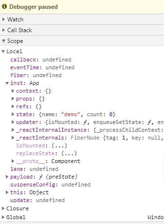
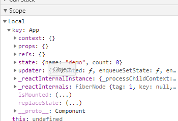
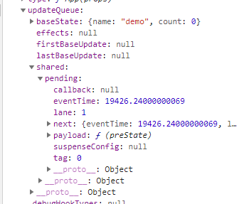

## setState的流程

使用`prototype.setState`进行搜索，首先找到`packages\react\src\ReactBaseClasses.js`里的setState：

```ts
Component.prototype.setState = function(partialState, callback) {
  // 校验partialState是否是正确的类型，打印报错。
  debugger; // 添加断点
  this.updater.enqueueSetState(this, partialState, callback, 'setState');
};
```

在Chrome里面打开demo页面（使用script编写简单的渲染，如果想测试函数组件这里换成函数组件即可）。

```html
<script type="text/babel">
      class App extends React.Component {
        constructor (props) {
          super(props);
          this.state = {
            name: 'demo',
            count: 0
          }
        }
        render () {
          const { name, count } = this.state
          return (
            <div>
              <h3>{name}.{count}</h3>
              <button onClick={() => this.setState(preState => ({
                count: preState.count + 1
              }))}>+1</button>
            </div>
          )
        }
      }
      ReactDOM.render(
        <div>
          <App/>
        </div>,
        document.getElementById('container')
      );
</script>
```

如上代码我们编写了一个简单的demo，当我们点击+1按钮的时候会触发setState然后执行到断点。

从debuger开始 step into 执行`this.updater.enqueueSetState`，进入`src/ReactFiberClassComponent.new.js`

在`src/ReactFiberClassComponent.new.js`里定义了一个名为`classComponentUpdater`的对象，上面的enqueueSetState就是在这里做了具体的实现。

```ts
const classComponentUpdater = {
  isMounted, // ./ReactFiberTreeReflection
  enqueueSetState(inst, payload, callback) {
    const fiber = getInstance(inst);
    const eventTime = requestEventTime();
    const suspenseConfig = requestCurrentSuspenseConfig();
    const lane = requestUpdateLane(fiber, suspenseConfig);

    const update = createUpdate(eventTime, lane, suspenseConfig);
    update.payload = payload;
    if (callback !== undefined && callback !== null) {
      if (__DEV__) {
        warnOnInvalidCallback(callback, 'setState');
      }
      update.callback = callback;
    }

    enqueueUpdate(fiber, update);
    scheduleUpdateOnFiber(fiber, lane, eventTime);
  },
  // ......
 }
```

第一步就是`const fiber = getInstance(inst);`(在浏览器里显示的是`const fiber = get(inst);`，这是因为这个方法是`import {get as getInstance, set as setInstance} from 'shared/ReactInstanceMap';`这样引入的)，我们可以在右侧看到call stack（函数调用栈）和scope（当前作用域里的变量）

我们可以看到 inst 也就是类组件的实例是如下的结构：



然后我们进入到get，get的具体定义在`shared/ReactInstanceMap.js`中：

```ts
function get(key) {
    return key._reactInternals;
}
```

这里的key就是inst也就是类组件实例了：



可以看到返回的是fiberNode的对象。从此我们知道组件对应的 fiberNode 存在于组件实例的`_reactInternals`上。

**继续执行**，我们看到定义了一个eventTime，我们使用ctrl + 左键`requestEventTime();`进入到`packages\react-reconciler\src\ReactFiberWorkLoop.new.js`中。

```ts
export function requestEventTime() {
  if ((executionContext & (RenderContext | CommitContext)) !== NoContext) {
    // 这里NoContext也是一个常量，这里利用二进制常量进行计算，我们可以得知当前调用栈是什么状态
    // 在react中执行，我们能很好的获取到实际时间
    return now();
  }
  // 不在react中，我们可能在浏览器事件执行中
  if (currentEventTime !== NoTimestamp) { // NoTimestamp from './ReactFiberLane'，是常量-1。
    // 直到我们再次进入react，我们给全部的更新使用同一个时间
    return currentEventTime;
  }
  // 第一次更新，计算出开始时间
  currentEventTime = now();
  return currentEventTime;
}
```

暂且知道他是和事件执行时间有关的字段，先不深入，继续往下。

**继续执行**，执行`requestCurrentSuspenseConfig`方法。这个方法在`src/ReactFiberSuspenseConfig.js`中：

```ts
import ReactSharedInternals from 'shared/ReactSharedInternals';

const { ReactCurrentBatchConfig } = ReactSharedInternals;

// ......

export function requestCurrentSuspenseConfig(): null | SuspenseConfig {
  return ReactCurrentBatchConfig.suspense;
}
```

**继续执行**：

```tsx
const lane = requestUpdateLane(fiber, suspenseConfig);
```

`requestUpdateLane`定义于`src\ReactFiberWorkLoop.new.js`，里面主要是通过判断`fiber.mode`返回不同的lane（通过里面的代码我们可以知道，和lane有关的代码都和优先级有关），这里是根据fiber和suspenseConfig最终获得一个优先级相关的lane。

**继续执行**：

```ts
var update = createUpdate(eventTime, lane, suspenseConfig);
update.payload = payload; // payload就是我们setState({ [key]: value })里面的{ [key]: value }

// packages\react-reconciler\src\ReactUpdateQueue.new.js
 function createUpdate(eventTime, lane, suspenseConfig) {
    var update = {
      eventTime: eventTime,
      lane: lane,
      suspenseConfig: suspenseConfig,
      tag: UpdateState,
      payload: null,
      callback: null,
      next: null
    };
    return update;
  }
```

从这段代码我们可以简单的知道，这里是根据开始时间（eventTime），lane（优先级），还有 suspenseConfig 创建一个更新。

继续执行下去：

```ts
if (callback !== undefined && callback !== null) {
   {
     warnOnInvalidCallback(callback, 'setState');
   }

   update.callback = callback; // 这里callback 就是 setState的第二个参数
}
```

由此我们可以知道，上述代码创建了一个update对象。

```ts
enqueueUpdate(fiber, update);

// packages\react-reconciler\src\ReactUpdateQueue.new.js
export function enqueueUpdate<State>(fiber: Fiber, update: Update<State>) {
  const updateQueue = fiber.updateQueue;
  if (updateQueue === null) {
    // 只有这个fiber未被挂载的时候才会发生这种情况
    return;
  }

  const sharedQueue: SharedQueue<State> = (updateQueue: any).shared;
  const pending = sharedQueue.pending;
  // 这是一个链表，讲新的更新插入链表头部。
  if (pending === null) {
    // 之前没有更新过
    update.next = update;
  } else {
    // 将这个update插入队列
    update.next = pending.next;
    pending.next = update;
  }
  sharedQueue.pending = update;

  if (__DEV__) {
    if (
      currentlyProcessingQueue === sharedQueue &&
      !didWarnUpdateInsideUpdate
    ) {
      console.error(
        'An update (setState, replaceState, or forceUpdate) was scheduled ' +
          'from inside an update function. Update functions should be pure, ' +
          'with zero side-effects. Consider using componentDidUpdate or a ' +
          'callback.',
      );
      didWarnUpdateInsideUpdate = true;
    }
  }
}
```

进入这个函数之前的updateQueue：



**enqueueSetState函数的最后**：

```ts
scheduleUpdateOnFiber(fiber, lane, eventTime);  // 顾名思义是调度更新相关

// packages\react-reconciler\src\ReactFiberWorkLoop.new.js
export function scheduleUpdateOnFiber(
  fiber: Fiber,
  lane: Lane,
  eventTime: number,
) {
  // 这个函数检查 nestedUpdateCount > NESTED_UPDATE_LIMIT，也就是最大更新数不能是50
  // nestedUpdateCount = 0;
  // rootWithNestedUpdates = null; // FiberRoot | null
  // 以上的变量是用来保证更新不是无限循环的
  checkForNestedUpdates();
  warnAboutRenderPhaseUpdatesInDEV(fiber); // 从名字就可以知道是发出一个在渲染期间更新的警告

  const root = markUpdateLaneFromFiberToRoot(fiber, lane);
  if (root === null) {
    warnAboutUpdateOnUnmountedFiberInDEV(fiber); // 发出一个警报
    return null;
  }

  // TODO: requestUpdateLanePriority 也可以读取 priority.
  // 传递一个 priority 作为参数传给这两个函数。
  const priorityLevel = getCurrentPriorityLevel();

  if (lane === SyncLane) {
    if (
      // Check if we're inside unbatchedUpdates
      (executionContext & LegacyUnbatchedContext) !== NoContext &&
      // 检查我们是否还没有渲染
      (executionContext & (RenderContext | CommitContext)) === NoContext
    ) {
      // 在根上注册挂起的交互，以避免丢失跟踪的交互数据.
      schedulePendingInteractions(root, lane);

      // 这是一个遗留case
      // 初始挂载ReactDOM.render-batchedUpdates中的根目录应该是同步的，但是布局更新应该推迟到批处理结束。
      performSyncWorkOnRoot(root);
    } else {
      ensureRootIsScheduled(root, eventTime);
      schedulePendingInteractions(root, lane);
      if (executionContext === NoContext) {
        // 现在刷新同步工作，除非我们已经在工作或在批处理中
        // 这是有意在scheduleUpdateOnFiber内部而不是scheduleCallbackForFiber中实现的，以保留在不立即刷新回调的情况下调度回调的能力。
        // 我们只对用户启动的更新执行此操作，以保留遗留模式的历史行为。
        flushSyncCallbackQueue();
      }
    }
  } else {
    // 调度一个互不相关（离散）的更新，但仅当它不同步时.
    if (
      (executionContext & DiscreteEventContext) !== NoContext &&
      // 只有用户阻塞优先级或更高的更新才被认为是离散的，即使在离散事件中也是如此。
      (priorityLevel === UserBlockingSchedulerPriority ||
        priorityLevel === ImmediateSchedulerPriority)
    ) {
      // 这是离散事件的结果。跟踪每个根的最低优先级离散更新，以便我们可以在需要时提前刷新它们。
      if (rootsWithPendingDiscreteUpdates === null) {
        rootsWithPendingDiscreteUpdates = new Set([root]);
      } else {
        rootsWithPendingDiscreteUpdates.add(root);
      }
    }
    // 如果回调是同步的，请在之后调度其他更新。
    ensureRootIsScheduled(root, eventTime);
    schedulePendingInteractions(root, lane);
  }

  // 我们在为“requestUpdateLane”内的transition分配lane时使用此选项。
  // 我们假设它与正在更新的根目录相同，因为在单个root的应用的常见情况下，很可能是这样。
  // 如果它不是同一个根，那么这不是一个大问题，我们只是可能批量更多的东西在一起，而不是必要的
  mostRecentlyUpdatedRoot = root;
}
```

让我们仔细看看`markUpdateLaneFromFiberToRoot`这个函数里面：

````ts
// src\ReactFiberWorkLoop.new.js
function markUpdateLaneFromFiberToRoot(
  fiber: Fiber,
  lane: Lane,
): FiberRoot | null {
  // Update the source fiber's lanes
  fiber.lanes = mergeLanes(fiber.lanes, lane);
  let alternate = fiber.alternate; // 指向fiber的兄弟节点
  if (alternate !== null) {
    // 如果有兄弟节点也更新他们的lanes
    alternate.lanes = mergeLanes(alternate.lanes, lane);
  }
  
  // 省略开发环境的警告代码...
  
  // 遍历父路径到根目录并更新子项过期时间
  let node = fiber.return; // 由此可知fiber的return指向了他的父级节点
  let root = null;
  if (node === null && fiber.tag === HostRoot) {
    root = fiber.stateNode;
  } else {
    while (node !== null) { // 依次遍历父级节点，并更新他们和他们的兄弟节点以及侄子节点的lanes，直到根节点
      alternate = node.alternate;
      // 省略开发环境的警告代码...
      node.childLanes = mergeLanes(node.childLanes, lane);
      if (alternate !== null) {
        alternate.childLanes = mergeLanes(alternate.childLanes, lane);
      }
      if (node.return === null && node.tag === HostRoot) {
        root = node.stateNode;
        break;
      }
      node = node.return;
    }
  }

  if (root !== null) {
    // 标记根节点有更新
    markRootUpdated(root, lane);
    if (workInProgressRoot === root) {
      // tree在渲染过程中接受到这个update. 标记此root上存在交叉更新工作. 
      // 除非`deferRenderPhaseUpdateToNextBatch` 这个标记关闭并且这是一个渲染阶段中的更新
      // 在这种情况下，出于向后兼容的原因，我们不会将渲染阶段更新视为交错的。
      if (
        deferRenderPhaseUpdateToNextBatch ||
        (executionContext & RenderContext) === NoContext
      ) {
        workInProgressRootUpdatedLanes = mergeLanes(
          workInProgressRootUpdatedLanes,
          lane,
        );
      }
      if (workInProgressRootExitStatus === RootSuspendedWithDelay) {
        // root 已经延迟挂起, 这意味着这次渲染肯定无法完成
        // 既然我们有一个新的update，现在先标记当前挂起，然后再标记传入的更新。
        // 这里有中断当前渲染的副作用并且切换到这个update
        // TODO: 确保不会覆盖我们已经开始渲染的pings
        markRootSuspended(root, workInProgressRootRenderLanes); // 如同方法名，标记根节点挂起
        // suspended：挂起
      }
    }
  }

  return root;
}

// src/ReactFiberLane.js
export function mergeLanes(a: Lanes | Lane, b: Lanes | Lane): Lanes {
  return a | b;
}

export function markRootUpdated(root: FiberRoot, updateLane: Lane) {
  root.pendingLanes |= updateLane; // 通过或操作，将lane加到根节点上

  // TODO: 理论上，对任何一条lane的任何更新都可以解除对其他lane的封锁. 
  // 但是尝试每一种可能的组合是不现实的. 我们需要一个决定尝试渲染哪些lane以及在哪些批次中渲染的启发式方法
  // 现在，我们使用与旧ExpirationTimes模型相同的启发式方法：
  // 以相同或更低的优先级重试任何lane，但不要尝试在不包括低优先级更新的情况下以较高优先级进行更新。
  // 当考虑不同优先级的更新时，这种方法很有效，但是对于同一优先级的更新来说，这是不够的，因为我们希望将这些更新视为并行的。

  // 以相等或更低的优先级取消任何更新
  const higherPriorityLanes = updateLane - 1; // Turns 0b1000 into 0b0111

  root.suspendedLanes &= higherPriorityLanes; // &= 操作后，小于updateLane的lane都变成0了，也就是从当前挂起里取出了
  root.pingedLanes &= higherPriorityLanes;
}

// src\ReactFiberWorkLoop.new.js

function markRootSuspended(root, suspendedLanes) {
  // 在挂起时，我们应该始终排除在渲染阶段被ping或（由于我们试图避免它而很少）更新的lane。
  // TODO: 除了这个讨厌的命名函数之外，也许还有更好的方法来考虑这个因素
  suspendedLanes = removeLanes(suspendedLanes, workInProgressRootPingedLanes);
  suspendedLanes = removeLanes(suspendedLanes, workInProgressRootUpdatedLanes);
  markRootSuspended_dontCallThisOneDirectly(root, suspendedLanes);
}
````


## 总结

1. 获取组件的fiber对象
2. 计算事件时间
3. 根据配置获得lane对象
4. 根据fiber，eventTime，lane创建一个update对象
5. 将setState的payload挂载到update对象上
6. 将update插入fiber的更新队列的末尾
7. 根据优先级处理当前update挂起还是正在进行