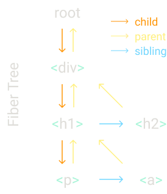

> https://pomb.us/build-your-own-react/

## JSX代码

```jsx
/**
 * const element = React.createElement(
 *  "h1",
 *  { title: "foo" },
 *  "Hello"
 * )
 * 最终返回的react元素形式是：
 * const element = {
 *  type: "h1",
 *  props: {
 *    title: "foo",
 *    children: "Hello",
 *  },
 * }
 */
const element = <h1 title="foo">Hello</h1>
const container = document.getElementById("root")
/**
 * PS: 这里的node指的是DOM
 * const node = document.createElement(element.type)
 * node["title"] = element.props.title
 * const text = document.createTextNode("")
 * text["nodeValue"] = element.props.children
 * node.appendChild(text)
 * container.appendChild(node)
 */
ReactDOM.render(element, container)
```

> 文中提到的**vanilla js**其实就是原生JS，Vanilla JS is a joke

## createElement

createElement唯一需要做的就是创建如上element一样的react元素对象

```ts
function createElement(type, props, ...children) {
  // children是rest parameter 格式，因为通常children都是一个数组。
  return {
    type,
    props: {
      ...props,
      children: children.map(child =>
        typeof child === "object"
          ? child
          : createTextElement(child)
      )
    },
  }
}

function createTextElement(text) {
  return {
    type: "TEXT_ELEMENT",
    props: {
      nodeValue: text,
      children: [],
    },
  }
}
```

children也可能是字符串或者数字类型，我们用一个特殊的节点类型包裹他们：TEXT_ELEMENT。react在没有children的情形下不是直接包裹原始值或者空数组，而是这么做是因为这么做代码更加简洁，而不是为了追求更高性能的代码。

我们自定义一个Didact代替React：

```tsx
const Didact = {
  createElement,
}

const element = Didact.createElement(
  "div",
  { id: "foo" },
  Didact.createElement("a", null, "bar"),
  Didact.createElement("b")
)


/** @jsx Didact.createElement */
const element = (
  <div id="foo">
    <a>bar</a>
    <b />
  </div>
)
// 如上给jsx添加这种注释，babel在编译JSX的时候就会使用我们的函数
```

## render Function

```tsx
function render(element, container) {
  // TODO create dom nodes
}

const Didact = {
  createElement,
  render,
}

/** ..... */
Didact.render(element, container)

/** 首先关注添加元素，根据element.type添加元素到容器 */
function render(element, container) {
  // 注意处理文本节点
  const dom =
    element.type == "TEXT_ELEMENT"
      ? document.createTextNode("")
      : document.createElement(element.type)

  // 将element的props添加到DOM node上面去
  const isProperty = key => key !== "children"
  Object.keys(element.props)
    .filter(isProperty)
    .forEach(name => {
      dom[name] = element.props[name]
    })
  
  /** 递归调用render每一个子节点 */
  element.props.children.forEach(child =>
    render(child, dom)
  )
  
  container.appendChild(dom)
}
```

## Concurrent Mode

在上述递归回调里有一个问题：一旦我们开始渲染，我们无法中断他的渲染。假如渲染树很大的话，我们需要等待很久。对于浏览器这样优先用户输入和平滑的动画效果的情况，是很不合适的。

因此，我们将把工作分成几个小单元，完成每个小单元后，如果还有其他需要完成的事情，我们将让浏览器中断渲染。

```jsx
let nextUnitOfWork = null

function workLoop(deadline) { // deadline参数我们用它来检测还有多少时间能够执行，在浏览器重新控制之前。
  let shouldYield = false // 剩余时间是否不足
  
  // 要开始使用循环，我们需要设置第一个工作单元
  while (nextUnitOfWork && !shouldYield) {
    nextUnitOfWork = performUnitOfWork(
      nextUnitOfWork
    )
    shouldYield = deadline.timeRemaining() < 1
  }
  // 使用requestIdleCallback进行循环，会在浏览器空闲的时候执行
  requestIdleCallback(workLoop)
}

requestIdleCallback(workLoop)

function performUnitOfWork(nextUnitOfWork) {
  // 编写一个performUnitOfWork函数，该函数不仅执行工作，还返回下一个工作单元。
}
```

react`React`不再使用`requestIdleCallback`。**现在，它使用Scheduler程序包**。

## Fibers

要组织工作单元，我们需要一个数据结构：一棵 fiber 树(`fiber tree`)。

我们将为每个元素分配一根`fiber`，并且每根`fiber`将成为一个工作单元。（fiber英文是纤维的意思）

```tsx
Didact.render(
  <div>
    <h1>
      <p />
      <a />
    </h1>
    <h2 />
  </div>,
  container
);
```

在渲染中，我们将创建`root fiber`并将其设置为`nextUnitOfWork`。剩下的工作将在`performUnitOfWork`函数上进行，我们将为每根`fiber`做三件事：

1. 将元素`element`添加到`DOM`
2. 为元素`element`的子代`children`创建`fiber`
3. 选择下一个工作单元(the next unit of work)



该数据结构的目标之一是使查找下一个工作单元变得容易。这就是为什么每个`fiber`都链接到其第一个子节点，下一个兄弟姐妹和父节点。当我们在一个`fiber`上完成了工作，如果这个`fiber`有一个`child`，那么这个`fiber`将会是下一个工作单元（the next unit of work）。如果这个`fiber`没有`child`， 用 `sibling`(兄弟) 作为下一个工作单元。

如果`fiber`既没有孩子`child`也没有兄弟姐妹`sibling`，那么我们去“叔叔”：父母的兄弟姐妹。如果父母没有兄弟姐妹，我们会不断检查父母，直到找到有兄弟姐妹的父母，或者直到找到根。如果到达根目录，则意味着我们已经完成了此渲染的所有工作。

### 修改代码

```ts
// 将render函数内创建DOM节点部分提取到这个函数里
function createDom(fiber) {
  const dom =
    fiber.type == "TEXT_ELEMENT"
      ? document.createTextNode("")
      : document.createElement(fiber.type)

  const isProperty = key => key !== "children"
  Object.keys(fiber.props)
    .filter(isProperty)
    .forEach(name => {
      dom[name] = fiber.props[name]
    })

  return dom
}

function render(element, container) {
  // TODO set next unit of work
  // 在 render 函数中，我们将nextUnitOfWork设置为 fiber tree 的根。
  nextUnitOfWork = {
    dom: container,
    props: {
      children: [element],
    },
  }
}

let nextUnitOfWork = null
```

然后，当浏览器准备就绪时，它将调用我们的`workLoop`，我们将开始在root上工作。

```ts
function workLoop(deadline) {
  let shouldYield = false
  while (nextUnitOfWork && !shouldYield) {
    nextUnitOfWork = performUnitOfWork(
      nextUnitOfWork
    )
    shouldYield = deadline.timeRemaining() < 1
  }
  requestIdleCallback(workLoop)
}

requestIdleCallback(workLoop)

function performUnitOfWork(fiber) {
  // TODO add dom node
  // TODO create new fibers
  // TODO return next unit of work
}
```

### performUnitOfWork

首先，我们创建一个新节点 `node` 并将其添加到 `DOM`。

我们在 `fibre.dom` 属性中跟踪 `DOM` 节点。然后，为每个孩子 `child` 创建一个新的 `fiber` 。

```ts
function performUnitOfWork(fiber) {
  if (!fiber.dom) {
    // 根据fiber
    fiber.dom = createDom(fiber)
  }

  if (fiber.parent) {
    fiber.parent.dom.appendChild(fiber.dom)
  }

  // TODO create new fibers
  // 然后，为每个孩子 child 创建一个新的 fiber 。
  const elements = fiber.props.children
  let index = 0
  let prevSibling = null
  while (index < elements.length) {
    const element = elements[index]
    const newFiber = {
      type: element.type,
      props: element.props,
      parent: fiber,
      dom: null,
    }
    
    // 然后将其添加到 fiber tree 中，将其设置为子代 child 或者兄弟 sibling 
    // 具体取决于它是否是第一个子代 child 。
    if (index === 0) {
      fiber.child = newFiber
    } else {
      prevSibling.sibling = newFiber
    }

    prevSibling = newFiber
    index++
  }
  // TODO return next unit of work
  if (fiber.child) {
    return fiber.child
  }
  let nextFiber = fiber
  while (nextFiber) {
    if (nextFiber.sibling) {
      return nextFiber.sibling
    }
    nextFiber = nextFiber.parent
  }
}
```

## Render and Commit Phase 渲染和提交阶段

还有另一个问题。

每次处理元素时，我们都会向 `DOM` 添加一个新节点。 而且，请记住，在完成渲染整个树之前，浏览器可能会中断我们的工作。 在这种情况下，用户将看到不完整的 `UI` 。 这不是我们想要的。

因此我们需要删除此处更改 DOM 的部分：

```diff
function performUnitOfWork(fiber) {

--  if (fiber.parent) {
--    fiber.parent.dom.appendChild(fiber.dom)
--  }

}
```

相反，我们将跟踪 `fiber tree` 的根 `root` 。我们称其为进行中的根或 `wipRoot` 。

```ts
function render(element, container) {
  wipRoot = {
    dom: container,
    props: {
      children: [element],
    },
  }
  nextUnitOfWork = wipRoot
}

let nextUnitOfWork = null
let wipRoot = null
```

一旦完成所有工作（因为没有下一个工作单元），我们便将整个 `fiber tree` 提交给 `DOM` 。

```diff
++ function commitRoot() {
++  // TODO add nodes to dom
++ }

function workLoop(deadline) {

++ if (!nextUnitOfWork && wipRoot) {
++  commitRoot()
++ }
	
}
```

我们在 `commitRoot` 函数中这么做。在这里，我们将所有节点递归附加到 `Dom` 。

```ts
function commitRoot() {
  commitWork(wipRoot.child)
  wipRoot = null
}

function commitWork(fiber) {
  if (!fiber) {
    return
  }
  const domParent = fiber.parent.dom
  domParent.appendChild(fiber.dom)
  commitWork(fiber.child)
  commitWork(fiber.sibling)
}
```

## Reconciliation

