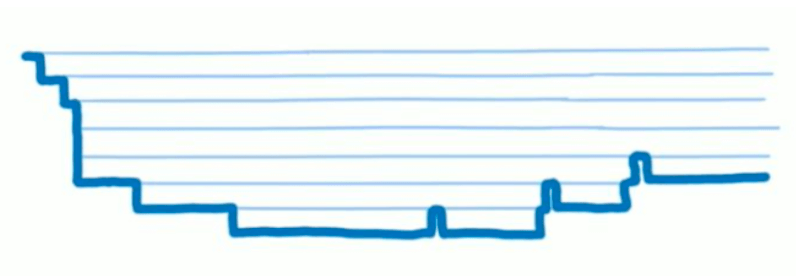
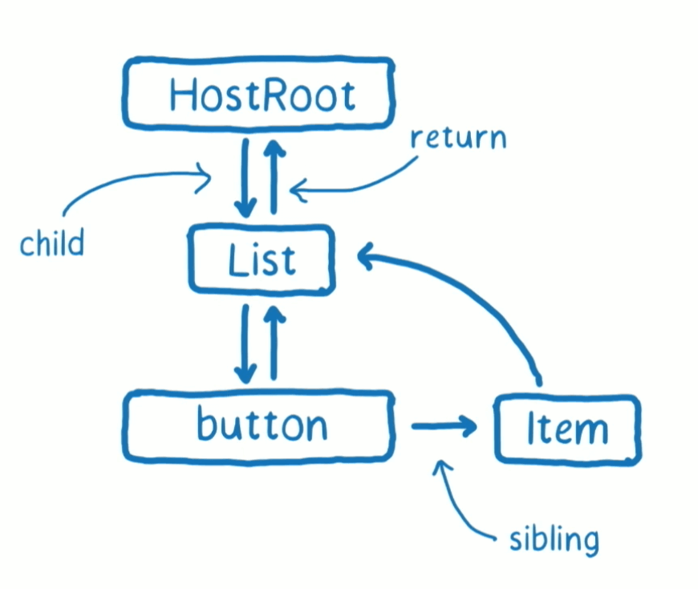
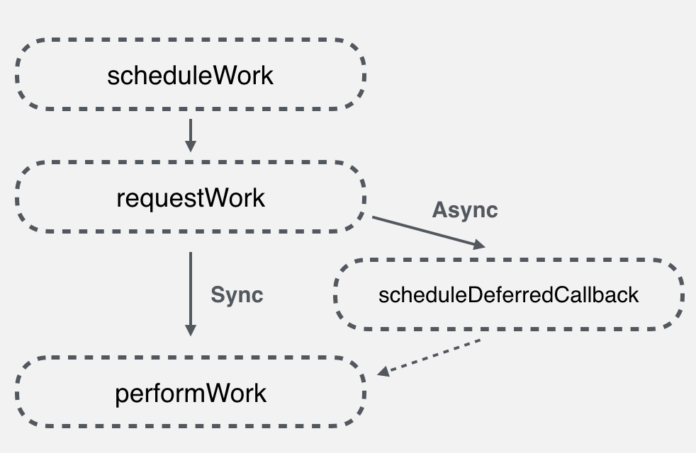
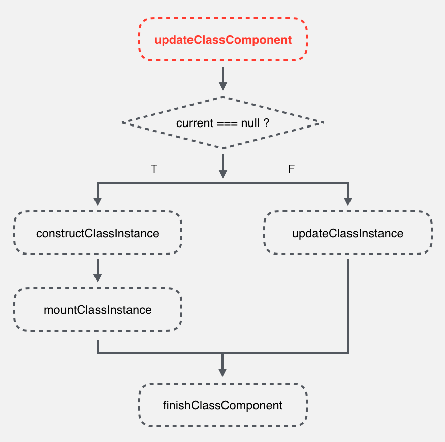
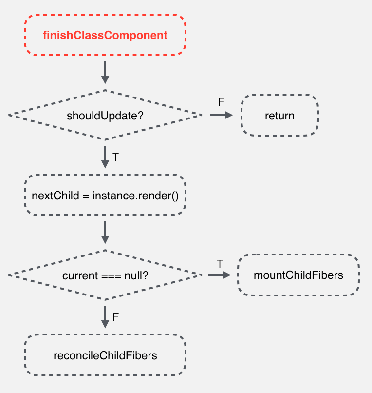
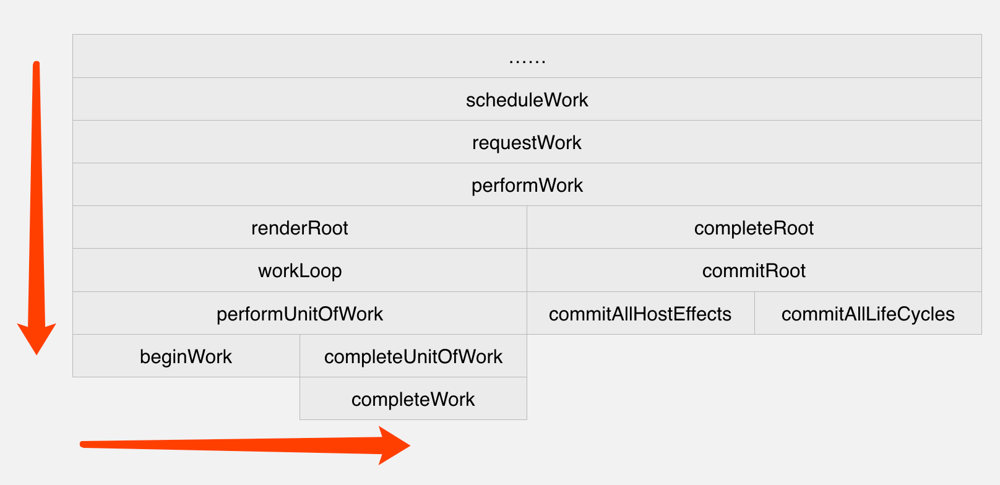

# React Fiber架构

> 本文代码是18年版本，和现在可能存在出入

## 基础概念

React定位是一个构建用户界面的JavaScript类库，使用JavaScript开发UI组件，支持多种方式渲染组件，输出用户界面。

React常见的三种应用类型：

- React Web 应用
- React Native 应用
- React服务端渲染

这三种应用分别对应三种不同的渲染方式：

- Web DOM 渲染
- 客户端原生 View 渲染
- 服务端字符串渲染

以 React Web应用 为例，介绍下React三个主要组成部分：

- React基础模块（这个模块定义了React的基础API及组件相关内容。对应我们开发页面时引入的 'react' 模块）
- 渲染模块（这个模块对于不同类型的应用，采用不同的渲染方式。对应我们开发页面时引入的 'react-dom' 模块）
- Reconciliation 模块（又叫 协调模块，这个模块是上面两个模块的基础，也是本文分享的重点，主要负责任务协调、生命周期函数管理等）

### React基础模块

```js
const React = {
  Children: {
    // ...
  },

  createRef,
  Component,
  PureComponent,

  createContext,
  forwardRef,

  Fragment: REACT_FRAGMENT_TYPE,
  StrictMode: REACT_STRICT_MODE_TYPE,
  unstable_AsyncMode: REACT_ASYNC_MODE_TYPE,
  unstable_Profiler: REACT_PROFILER_TYPE,

  createElement,
  cloneElement,
  createFactory,
  isValidElement,

  version: ReactVersion,

  __SECRET_INTERNALS_DO_NOT_USE_OR_YOU_WILL_BE_FIRED: ReactSharedInternals,
};
```

从上面的源码可以看到，React基础模块只包括了基础的API和组件相关的定义。如：createRef、Component等。

其中可以重点关注的两点：

#### 1、React.creatElement

JSX语法会被babel编译成调用 React.creatElement 方法，而 `React.creatElement` 最终返回的是 React Element：

```js
{
    $$typeof: REACT_ELEMENT_TYPE,
    type: type,
    key: key,
    ref: ref,
    props: props,
    _owner: owner,
}
```

#### 2、React.component

组件是我们开发使用最多的，我们可以简单的看下源码：

```js
function Component(props, context, updater) {
  this.props = props;
  this.context = context;
  // If a component has string refs, we will assign a different object later.
  this.refs = emptyObject;
  // We initialize the default updater but the real one gets injected by the
  // renderer.
  this.updater = updater || ReactNoopUpdateQueue;
}
Component.prototype.isReactComponent = {};
Component.prototype.setState = function(partialState, callback) {
  this.updater.enqueueSetState(this, partialState, callback, 'setState');
};
Component.prototype.forceUpdate = function(callback) {
  this.updater.enqueueForceUpdate(this, callback, 'forceUpdate');
};
```

从Component的定义上可以看到，我们常用的 setState 方法是调用了 `updater.enqueueSetState`（21年看源码的时候也是这样），以 react-dom 为例，此 updater 对象会调用该组件构造函数时（这块会在后面的生命周期函数调用中讲到），赋值为classComponentUpdater，源码如下：

```js
const classComponentUpdater = {
  isMounted,
  enqueueSetState(inst, payload, callback) {
    // ...
  },
  enqueueReplaceState(inst, payload, callback) {
    // ...
  },
  enqueueForceUpdate(inst, callback) {
    // ...
  },
};
```

可以知道，组件中调用 setState 其实是调用的 classComponentUpdater.enqueueSetState 方法，这里就是开始 setState 的入口

至此，就简单的介绍了React基础模块，下面开始介绍渲染模块：react-dom

### 渲染模块：react-dom

```js
const ReactDOM: Object = {
  createPortal,
  findDOMNode(
    componentOrElement: Element | ?React$Component<any, any>,
  ): null | Element | Text {
    // ...
  },
  hydrate(element: React$Node, container: DOMContainer, callback: ?Function) {
    return legacyRenderSubtreeIntoContainer(null, element, container, true, callback,);
  },

  render(element: React$Element<any>, container: DOMContainer, callback: ?Function,) {
    return legacyRenderSubtreeIntoContainer(null, element, container, false, callback,);
  },
  // ...
};
```

这里我们可以关注下 render 方法，所有 react web应用入口都会调用 ReactDOM.render()，本文也会从 ReactDOM.render() 开始进行源码的分析

在进行源码分析之前，先介绍下本文的核心：Reconciliation模块

### Reconciliation模块

Reconciliation模块又叫协调模块，而我们题目上说的 `React Fiber` 则是在这个模块中使用一种调度算法

React Fiber调度算法又叫 Fiber Reconciler，是 React 16 启用的一种新的调度算法，是对核心调度算法（Stack Reconciler）的重构

#### Stack Reconciler

React 16版本之前使用的 Stack Reconciler 调度算法，它通过递归的形式遍历 Virtual DOM，存在难以中断和恢复的问题，如果react更新任务运行时间过长，就会阻塞布局、动画等的运行，可能导致掉帧。它的调用栈如下：



#### Fiber Reconciler

允许渲染过程分段完成，而不必须一次性完成，中间可以返回至主进程控制执行其他任务，它有如下新特性：

- 可拆分，可中断任务
- 可重用各分阶段任务，且可以设置优先级
- 可以在父子组件任务间前进后退切换任务
- render方法可以返回多元素（即可以返回数组）
- 支持异常边界处理异常

它的调用栈如下：


## 源码分析

React Fiber架构引入了新的数据结构：Fiber节点

### Fiber

Fiber节点数据结构如下：

```js
export type Fiber = {|
  // Tag identifying the type of fiber.
  tag: TypeOfWork,
  // Unique identifier of this child.
  key: null | string,
  // The function/class/module associated with this fiber.
  type: any,
  // The local state associated with this fiber.
  stateNode: any,
  // Remaining fields belong to Fiber
  return: Fiber | null,
  // Singly Linked List Tree Structure.
  child: Fiber | null,
  sibling: Fiber | null,
  index: number,
  // The ref last used to attach this node.
  ref: null | (((handle: mixed) => void) & {_stringRef: ?string}) | RefObject,
  // Input is the data coming into process this fiber. Arguments. Props.
  pendingProps: any, // This type will be more specific once we overload the tag.
  memoizedProps: any, // The props used to create the output.
  // A queue of state updates and callbacks.
  updateQueue: UpdateQueue<any> | null,
  // The state used to create the output
  memoizedState: any,
  // A linked-list of contexts that this fiber depends on
  firstContextDependency: ContextDependency<mixed> | null,
  mode: TypeOfMode,
  // Effect
  effectTag: TypeOfSideEffect,
  // Singly linked list fast path to the next fiber with side-effects.
  nextEffect: Fiber | null,
  firstEffect: Fiber | null,
  lastEffect: Fiber | null,

  expirationTime: ExpirationTime,
  childExpirationTime: ExpirationTime,

  alternate: Fiber | null,
  actualDuration?: number,
  actualStartTime?: number,
  selfBaseDuration?: number,
  treeBaseDuration?: number,
|};
```

Fiber树结构图（链表结构）如下：



### 源码函数调用流程


React组件渲染分为两个阶段：reconciler、render。从图上可以看到：

- reconciler阶段是对Virtual DOM操作阶段，对应到新的调度算法中，就是找到需要更新的工作
- render阶段是渲染阶段，拿到更新工作，在不同应用中，使用不同的渲染方式进行渲染

Reconciliation模块的工作可以分为两部分：

1、reconciliation

简单来说就是找到需要更新的工作，通过 Diff Fiber Tree 找出要做的更新工作，这是一个js计算过程，计算结果可以被缓存，计算过程可以被打断，也可以恢复执行

2、commit

提交更新并调用对应渲染模块（react-dom）进行渲染，为了防止页面抖动，该过程是**同步且不能被打断**

#### reconciliation阶段

我们以 ReactDOM.render() 方法为入口，来看看reconciliation阶段的函数调用流程：


从图中可以看到，我把此阶段分为三部分，分别以红线划分。简单的概括下三部分的工作：

1、第一部分从 ReactDOM.render() 方法开始，把接收的React Element转换为Fiber节点，并为其设置优先级，记录update等。这部分主要是一些数据方面的准备工作。

2、第二部分主要是三个函数：scheduleWork、requestWork、performWork，即安排工作、申请工作、正式工作三部曲。React 16 新增的异步调用的功能则在这部分实现。

3、第三部分是一个大循环，遍历所有的Fiber节点，通过Diff算法计算所有更新工作，产出 **EffectList** 给到commit阶段使用。这部分的核心是 beginWork 函数。

##### 第一部分

第一部分较为简单

##### 第二部分：任务协调

三部曲：scheduleWork、requestWork、performWork（安排工作、申请工作、正式工作）



在三部曲中的 requestWork函数中，会判断当前任务是同步还是异步（暂时React的异步调用功能还在开发中 - 18年，未开放使用，本文后续内容是以同步任务为例），然后通过不同的方式调用任务。同步任务直接调用performWork函数立即执行，而异步任务则会在后面的某一时刻被执行，那么异步任务是怎么被调度的呢？

**异步任务调度**有两种方式，主要是通过该任务的优先级进行判断，主要有两种：

1、animation（动画）：则会调用 requestAnimationFrame API 告诉浏览器，在下一次重绘之前调用该任务来更新动画

2、其他异步任务：则会调用 requestIdleCallback API 告诉浏览器，在浏览器空闲时期依次调用任务，这就可以让开发者在主事件循环中执行后台或低优先级的任务，而且不会对像动画和用户交互等关键的事件产生影响

而原生requestIdleCallback存在兼容性问题，所以React本身开发了 **ReactScheduler** 模块 来实现这个功能

后续会以同步任务为例，所以我们开始介绍第三部分的核心函数：beginWork

##### 第三部分：beginWork

从上面的函数调用流程图可以看到，beginWork在大循环中被调用，返回当前节点的子节点。

React是一个树结构，要进行更新只能通过某个节点执行**setState、forceUpdate**等方法，在某一个节点执行了这些方法之后，React会向上搜索直到找到**root**节点，然后把**root**节点放到更新队列中，等待更新。

所以React的更新都是从**root**往下执行的，他会尝试重新构建一个新的树，在这个过程中能复用之前的节点就会复用

```js
function beginWork(
  current: Fiber | null,
  workInProgress: Fiber,
  renderExpirationTime: ExpirationTime,
): Fiber | null {
  const updateExpirationTime = workInProgress.expirationTime;
  /**
  * 如果能满足这个判断条件并且进入bailoutOnAlreadyFinishedWork
  * 那么有极高的可能这个节点以及他的子树都不需要更新，React会直接跳过
  */
  if (!hasLegacyContextChanged() && (updateExpirationTime === NoWork || updateExpirationTime > renderExpirationTime)) {
    switch (workInProgress.tag) {
      case HostRoot:
        ...
      case HostComponent:
        ...
      case ClassComponent:
        pushLegacyContextProvider(workInProgress);
        break;
      case HostPortal:
        ...
      case ContextProvider:
        ...
      case Profiler:
        ...
    }
    // 复用current
    // bailoutOnAlreadyFinishedWork 用于跳过子节点的更新
    return bailoutOnAlreadyFinishedWork(current, workInProgress, renderExpirationTime,);
  }

  // Before entering the begin phase, clear the expiration time.
  workInProgress.expirationTime = NoWork;

  // mount时：根据tag不同，创建不同的子Fiber节点
  switch (workInProgress.tag) {
    case IndeterminateComponent:
      return mountIndeterminateComponent(current, workInProgress, renderExpirationTime,);
    case FunctionalComponent:
      return updateFunctionalComponent(current, workInProgress, renderExpirationTime,);
    case ClassComponent:
      return updateClassComponent(current, workInProgress, renderExpirationTime,);
    case HostRoot:
      return updateHostRoot(current, workInProgress, renderExpirationTime);
    case HostComponent:
      return updateHostComponent(current, workInProgress, renderExpirationTime);
    case HostText:
      return updateHostText(current, workInProgress);
    case PlaceholderComponent:
      return updatePlaceholderComponent(current, workInProgress, renderExpirationTime,);
    case HostPortal:
      return updatePortalComponent(current, workInProgress, renderExpirationTime,);
    case ForwardRef:
      return updateForwardRef(current, workInProgress, renderExpirationTime);
    case Fragment:
      return updateFragment(current, workInProgress, renderExpirationTime);
    case Mode:
      return updateMode(current, workInProgress, renderExpirationTime);
    case Profiler:
      return updateProfiler(current, workInProgress, renderExpirationTime);
    case ContextProvider:
      return updateContextProvider(current, workInProgress, renderExpirationTime,);
    case ContextConsumer:
      return updateContextConsumer(current, workInProgress, renderExpirationTime,);
    default:
      ...
  }
}
```

先介绍一下React Fiber架构的**双缓冲技术**：


从上图可以看到有两颗 Fiber Tree：current、workInProgress，它们之间是通过每个Fiber节点上的alternate属性联系在一起，可以查看源码ReactFiber.js中的 createWorkInProgress 方法，如下：

```ts
export function createWorkInProgress(
  current: Fiber,
  pendingProps: any,
  expirationTime: ExpirationTime,
): Fiber {
  let workInProgress = current.alternate;
  if (workInProgress === null) {
    workInProgress = createFiber(current.tag, pendingProps, current.key, current.mode,);
    ...
    workInProgress.alternate = current;
    current.alternate = workInProgress;
  } else {
    workInProgress.effectTag = NoEffect;
    workInProgress.nextEffect = null;
    workInProgress.firstEffect = null;
    workInProgress.lastEffect = null;
    ...
  }
  ...
  return workInProgress;
}
```

以上代码为简化之后的，可以发现，current与workInProgress互相持有引用。而从上图可以发现，所有更新都是在workInProgress上进行操作，等更新完毕之后，再把current指针指向workInProgress，从而丢弃旧的Fiber Tree

从beginWork源码来看，主要分为两部分，一部分是对Context的处理，一部分是根据fiber对象的tag类型，调用对应的update方法。在这里我们重点关注第二部分。而在第二部分中，我们以 ClassComponent类型 为例，讲讲 updateClassComponent函数 中做了什么呢？

主要有两部分：生命周期函数的调用及Diff算法

### 生命周期函数调用

流程图如下：



current为null，意味着当前的update是组件第一次渲染

1、调用 constructClassInstance 构造组件实例，主要是调用 `constructor` 构造函数，并注入classComponentUpdater（这块就是文章一开始介绍React Component时提到的updater注入）

2、mountClassInstance 则是调用 `getDerivedStateFromProps` 生命周期函数（v16，错误边界） 及 `UNSAFE_componentWillMount` 生命周期函数

current不为null，调用 updateClassInstance 方法

1、如果新老props不一致，则会调用 `UNSAFE_componentWillReceiveProps` 生命周期函数

2、然后调用 `shouldComponentUpdate` 生命周期函数，获得shouldUpdate值，若未定义此生命周期函数，默认为true（是否重新渲染），如果shouldUpdate为true，则会调用 `UNSAFE_componentWillUpdate` 生命周期函数

最后调用 finishClassComponent 方法，那么 finishClassComponent函数 中做了什么呢？流程图如下：



- 如果 shouldUpdate 为false，表示不需要更新，直接返回
- 如果 shouldUpdate 为true，调用实例的 `render` 方法（也就是类组件里面的 render ），返回新子节点
- 如果是首次渲染，调用 mountChildFibers 创建子节点的Fiber实例
- 否则，调用 reconcileChildFibers 对新老子节点进行Diff

执行到了这，updateClassComponent函数主要是执行了组件的生命周期函数，下面讲讲需要对新老子节点进行Diff时使用的**Diff算法**

### Diff算法

reconcileChildFibers函数 中，源码如下：

```ts
function reconcileChildFibers(
    returnFiber: Fiber,
    currentFirstChild: Fiber | null,
    newChild: any,
    expirationTime: ExpirationTime,
): Fiber | null {
    // fragments <>{[...]}</>
    const isUnkeyedTopLevelFragment = typeof newChild === 'object' && newChild !== null && newChild.type === REACT_FRAGMENT_TYPE && newChild.key === null;
    if (isUnkeyedTopLevelFragment) {
        newChild = newChild.props.children;
    }
    const isObject = typeof newChild === 'object' && newChild !== null;
    if (isObject) {
      	// 如果是数组也会进入，但是数组肯定没有 $$typeof
        switch (newChild.$$typeof) {
        case REACT_ELEMENT_TYPE:
            return placeSingleChild(
                reconcileSingleElement(returnFiber, currentFirstChild, newChild, expirationTime,),
            );
        case REACT_PORTAL_TYPE:
            return placeSingleChild(
                reconcileSinglePortal(returnFiber, currentFirstChild, newChild, expirationTime,),
            );
        }
    }
    if (typeof newChild === 'string' || typeof newChild === 'number') {
        return placeSingleChild(
            reconcileSingleTextNode(returnFiber, currentFirstChild, '' + newChild, expirationTime,),
        );
    }
    if (isArray(newChild)) {
        return reconcileChildrenArray(returnFiber, currentFirstChild, newChild, expirationTime,);
    }
    if (getIteratorFn(newChild)) {
        return reconcileChildrenIterator(returnFiber, currentFirstChild, newChild, expirationTime,);
    }
    if (isObject) {
        throwOnInvalidObjectType(returnFiber, newChild);
    }
    // Remaining cases are all treated as empty.
    // 更新删除掉了所有节点，执行删除
    return deleteRemainingChildren(returnFiber, currentFirstChild);
}
```

reconcileChildFibers函数中主要是根据newChild类型，调用不同的Diff算法：

1、单个元素，调用 reconcileSingleElement

2、单个Portal元素，调用 reconcileSinglePortal

3、string或者number，调用 reconcileSingleTextNode

4、array（React 16 新特性），调用 reconcileChildrenArray

前三种情况，在新子节点上添加 effectTag：Placement，标记为更新操作，而这些操作的标记，将用于commit阶段。下面以单个元素为例，讲讲具体的Diff算法

**reconcileSingleElement**函数源码如下：

```ts
function reconcileSingleElement(
    returnFiber: Fiber,
    currentFirstChild: Fiber | null,
    element: ReactElement,
    expirationTime: ExpirationTime,
): Fiber {
    const key = element.key;
    let child = currentFirstChild;
    // 先检查key值是否存在能够复用的部分
    while (child !== null) {
        // 判断key是否相等
        if (child.key === key) {
            if (child.tag === Fragment ? element.type === REACT_FRAGMENT_TYPE : child.type === element.type) {
                // key 相等且 type 相等或者说 element 是 fragment 节点，删除旧子节点的兄弟节点，复用旧节点并返回
                deleteRemainingChildren(returnFiber, child.sibling);
                const existing = useFiber(child, element.type === REACT_FRAGMENT_TYPE ? element.props.children : element.props, expirationTime,);
                existing.ref = coerceRef(returnFiber, child, element);
                existing.return = returnFiber;
                return existing;
            } else {
                // key相等但type不相等，删除旧子节点及兄弟节点，跳出循环
                deleteRemainingChildren(returnFiber, child);
                break;
            }
        } else {
            // key不相等，删除此旧子节点，继续循环
            deleteChild(returnFiber, child);
        }
        // 继续遍历此旧子节点的兄弟节点
        child = child.sibling;
    }
    // 不能复用，则直接新建Fiber实例，并返回
    if (element.type === REACT_FRAGMENT_TYPE) {
        const created = createFiberFromFragment(element.props.children, returnFiber.mode, expirationTime,
        element.key,);
        created.return = returnFiber;
        return created;
    } else {
        const created = createFiberFromElement(element, returnFiber.mode, expirationTime,);
        created.ref = coerceRef(returnFiber, currentFirstChild, element);
        created.return = returnFiber;
        return created;
    }
}
```

具体过程在代码的注释中写的比较清楚，在这就不详细展开。不过我们可以看看 deleteChild（删除子节点）中，具体做了什么，源码如下：

```ts
// effect list 基于根节点生成，每个fiber的firstEffect指向其第一个子fiber，lastEffect指向其最后一个子effect，nextEffect指向下一个effect，组成单链表结构
// effect list 也就是我们需要修改的列表，这里是把一个fiber标记成删除然后加入到 effect list 的末尾
function deleteChild(returnFiber: Fiber, childToDelete: Fiber): void {
    if (!shouldTrackSideEffects) {
        return;
    }
    const last = returnFiber.lastEffect;
    if (last !== null) {
        last.nextEffect = childToDelete;
        returnFiber.lastEffect = childToDelete;
    } else {
        returnFiber.firstEffect = returnFiber.lastEffect = childToDelete;
    }
    childToDelete.nextEffect = null;
    childToDelete.effectTag = Deletion;
}
```

可以看到，deleteChild 删除子节点并不是真的删除这个对象，而是通过 firstEffect、lastEffect、nextEffect 属性来维护一个 EffectList（链表结构），通过 effectTag 标记当前删除操作，这些信息都会在 commit 阶段使用到

以上，就是beginWork函数的整个过程，可以知道遍历完Fiber树之后，通过Diff算法，可以产出 EffectList，给commit阶段使用

#### commit阶段

函数调用流程图如下：


commit阶段做的事情是拿到reconciliation阶段产出的EffectList，即所有更新工作，提交这些更新工作并调用渲染模块（react-dom）渲染UI。

##### effectTag

在前面也提到，commit阶段会通过 effectTag标记 识别操作类型，所以我们先来看看 effectTag 有哪些类型：

```ts
// Don't change these two values. They're used by React Dev Tools.
export const NoEffect = /*              */ 0b00000000000;
export const PerformedWork = /*         */ 0b00000000001;
// You can change the rest (and add more).
export const Placement = /*             */ 0b00000000010;
export const Update = /*                */ 0b00000000100;
export const PlacementAndUpdate = /*    */ 0b00000000110;
export const Deletion = /*              */ 0b00000001000;
export const ContentReset = /*          */ 0b00000010000;
export const Callback = /*              */ 0b00000100000;
export const DidCapture = /*            */ 0b00001000000;
export const Ref = /*                   */ 0b00010000000;
export const Snapshot = /*              */ 0b00100000000;
// Update & Callback & Ref & Snapshot
export const LifecycleEffectMask = /*   */ 0b00110100100;
// Union of all host effects
export const HostEffectMask = /*        */ 0b00111111111;
export const Incomplete = /*            */ 0b01000000000;
export const ShouldCapture = /*         */ 0b10000000000;
```

可以看到：

1、effectTag类型是使用二进制位表示，可以多个叠加

2、通过位运算匹配effectTag类型

从上面的流程图，可以看到commit阶段有比较重要的三个函数：

#### 1、commitBeforeMutationLifecycles

此函数主要是保存当前DOM的一个快照，执行 `getSnapshotBeforeUpdate` 生命周期函数

#### 2、commitAllHostEffects

提交所有更新并渲染，源码如下：

```js
function commitAllHostEffects() {
  while (nextEffect !== null) {
    recordEffect();
    const effectTag = nextEffect.effectTag;
    if (effectTag & ContentReset) {
      commitResetTextContent(nextEffect);
    }
    if (effectTag & Ref) {
      const current = nextEffect.alternate;
      if (current !== null) {
        commitDetachRef(current);
      }
    }
    // 使用位运算的并操作可以简化判断，并且排除其他类型，以下代码保证 primaryEffectTag 是三种类型之一或者他们的任意组合
    let primaryEffectTag = effectTag & (Placement | Update | Deletion);
    switch (primaryEffectTag) {
      case Placement: {
        commitPlacement(nextEffect);
        nextEffect.effectTag &= ~Placement;
        break;
      }
      case PlacementAndUpdate: {
        commitPlacement(nextEffect);
        nextEffect.effectTag &= ~Placement;
        const current = nextEffect.alternate;
        commitWork(current, nextEffect);
        break;
      }
      case Update: {
        const current = nextEffect.alternate;
        commitWork(current, nextEffect);
        break;
      }
      case Deletion: {
        commitDeletion(nextEffect);
        break;
      }
    }
    nextEffect = nextEffect.nextEffect;
  }
}
```

从源码可以看到，此函数主要是遍历EffectList，根据effectTag，调用对应commit方法，进而调用react-dom提供的操作DOM的方法，渲染UI，操作DOM的方法有：

```js
{
  getPublicInstance,
  supportsMutation,
  supportsPersistence,
  commitMount,
  commitUpdate,
  resetTextContent,
  commitTextUpdate,
  appendChild,
  appendChildToContainer,
  insertBefore,
  insertInContainerBefore,
  removeChild,
  removeChildFromContainer,
  replaceContainerChildren,
  createContainerChildSet,
}
```

注意，在调用删除操作的commit方法时，会执行 `componentWillUnmount` 生命周期函数

在这个方法中，基本完成了将更新提交并渲染UI的工作

#### 3、commitAllLifeCycles

此函数主要是根据fiber节点类型，执行相应的处理，以 ClassComponent 为例，完成UI渲染之后，会执行后续的生命周期函数：

1、判断是否首次渲染，是则执行 `componentDidMount` 生命周期函数

2、否则，执行 `componentDidUpdate` 生命周期函数

以上就是commit阶段的全过程



