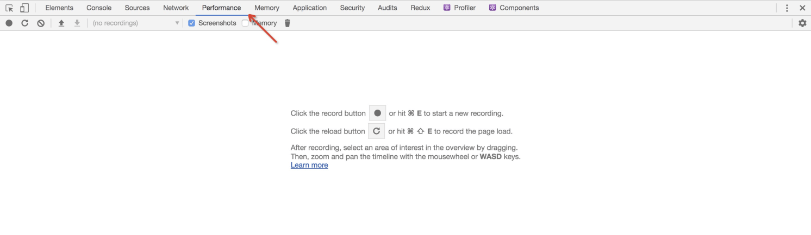
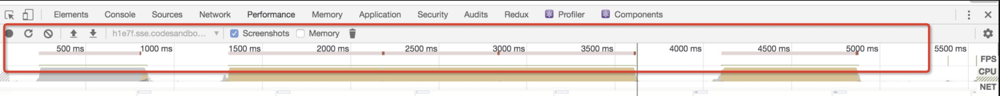
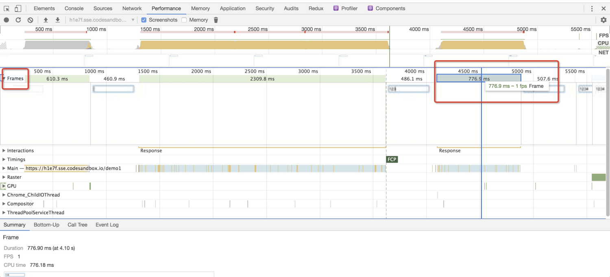
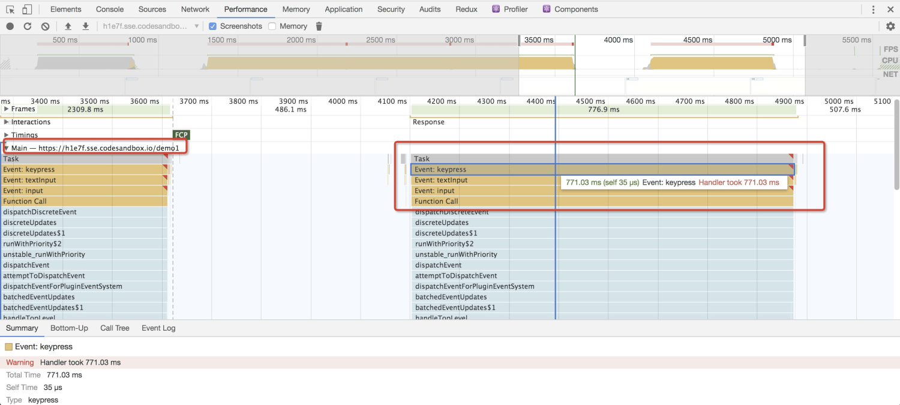
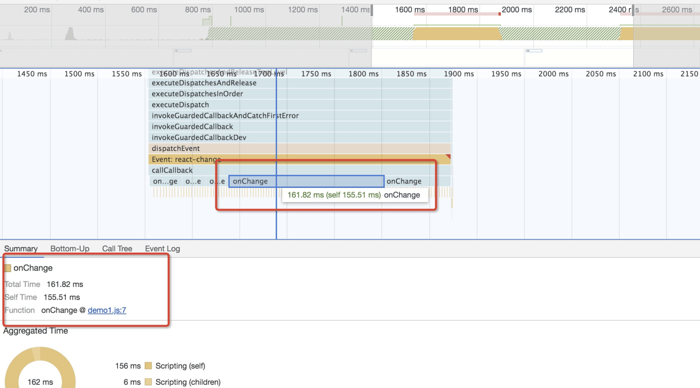
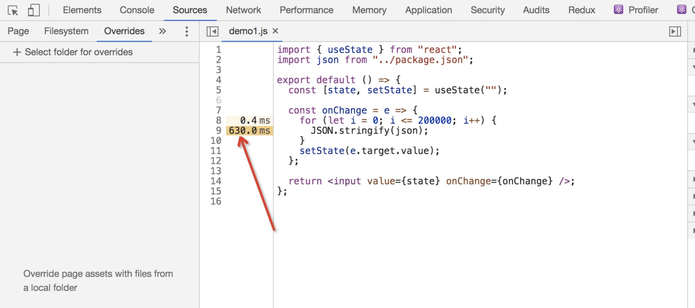
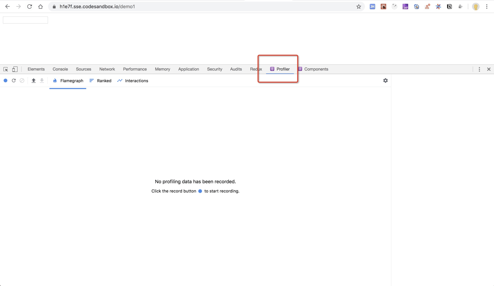
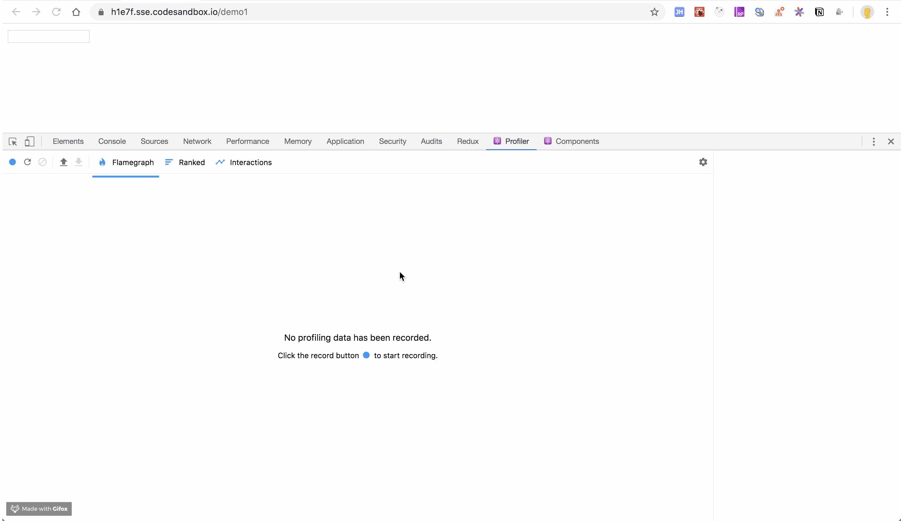
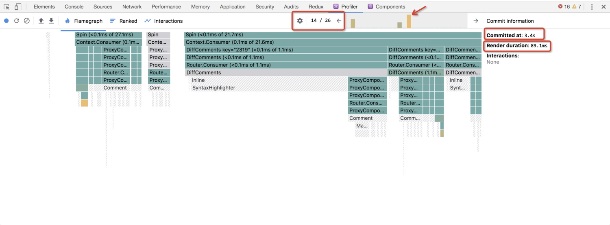
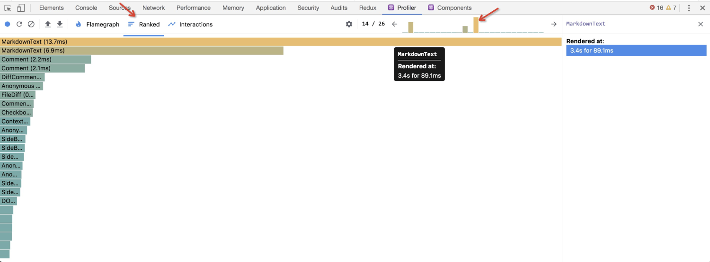

## 性能分析

### Performance

说到性能分析，当然要有一些指标，来度量现在网页“卡”的程度，并指导我们持续改进。chrome 自带的 Performance，一般就足够我们进行分析了。



从上面的动图可以看到，最后上面一栏出现很多红线，这就代表性能出问题了：





我们看下 Frames（帧） 这一栏，能看到红框中在一次输入中，776.9 ms 内都是 1 fps 的。这代表什么意思？我们知道正常网页刷新频率一般是 60 帧，也就是 16.67ms（1s/60）必须要刷新一次，否则就会有卡顿感，刷新时间越长，就越卡顿，在当前例子中，我们输入字符后，776.9 ms 后才触发更新，可以说是相当相当卡了。

我们知道 JS 是单线程的，也就是执行代码与绘制是同一个线程，必须等代码执行完，才能开始绘制。那具体是那一块代码执行时间长了呢？这里我们就要看 Main 这一栏，这一栏列出了 JS 调用栈。



在 Main 这一栏中，可以看到我们的 KeyPress 事件执行了 771.03ms，然后往上托动，就能看到 KeyPress 中 JS 的执行栈，能找到每个函数的执行时间。



拖动到最下面，你可以看到 onChange 函数执行了很长时间，点击它，你可以在下面看到这个函数的具体信息，点击 `demo1.js:7` 甚至能看到每一行执行了多长时间。



罪魁祸首找到了，第九行代码执行了 630ms，找到问题所在，就好解决了。

这是一个最简单的例子，这种由单个地方引起的性能问题，也是比较好解决的。找到它、修改它、解决它！

### React Profiler

React.Profiler 是 React 提供的，分析组件渲染次数、开始时间及耗时的一个 API，你可以在官网找到它的[文档](https://zh-hans.reactjs.org/docs/profiler.html)。

当然我们不需要每个组件都去加一个 React.Profiler 包裹，在开发环境下，React 会默记录每个组件的信息，我们可以通过 Chrome Profiler Tab 整体分析。

当然我们的 Chrome 需要安装 [React 扩展](https://chrome.google.com/webstore/detail/react-developer-tools/fmkadmapgofadopljbjfkapdkoienihi)，才能在工具栏中找到 `Profiler` 的 Tab。



Profiler 的用法和 Performance 用法差不多，点击开始记录，操作页面，然后停止记录，就会产出相关数据。



找了一张比较复杂的图来做个示例，图中的数字分别表示：本次操作 React 做了 26 次 commit，第 14 次 commit 耗时最长，该次 commit 从 3.4s 时开始，消耗了 89.1 ms。



同时我们切换到 Ranked 模式，可以看到该次 commit，每个组件的耗时排名。比如下图表示 `MarkdownText` 组件耗时最长，达到 13.7 ms。



通过 React.Profiler，我们可以清晰的看到 React 组件的执行次数及时间，为我们优化性能指明了方向。

但我们需要注意的是，**React.Profiler 记录的是 commit 阶段的数据**。React 的执行分为两个阶段：

- **render** 阶段：该阶段会确定例如 DOM 之类的数据需要做那些变化。在这个阶段，React 将会执行 render 及 render 之前的生命周期。
- **commit** 阶段：该阶段 React 会提交更新，同时在这个阶段，React 会执行像 `componentDidMount` 和 `componentDidUpdate` 之类的生命周期函数。

所以 React.Profiler 的分析范围是有限的，比如我们最开始的 input 示例，通过 React Profiler 是分析不出来性能问题的。

## 性能改进

如果所有的性能问题都像上面这么简单就好了。某个点耗时极长，找到它并改进之，皆大欢喜。但在 React 项目中，最容易出现的问题是组件太多，每个组件执行 1ms，一百个组件就执行了 100ms，怎么优化？没有任何一个突出的点可以攻克，我们也不可能把一百个组件都优化成 0.01 ms。

```jsx
class App extend React.Component{
    constructor(props){
    super(props);
    this.state={
      count: 0
    }
  }
  render(){
    return (
      <div>
        <A />
        <B />
        <C />
        <D />
        <Button onClick={()=>{ this.setState({count: 1}) }}>click</Button>
      </div>
    )
  }
}
```

就像上面这个组件一样，当我们点击 Button 更新 state 时，A/B/C/D 四个组件均会执行一次 render 计算，这些计算完全是无用的。当我们组件够多时，会逐渐成为性能瓶颈！我们目标是**减少不必要的 render。**

### PureComponent/ShouldComponentUpdate

说到避免 Render，当然第一时间想到的就是 ShouldComponentUpdate 这个生命周期，该生命周期通过判断 props 及 state 是否变化来手动控制是否需要执行 render。当然如果使用 PureComponent，组件会自动处理 ShouldComponentUpdate。

使用 PureComponent/ShouldComponentUpdate 时，需要注意几点：

1. PureComponent 会对 props 与 state 做**浅比较，\**所以一定要保证 props 与 state 中的数据是 immutable 的\**。**
2. 如果你的数据不是 immutable 的，或许你可以自己手动通过 ShouldComponentUpdate 来进行深比较。当然深比较的性能一般都不好，不到万不得已，最好不要这样搞。

### React.memo

React.memo 与 PureComponent 一样，但它是为函数组件服务的。React.memo 会对 props 进行**浅比较**，如果一致，则不会再执行了。

```jsx
const App = React.memo(()=>{
  return <div></div>
});
```

当然，如果你的数据不是 immutable 的，你可以通过 React.memo 的第二个参数来手动进行深比较，同样极其不推荐。

React.memo 对 props 的变化做了优化，避免了无用的 render。那 state 要怎么控制呢？

```jsx
const [state, setState] = useState(0);
```

React 函数组件的 useState，其 setState 会自动做浅比较，也就是如果你在上面例子中调用了 `setState(0)` ，函数组件会忽略这次更新，并不会执行 render 的。一般在使用的时候要注意这一点，经常有同学掉进这个坑里面。

### 善用 React.useMemo

React.useMemo 是 React 内置 Hooks 之一，主要为了解决函数组件在频繁 render 时，无差别频繁触发无用的昂贵计算 ，一般会作为性能优化的手段之一。

```js
const App = (props)=>{
  const [boolean, setBoolean] = useState(false);
  const [start, setStart] = useState(0);
  
  // 这是一个非常耗时的计算
  const result = computeExpensiveFunc(start);
}
```

在上面例子中， `computeExpensiveFunc` 是一个非常耗时的计算，但是当我们触发 `setBoolean` 时，组件会重新渲染， `computeExpensiveFunc` 会执行一次。这次执行是毫无意义的，因为 `computeExpensiveFunc` 的结果只与 `start` 有关系。

React.useMemo 就是为了解决这个问题诞生的，它可以指定只有当 `start` 变化时，才允许重新计算新的 `result` 。

```js
const result = useMemo(()=>computeExpensiveFunc(start), [start]);
```

### 合理使用 React.useCallback

在函数组件中，React.useCallback 也是性能优化的手段之一。

```jsx
const OtherComponent = React.memo(()=>{
    ...
});
  
const App = (props)=>{
  const [boolan, setBoolean] = useState(false);
  const [value, setValue] = useState(0);
 
  const onChange = (v)=>{
      axios.post(`/api?v=${v}&state=${state}`)
  }
 
  return (
    <div>
        {/* OtherComponent 是一个非常昂贵的组件 */}
        <OtherComponent onChange={onChange}/>
    </div>
  )
}
```

在上面的例子中， `OtherComponent` 是一个非常昂贵的组件，我们要避免无用的 render。虽然 `OtherComponent` 已经用 React.memo 包裹起来了，但在父组件每次触发 `setBoolean` 时， `OtherComponent` 仍会频繁 render。

因为父级组件 `onChange` 函数在每一次 render 时，都是新生成的，导致子组件浅比较失效。通过 React.useCallback，我们可以让 onChange 只有在 state 变化时，才重新生成。

```jsx
const onChange = React.useCallback((v)=>{
  axios.post(`/api?v=${v}&state=${state}`)
}, [state])
```

通过 useCallback 包裹后， `boolean` 的变化不会触发 `OtherComponent` ，只有 `state` 变化时，才会触发，可以避免很多无用的 `OtherComponent` 执行。

但是仔细想想， `state` 变化其实也是没有必要触发 `OtherComponent` 的，我们只要保证 `onChange` 一定能访问到最新的 `state` ，就可以避免 `state` 变化时，触发 `OtherComponent` 的 render。

```js
const onChange = usePersistFn((v)=>{
  axios.post(`/api?v=${v}&state=${state}`)
})
```

上面的例子，我们使用了 Umi Hooks 的 [usePersistFn](https://hooks.umijs.org/zh-CN/hooks/advanced/use-persist-fn)（这个函数其实就是把函数放到了useRef上面去，之前关于优化的文章也提到可以使用 useRef 持久化函数代替 useCallback，还不用担心内部的state不会更新），它可以保证函数地址永远不会变化，无论何时， `onChange` 地址都不会变化，也就是无论何时， `OtherComponent` 都不会重新 render 了。

### 谨慎使用 Context

Context 是跨组件传值的一种方案，但我们需要知道，我们无法阻止 Context 触发的 render。

不像 props 和 state，React 提供了 API 进行浅比较，避免无用的 render，Context 完全没有任何方案可以避免无用的渲染。

有几点关于 Context 的建议：

- Context 只放置必要的，关键的，被大多数组件所共享的状态。
- 对非常昂贵的组件，建议在父级获取 Context 数据，通过 props 传递进来。

### 小心使用 Redux

Redux 中的一些细节，稍不注意，就会触发无用的 render，或者其它的坑。

#### 精细化依赖

```jsx
const App = (props)=>{
  return (
    <div>
        {props.project.id}
    </div>
  )
}
export default connect((state)=>{
  layout: state.layout,
  project: state.project,
  user: state.user
})(App);
```

在上面的例子中，App 组件显示声明依赖了 redux 的 `layout` 、 `project` 、 `user` 数据，在这三个数据变化时，都会触发 App 重新 render。

但是 App 只需要监听 `project.id` 的变化，所以精细化依赖可以避免无效的 render，是一种有效的优化手段。

```jsx
const App = (props)=>{
  return (
    <div>
        {props.projectId}
    </div>
  )
}
export default connect((state)=>{
  projectId: state.project.id,
})(App);
```

#### 不可变数据

我们经常会不小心直接操作 redux 源数据，导致意料之外的 BUG。

我们知道，JS 中的 数组/对象 是地址引用的。在下面的例子中，我们直接操作数组，并不会改变数据的地址。

```js
const list = ['1'];
const oldList = list;
list.push('a');

list === oldList; //true
```

在 Redux 中，就经常犯这样的错误。下面的例子，当触发 `PUSH` 后，直接修改了 `state.list` ，导致 `state.list` 的地址并没有变化。

```js
let initState = {
  list: ['1']
}

function counterReducer(state, action) {
  switch (action.type) {
    case 'PUSH':
      state.list.push('2');
      return {
        list: state.list
      }
    default:    
      return state;
  }
}
```

如果组件中使用了 `ShouldComponentUpdate` 或者 `React.memo` ，浅比较 `props.list === nextProps.list` ，会阻止组件更新，导致意料之外的 BUG。

所以如果大量使用了 `ShouldComponentUpdate` 与 `React.meo` ，则一定要保证依赖数据的不可变性！建议使用 [immer.js](https://github.com/immerjs/immer) 来操作复杂数据。