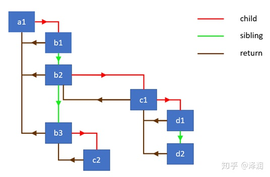

# 为何 React 在 Fiber 中使用链表遍历组件树

## 背景介绍

Fiber架构主要有两个阶段, reconciliation(协调)和commit(提交)。协调阶段通常称为渲染阶段。此时会发生：

1. 更新state和props
2. 调用生命周期
3. 检索子级
4. 比较和之前子级的区别
5. 更新DOM

上面的所有活动在 Fiber 里都被称为 Effect. 需要完成工作的类型取决于 React Element type 属性.

**如果React同步遍历整个组件树，一次的更新操作过多**，执行的时间可能会超过16ms以上, 会导致视觉上的卡顿。

现在有一个有用的浏览器 API 来解决这问题：

### requestIdleCallback

requestIdleCallback会在浏览器空闲的时候，执行callback。

假定React执行更新的操作都在`performWork`中，并且使用requestIdleCallback，代码可能会如下所示

```js
requestIdleCallback((deadline) => {
  	// 一旦时间耗尽, deadline.didTimeout 会是 true
  	// deadline.timeRemaining() 表示还有多少时间给我们进行操作
    while ((deadline.timeRemaining() > 0 || deadline.didTimeout) && nextComponent) {
        nextComponent = performWork(nextComponent);
    }
});
```

我们不能像之前一样同步处理整个组件树。要解决此问题React必须从依赖堆栈的同步递归模型迁移到具有链表和指针的异步模型。

**同步递归：**

```js
walk(a1)
function walk(instance) {
  doWork(instance)
  const children = instance.render()
  children.forEach(walk)
}
function doWork(o) {
  console.log(o.name)
}
```

> 在以前的版本中，React 用的是同步递归方式来遍历整个树。如果仅依靠调用堆栈，每次更新都会工作到堆栈被清空为止。如果**可以随时中断调用堆栈，手动操作栈帧**，当然更好。**React 实现了一种单链表遍历算法。这种算法可以停止遍历并阻止栈增长，不再用递归实现遍历树的。**

## **链表遍历**

为了实现这个算法, 我们需要一个有3个属性的数据结构

- child ---- 第一个子元素
- sibling ---- 第一个兄弟元素
- return ---- 父元素

这种数据结构, 在 React 里被称为 fiber。它是表示一个带有要执行的 work 队列的 React Element。



```js
function walk(o) {
  let root = o;
  let current = o;
  while(true) {
    // 执行每个 node 的 work
    let child = doWork(current);
    if(child) {
      	// 找到最底部的子元素
        current = child;
        continue;
    }
    // 到达顶点 退出函数
    if(current === null) {
        return
    }
    // 寻找兄弟节点
    while(!current.sibling) {
       // 如果没有兄弟节点就往上追溯父节点
       if(!current.return || current.return === root) {
         return
       }
       current = current.return
    }
    // 遍历兄弟节点
    current = current.sibling
  }
}
```

它看起来是浏览器的堆栈。 所以通过这种算法，我们有效的代替了浏览器的调用栈实现。因为我们现在通过持有充当顶部帧的节点引用来控制堆栈。我们可以随时停止遍历并在后面恢复它。这正是我们想要实现能够使用新requestIdleCallback API 的条件。

## **Work loop in React**

```js
function workloop(isYieldy) {
  if(!isYieldy) {
    // Flush work without yielding
    while(nextUnitWork !== null) {
      nextUnitWork = performUnitOfWork(nextUnitWork)
    }
  } else {
    // Flush asynchronous work until the deadline runs out of time
    while(nextUnitWork !== null && !shouldYield()) {
      nextUnitOfWork = performUnitWork(nextUnitWork)
    }
  }
}
```

在 nextUnitOfWork 变量中保持着对当前 fiber 节点的引用作为栈的顶部帧。

这个算法可以同步的遍历组件树,并对树中的每个 fiber 节点（nextUnitOfWork）执行 work，通常是由 UI 事件（click, input等等）调用的交互式更新。它也可以异步的遍历组件树，在每个 fiber 节点执行完 work 检查还有没有剩余时间。

shouldYield 函数根据 deadlineDidExpire 和 deadline 变量返回结果。这两个变量在 React 对 fiber 节点执行工作的时候会不断的更新。

### 为什么不使用双向链表

之前疑问为什么不用双向链表？读懂后就明白了，如果是双向链表就无法暂停了，双向链表暂停后我们不知道暂停前他执行的方向。而且三个指针足够我们使用了，使用双向链表会多一个指针会增加性能和内存成本。我们需要的是按照一定方向执行，这样我们可以清楚知道暂停位置。

