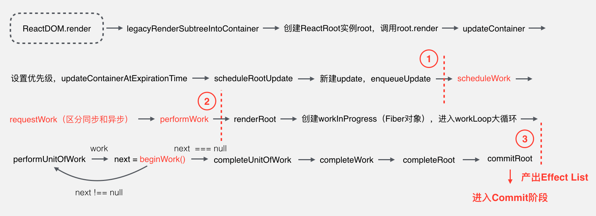
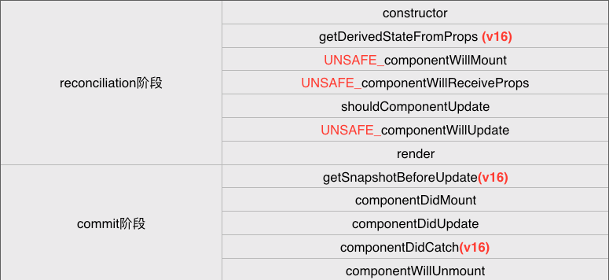

# 从源码看React异常处理

## 什么是错误边界

React16引入了 **Error Boundaries** 即异常边界概念，以及一个新的生命周期函数：`componentDidCatch`，来支持React运行时的异常捕获和处理。

Error Boundaries（异常边界）是React组件，用于捕获它子组件树种所有组件产生的js异常，并渲染指定的兜底UI来替代出问题的组件

如果一个 class 组件中定义了` static getDerivedStateFromError()` 或 `componentDidCatch()` 这两个生命周期方法中的任意一个（或两个）时，那么它就变成一个错误边界。

当抛出错误后，请使用 `static getDerivedStateFromError()` 渲染备用 UI ，使用 `componentDidCatch()` 打印错误信息。

**只有 class 组件才可以成为错误边界组件**。大多数情况下, 你只需要声明一次错误边界组件, 并在整个应用中使用它。

### 错误边界的限制

它能捕获子组件生命周期函数中的异常，包括构造函数（constructor）和render函数

而**不能捕获以下异常**：

- Event handlers（事件处理函数）
- Asynchronous code（异步代码，如setTimeout、promise等）
- Server side rendering（服务端渲染）
- Errors thrown in the error boundary itself (rather than its children)（异常边界组件本身抛出的异常）

注意**错误边界仅可以捕获其子组件的错误**，它无法捕获其自身的错误。如果一个错误边界无法渲染错误信息，则错误会冒泡至最近的上层错误边界，这也类似于 JavaScript 中 catch {} 的工作机制。

### 具体使用

```jsx
class ErrorBoundary extends React.Component {
  constructor(props) {
    super(props);
    this.state = { hasError: false };
  }

  componentDidCatch(error, info) {
    // Display fallback UI
    this.setState({ hasError: true });
    // You can also log the error to an error reporting service
    logErrorToMyService(error, info);
  }

  render() {
    if (this.state.hasError) {
      // You can render any custom fallback UI
      return <h1>Something went wrong.</h1>;
    }
    return this.props.children;
  }
}

/** 使用 */
<ErrorBoundary>
  <MyWidget />
</ErrorBoundary>
```

## 源码分析

**reconciliation阶段**

函数调用流程如下：



这个阶段核心的部分是上图中标出的第三部分，React组件部分的生命周期函数的调用以及通过Diff算法计算出所有更新工作都在第三部分进行的，所以异常处理也是在这部分进行的。

**commit阶段**

函数调用流程如下：


这个阶段主要做的工作拿到reconciliation阶段产出的所有更新工作，提交这些工作并调用渲染模块（react-dom）渲染UI。完成UI渲染之后，会调用剩余的生命周期函数，所以异常处理也会在这部分进行

而各生命周期函数在各阶段的调用情况如下：



React异常处理在源码中的入口主要有两处：

1、reconciliation阶段的 `renderRoot` 函数，对应异常处理方法是 `throwException`

2、commit阶段的 `commitRoot` 函数，对应异常处理方法是 `dispatch`

### throwException

首先看看 `renderRoot` 函数源码中与异常处理相关的部分：

```ts
function renderRoot(
  root: FiberRoot,
  isYieldy: boolean,
  isExpired: boolean,
): void {
  ...
  do {
    try {
      workLoop(isYieldy);
    } catch (thrownValue) {
      if (nextUnitOfWork === null) {
        // 这里是 fatal error（yjh 翻译成致命错误）
        didFatal = true;
        onUncaughtError(thrownValue);
      } else {
        // ...
        const sourceFiber: Fiber = nextUnitOfWork;
        let returnFiber = sourceFiber.return;
        if (returnFiber === null) {
          // 这里是根节点，根节点能够捕获自己的错误。
          // 然而，我们不知道它是在我们压入 host context 之前还是之后出错
          // 我们需要这些信息去避免堆栈不明确.
          // 因为我们不确定，所以把这当作致命的错误。
          // 我们可以追踪它在哪个阶段失败，但似乎不值得。至少现在是这样。
          didFatal = true;
          onUncaughtError(thrownValue);
        } else {
          throwException(
            root,
            returnFiber,
            sourceFiber,
            thrownValue,
            nextRenderExpirationTime,
          );
          nextUnitOfWork = completeUnitOfWork(sourceFiber);
          continue;
        }
      }
    }
    break;
  } while (true);
  ...
}
```

可以看到，这部分就是在`workLoop`大循环外套了层`try...catch...`，在catch中判断当前错误类型，调用不同的异常处理方法。

有两种异常处理方法：

1、RootError，最后是调用 `onUncaughtError` 函数处理

2、ClassError，最后是调用 `componentDidCatch` 生命周期函数处理（也就是上面代码里面的 throwException）

上面两种方法处理流程基本类似，这里就重点分析 ClassError 方法

接下来我们看看 `throwException` 源码：

```ts
function throwException(
  root: FiberRoot,
  returnFiber: Fiber,
  sourceFiber: Fiber,
  value: mixed,
  renderExpirationTime: ExpirationTime,
) {
  // ...
  // 我们找不到可以处理此类异常的边界。重新开始并再次遍历父路径，这次将异常视为错误。
  renderDidError();
  value = createCapturedValue(value, sourceFiber);
  let workInProgress = returnFiber;
  do {
    switch (workInProgress.tag) {
      case HostRoot: {
        // 假如到达了根节点
        const errorInfo = value;
        workInProgress.effectTag |= ShouldCapture;
        workInProgress.expirationTime = renderExpirationTime;
        const update = createRootErrorUpdate(
          workInProgress,
          errorInfo,
          renderExpirationTime,
        );
        enqueueCapturedUpdate(workInProgress, update);
        return;
      }
      case ClassComponent:
      case ClassComponentLazy:
        // 捕捉并重试
        const errorInfo = value;
        const ctor = workInProgress.type;
        const instance = workInProgress.stateNode;
        /**
        * 根据类的静态方法或者实例的生命周期判断是否是错误边界，将错误传入错误边界
        */
        if (
          (workInProgress.effectTag & DidCapture) === NoEffect &&
          ((typeof ctor.getDerivedStateFromCatch === 'function' &&
            enableGetDerivedStateFromCatch) ||
            (instance !== null &&
              typeof instance.componentDidCatch === 'function' &&
              !isAlreadyFailedLegacyErrorBoundary(instance)))
        ) {
          workInProgress.effectTag |= ShouldCapture;
          workInProgress.expirationTime = renderExpirationTime;
          // 调度错误边界使用已经更新过的 state 去进行重新渲染
          const update = createClassErrorUpdate(
            workInProgress,
            errorInfo,
            renderExpirationTime,
          );
          enqueueCapturedUpdate(workInProgress, update);
          return;
        }
        break;
      default:
        break;
    }
    workInProgress = workInProgress.return;
  } while (workInProgress !== null);
}
```

throwException函数分为两部分：

1、（这部分代码在上面中没有展示出来）遍历当前异常节点的所有父节点，找到对应的错误信息（错误名称、调用栈等）

2、第二部分就是上面展示出来的部分，可以看到，也是向上遍历当前异常节点的所有父节点，判断各节点的类型，主要还是上面提到的两种类型，这里重点讲ClassComponent类型，判断该节点是否是异常边界组件（通过判断是否存在`componentDidCatch`生命周期函数等），如果是找到异常边界组件，则调用 `createClassErrorUpdate`函数新建update，并将此update放入此节点的异常更新队列中，在后续更新中，会更新此队列中的更新工作。

`createClassErrorUpdate`的源码：

```ts
function createClassErrorUpdate(
  fiber: Fiber,
  errorInfo: CapturedValue<mixed>,
  expirationTime: ExpirationTime,
): Update<mixed> {
  // 创建一个更新对象
  const update = createUpdate(expirationTime);
  update.tag = CaptureUpdate;
  // ...
  const inst = fiber.stateNode;
  if (inst !== null && typeof inst.componentDidCatch === 'function') {
    update.callback = function callback() {
      if (
        !enableGetDerivedStateFromCatch ||
        getDerivedStateFromCatch !== 'function'
      ) {
        // 为了保留错误边界先前存在的重试行为，我们跟踪哪些错误边界在此批处理过程中已经失败。
        // This gets reset before we yield back to the browser.
        // TODO: 假如没有定义 getDerivedStateFormCatch ，在严格模式发出警告
        markLegacyErrorBoundaryAsFailed(this);
      }
      const error = errorInfo.value;
      const stack = errorInfo.stack;
      logError(fiber, errorInfo);
      // 调用生命周期
      this.componentDidCatch(error, {
        componentStack: stack !== null ? stack : '',
      });
    };
  }
  return update;
}
```

可以看到，此函数返回一个update，此update的callback最终会调用组件的 `componentDidCatch`生命周期函数

update 的 callback 最终会在 commit 阶段的 `commitAllLifeCycles`函数中被调用。

以上就是 reconciliation阶段 的异常捕获到异常处理的流程，可以知道此阶段是在`workLoop`大循环外套了层`try...catch...`，所以workLoop里所有的异常都能被异常边界组件捕获并处理。

### dispatch

我们先看看 `dispatch` 的源码：

```js
function dispatch(
  sourceFiber: Fiber,
  value: mixed,
  expirationTime: ExpirationTime,
) {
  let fiber = sourceFiber.return;
  // 不停的往上冒泡，直到将错误传递给错误边界
  while (fiber !== null) {
    switch (fiber.tag) {
      case ClassComponent:
      case ClassComponentLazy:
        const ctor = fiber.type;
        const instance = fiber.stateNode;
        /* 找到错误边界就退出 */
        if (
          typeof ctor.getDerivedStateFromCatch === 'function' ||
          (typeof instance.componentDidCatch === 'function' &&
            !isAlreadyFailedLegacyErrorBoundary(instance))
        ) {
          const errorInfo = createCapturedValue(value, sourceFiber);
          const update = createClassErrorUpdate(
            fiber,
            errorInfo,
            expirationTime,
          );
          enqueueUpdate(fiber, update);
          scheduleWork(fiber, expirationTime);
          return;
        }
        break;
      case HostRoot: {
        const errorInfo = createCapturedValue(value, sourceFiber);
        const update = createRootErrorUpdate(fiber, errorInfo, expirationTime);
        enqueueUpdate(fiber, update);
        scheduleWork(fiber, expirationTime);
        return;
      }
    }
    fiber = fiber.return;
  }

  if (sourceFiber.tag === HostRoot) {
    // 错误在根节点抛出，这里没有父节点，所以直接在根节点上面捕捉。
    const rootFiber = sourceFiber;
    const errorInfo = createCapturedValue(value, rootFiber);
    const update = createRootErrorUpdate(rootFiber, errorInfo, expirationTime);
    enqueueUpdate(rootFiber, update);
    scheduleWork(rootFiber, expirationTime);
  }
}
```

dispatch函数做的事情和上部分的 `throwException` 类似，遍历当前异常节点的所有父节点，找到异常边界组件（有`componentDidCatch`生命周期函数的组件），新建update，在update.callback中调用组件的`componentDidCatch`生命周期函数，后续的部分这里就不详细描述了，和 reconciliation阶段 基本一致，这里我们看看commit阶段都哪些部分调用了dispatch函数。

```js
function captureCommitPhaseError(fiber: Fiber, error: mixed) {
  return dispatch(fiber, error, Sync);
}
```

调用 captureCommitPhaseError 即调用 dispatch，而 captureCommitPhaseError 主要是在 `commitRoot` 函数中被调用，源码如下：

```js
function commitRoot(root: FiberRoot, finishedWork: Fiber): void {
  // ...
  // commit阶段的准备工作
  prepareForCommit(root.containerInfo);

  // Invoke instances of getSnapshotBeforeUpdate before mutation.
  nextEffect = firstEffect;
  startCommitSnapshotEffectsTimer();
  while (nextEffect !== null) {
    let didError = false;
    let error;
    try {
        // 调用 getSnapshotBeforeUpdate 生命周期函数
        commitBeforeMutationLifecycles();
    } catch (e) {
        didError = true;
        error = e;
    }
    if (didError) {
      // 调用 captureCommitPhaseError
      captureCommitPhaseError(nextEffect, error);
      if (nextEffect !== null) {
        nextEffect = nextEffect.nextEffect;
      }
    }
  }
  stopCommitSnapshotEffectsTimer();

  // 在树中提交所有的副作用. 分两次完成.
  // 第一次执行所有宿主（DOM）插入、更新、删除和ref卸载。
  nextEffect = firstEffect;
  startCommitHostEffectsTimer();
  while (nextEffect !== null) {
    let didError = false;
    let error;
    try {
        // 提交所有更新并调用渲染模块渲染UI
        commitAllHostEffects(root);
    } catch (e) {
        didError = true;
        error = e;
    }
    if (didError) {
      // captureCommitPhaseError调用
      captureCommitPhaseError(nextEffect, error);
      // Clean-up
      if (nextEffect !== null) {
        nextEffect = nextEffect.nextEffect;
      }
    }
  }
  stopCommitHostEffectsTimer();

  // work-in-progress树现在是current树了。
	// 这必须发生在提交阶段的第一个过程之后，在componentWillUnmount期间前一个树仍然是 current 树。但是在第二个过程之前，在componentDidMount/Update期间 finishedWork 是 current 。
  root.current = finishedWork;

  // 在第二步中，我们将执行所有生命周期和ref回调。
  // 生命周期作为一个单独的过程发生，因此整个树中的所有插入、更新和删除都已被调用。此过程还触发任何特定于渲染器的初始 effect 。
  nextEffect = firstEffect;
  startCommitLifeCyclesTimer();
  while (nextEffect !== null) {
    let didError = false;
    let error;
    try {
        // 调用剩余生命周期函数
        commitAllLifeCycles(root, committedExpirationTime);
    } catch (e) {
        didError = true;
        error = e;
    }
    if (didError) {
      // captureCommitPhaseError 调用
      captureCommitPhaseError(nextEffect, error);
      if (nextEffect !== null) {
        nextEffect = nextEffect.nextEffect;
      }
    }
  }
  // ...
}
```

可以看到，有三处（也是commit阶段主要的三部分）通过`try...catch...`调用了 `captureCommitPhaseError`函数，即调用了 `dispatch`函数。

上面我们说了 update 的 callback 会在commit阶段的`commitAllLifeCycles`函数中被调用，我们来看下具体的调用流程：

1、commitAllLifeCycles函数中会调用`commitLifeCycles`函数

2、在commitLifeCycles函数中，对于 ClassComponent 和 HostRoot 会调用`commitUpdateQueue`函数

3、我们来看看 commitUpdateQueue 函数源码：

```tsx
export function commitUpdateQueue<State>(
  finishedWork: Fiber,
  finishedQueue: UpdateQueue<State>,
  instance: any,
  renderExpirationTime: ExpirationTime,
): void {
  // ...
  // Commit the effects
  commitUpdateEffects(finishedQueue.firstEffect, instance);
  finishedQueue.firstEffect = finishedQueue.lastEffect = null; // 清空链表

  commitUpdateEffects(finishedQueue.firstCapturedEffect, instance);
  finishedQueue.firstCapturedEffect = finishedQueue.lastCapturedEffect = null; // 清空链表
}

function commitUpdateEffects<State>(
  effect: Update<State> | null,
  instance: any,
): void {
  while (effect !== null) {
    const callback = effect.callback;
    if (callback !== null) {
      effect.callback = null;
      callCallback(callback, instance);
    }
    effect = effect.nextEffect;
  }
}
```

我们可以看到，commitUpdateQueue函数中会调用两次`commitUpdateEffects`函数，参数分别是正常update队列以及存放异常处理update队列

而commitUpdateEffects函数就是遍历所有update，调用其callback方法

上文提到，commitAllLifeCycles函数中是用于调用剩余生命周期函数，所以异常边界组件的 `componentDidCatch`生命周期函数也是在这个阶段调用。

### 总结

我们现在可以知道，React内部其实也是通过 `try...catch...` 形式是捕获各阶段的异常，但是只在两个阶段的特定几处进行了异常捕获，这也是为什么异常边界只能捕获到子组件在构造函数、render函数以及所有生命周期函数中抛出的异常

我们也提到了React内部将异常分为了两种异常处理方法：RootError、ClassError，我们只重点分析了 ClassError 类型的异常处理函数。

其实 **RootError** 是一样的，区别在于最后调用的处理方法不同，在遍历所有父节点过程中，如果有异常边界组件，则会调用 ClassError 类型的异常处理函数，如果没有，一直遍历到根节点，则会调用 RootError 类型的异常处理函数，最后调用的 `onUncaughtError` 方法，此方法做的事情很简单，其实就是将 `hasUnhandledError` 变量赋值为 `true`，将 `unhandledError` 变量赋值为异常对象，此异常对象最终将在 `finishRendering`函数中被抛出，而`finishRendering`函数是在`performWork`函数的最后被调用。

