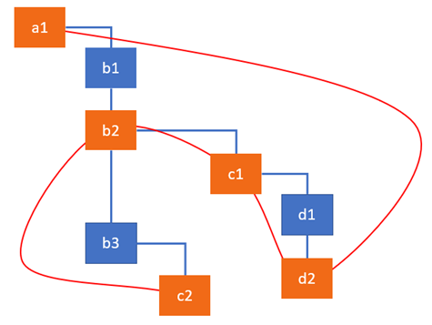
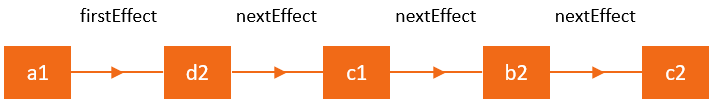

# 深入React fiber架构及源码

React16提出了Fiber结构，其能够将任务分片，划分优先级，同时能够实现类似于操作系统中对线程的**抢占式调度**，非常强大。

React是一个用于构建UI的JavaScript库，其核心是跟踪组件状态变化并将更新到view上。在React中，我们将此过程视为**reconciliation 协调**。在调用setState方法后，框架会检查state或props是否已更改并在UI上重新呈现组件。

React的文档提供了一种更高层次的对这种机制的描述：包含React元素的作用，生命周期方法和渲染方法，以及应用于组件子元素的diffing算法等相关内容。从render方法返回的不可变React元素树通常称为“Virtual DOM”。

除了React元素的树之外，框架总是有一个用于保持状态的内部实例树(internal instances)（组件，DOM节点等），与之相对的是跟具体平台有关的public instance，也被称为Host instance 。从React 16开始，React推出了该内部实例树的新实现以及负责操作树的算法，被称为Fiber。

```jsx
import React, { Component } from 'react';

export default class ClickCounter extends Component{
    constructor(props) {
        super(props);
        this.state = {count: 0};
        this.handleClick = this.handleClick.bind(this);
    }

    handleClick() {
        this.setState((state) => {
            return {count: state.count + 1};
        });
    }


    render() {
        return [
            <button key="1" onClick={this.handleClick}>Update counter</button>,
            <span key="2">{this.state.count}</span>
        ]
    }
 }
```

React会在**reconciliation**期间执行各种活动。从第一次渲染到状态更新后的期间内，React 执行了如下高阶操作：

- 更新了 `ClickCounter` 组件的内部状态的 `count` 属性
- 获取和比较了 `ClickCounter` 组件的子组件及其 props
- 更新 `span` 元素的 props
- 更新 `span` 元素的 `textContent` 属性

在reconciliation期间，还会执行其他活动包括调用生命周期方法或更新引用。

所有这些活动在fiber架构中统称为“work”。work类型通常取决于React元素的类型。例如，对于类定义的组件，React 需要创建实例，但是函数定义的组件就不必执行此操作。正如我们所了解的，React 中有许多元素类型，例如：类和函数组件，宿主组件（DOM 节点）portal 等。React 元素的类型由 createElement 函数的第一个参数定义，此函数通常在 render 方法中调用以创建元素。

## 从 React 元素到 Fiber 节点

### React 元素

如果模板经过 JSX 编译器处理，你就会得到一堆 React 元素。这是从 React 组件的 render 方法返回的，但并不是 HTML 。由于我们并没有被强制要求使用 JSX，因此我们的 ClickCounter 组件的 render 方法可以像这样重写：

```js
class ClickCounter {
    // ...
    render() {
        return [
            React.createElement(
                'button',
                {
                    key: '1',
                    onClick: this.onClick
                },
                'Update counter'
            ),
            React.createElement(
                'span',
                {
                    key: '2'
                },
                this.state.count
            )
        ]
    }
}
```

`render` 方法中调用的 `React.createElement` 会产生两个如下的数据结构：

```js
[
    {
        $$typeof: Symbol(react.element),
        type: 'button',
        key: "1",
        props: {
            children: 'Update counter',
            onClick: () => { ... }
        }
    },
    {
        $$typeof: Symbol(react.element),
        type: 'span',
        key: "2",
        props: {
            children: 0
        }
    }
]
```

React 为这些对象添加了 `$$typeof` 属性，它们是 React 元素**唯一的标识**。此外我们还有属性 `type`、`key` 和 `props` 来描述元素。这些值取自你传递给 `React.createElement` 函数的参数。请注意React 如何将文本内容表示为 `span` 和 `button` 节点的子项，以及 click 钩子如何成为 `button` 元素 props 的一部分。React 元素上还有其他字段，如 `ref` 字段，而这超出了本文的范围。

而 `ClickCounter` 的 React 元素就没有什么 props 或 key 属性:

```js
{
    $$typeof: Symbol(react.element),
    key: null,
    props: {},
    ref: null,
    type: ClickCounter
}
```

### Fiber 节点

在`协调`期间，从 `render` 方法返回的每个 React 元素的数据都会被合并到 Fiber 节点树中。每个 React 元素都有一个相应的 Fiber 节点。与 React 元素不同，不会在每次渲染时重新创建这些 Fiber 。这些是持有组件状态和 DOM 的可变数据结构。

每个 React 元素都会转换为 **相应类型** 的 Fiber 节点，用于描述需要完成的工作。

**可以将 Fiber 视为表示某些要做的工作的数据结构，或者说，是一个工作单位。Fiber 的架构还提供了一种跟踪、规划、暂停和销毁工作的便捷方式。**

当 React 元素第一次转换为 Fiber 节点时，React 在 [createFiberFromTypeAndProps](https://github.com/facebook/react/blob/769b1f270e1251d9dbdce0fcbd9e92e502d059b8/packages/react-reconciler/src/ReactFiber.js#L414) 函数中使用元素中的数据来创建 Fiber。在随后的更新中，React 会再次利用 Fiber 节点，并使用来自相应 React 元素的数据更新必要的属性。如果不再从 `render` 方法返回相应的 React 元素，React 可能还需要根据 `key` 属性来移动或删除层级结构中的节点。

*查看 [ChildReconciler](https://github.com/facebook/react/blob/95a313ec0b957f71798a69d8e83408f40e76765b/packages/react-reconciler/src/ReactChildFiber.js#L239) 函数以查看 React 为现有 Fiber 节点执行的所有活动和相应函数的列表。*

因为React为每个 React 元素创建一个 Fiber 节点，并且因为我们有一个这些元素组成的树，所以我们可以得到一个 Fiber 节点树。

所有 Fiber 节点都通过链表连接，具体是使用Fiber节点上的 `child`、`sibling` 和 `return` 属性。

### current 树及 workInProgress 树

在第一次渲染之后，React 最终得到一个 Fiber 树，它反映了用于渲染 UI 的应用程序的状态。这棵树通常被称为 **current 树（当前树）**。当 React 开始处理更新时，它会构建一个所谓的 **workInProgress 树（工作过程树）**，它反映了要刷新到屏幕的未来状态。

所有工作都在 `workInProgress` 树的 Fiber 节点上执行。当 React 遍历 `current` 树时，对于每个现有 Fiber 节点，React 会创建一个构成 `workInProgress` 树的备用节点，这一节点会使用 render 方法返回的 React 元素中的数据来创建。处理完更新并完成所有相关工作后，React 将准备好一个备用树以刷新到屏幕。一旦这个 `workInProgress` 树在屏幕上呈现，它就会变成 `current` 树。

React 的核心原则之一是一致性。 React **总是一次性更新 DOM** - 它不会显示部分中间结果。`workInProgress` 树充当用户不可见的「草稿」，这样 React 可以先处理所有组件，然后将其更改刷新到屏幕。

在源代码中，您将看到很多函数从 `current` 和 `workInProgress` 树中获取 Fiber 节点。这是一个这类函数的签名：

```js
function updateHostComponent(current, workInProgress, renderExpirationTime) {...}
```

每个Fiber节点持有`备用`域在另一个树的对应部分的引用。来自 `current` 树中的节点会指向 `workInProgress` 树中的节点，反之亦然。

### 副作用

我们可以将 React 中的一个组件视为一个使用 state 和 props 来计算 UI 表示的函数。其他所有活动，如改变 DOM 或调用生命周期方法，都应该被视为副作用，或者简单地说是一种效果。

你之前可能已经在 React 组件中执行数据提取，订阅或手动更改 DOM。我们将这些操作称为“**副作用**”（或简称为“效果”），因为它们会影响其他组件，并且在渲染过程中无法完成。

大多 state 和 props 更新都会导致副作用。既然使用副作用是工作（活动）的一种类型，Fiber 节点是一种方便的机制来跟踪除了更新以外的效果。每个 Fiber 节点都可以具有与之相关的副作用，它们可在 `effectTag` 字段中编码。

fiber 中的副作用基本上定义了处理更新后需要为实例完成的工作。对于宿主组件 **host component**（DOM 元素），这里的工作包括添加，更新或删除元素。对于类组件，React可能需要更新 refs 并调用 `componentDidMount` 和 `componentDidUpdate` 生命周期方法。对于其他类型的 Fiber ，还有相对应的其他副作用。

### 副作用列表

React 处理更新的速度非常迅速，为了达到这种水平的性能，它采用了一些有趣的技术。**其中之一是构建具有副作用的 Fiber 节点的线性列表，从而能够快速遍历。**遍历线性列表比树快得多，并且没有必要在没有副作用的节点上花费时间。

此列表的目标是标记具有 DOM 更新或其他相关副作用的节点。此列表是 `finishedWork` 树的子集，并使用 `nextEffect` 属性而不是 `current` 和 `workInProgress` 树中使用的 `child` 属性进行链接。

为了使这个可视化，让我们想象如下的 Fiber 节点树，其中橙色的部分表示有工作要做。 c2将会被插入到 DOM 中，d2和 c1 将会修改属性，b2 会触发生命周期函数。effect 链表会将它们连接在一起以便 React 可以跳过其他的节点。



*注意，垂直方向的连线表示同层关系，而折线连接表示父子关系，例如，`b1` 没有子节点，而 `b2` 有一个子节点 `c1`。*

可以看到具有副作用的节点是如何链接在一起的。当遍历节点时，React 使用 `firstEffect` 指针来确定列表的开始位置。所以上面的图表可以表示为这样的线性列表：



如您所见，React 按照从子到父的顺序应用副作用。

### Fiber 树的根节点

每个 React 应用程序都有一个或多个充当容器的 DOM 元素。

在我们的例子中，它是带有 ID 为 `container` 的 `div` 元素。React 为每个容器创建一个 [Fiber 根](https://github.com/facebook/react/blob/0dc0ddc1ef5f90fe48b58f1a1ba753757961fc74/packages/react-reconciler/src/ReactFiberRoot.js#L31) 对象。您可以使用对 DOM 元素的引用来访问它：

```js
const fiberRoot = query('#container')._reactRootContainer._internalRoot
```

这个 FiberRoot 是React保存对 Fiber 树的引用的地方，它存储在 Fiber 根对象的 `current` 属性中：

```js
const hostRootFiberNode = fiberRoot.current
```

Fiber 树以 [一个特殊类型](https://github.com/facebook/react/blob/cbbc2b6c4d0d8519145560bd8183ecde55168b12/packages/shared/ReactWorkTags.js#L34) 的 Fiber 节点 `HostRoot` 开始。它在内部创建的，并充当最顶层组件的父级。`HostRoot` 节点可通过 `stateNode` 属性返回到 `FiberRoot`：

```js
// hostRootFiberNode = fiberRoot
fiberRoot.current.stateNode === fiberRoot; // true
```

可以通过 Fiber 根访问最顶层的 `HostRoot` 节点来探索 Fiber 树，或者可以从组件实例中获取单独的 Fiber 节点，如下所示：

```js
compInstance._reactInternalFiber
```

### Fiber 节点结构

让我们看一下为 `ClickCounter` 组件创建的 Fiber 节点的结构

```js
{
    stateNode: new ClickCounter(),
    type: ClickCounter,
    alternate: null,
    key: null,
    updateQueue: null,
    memoizedState: {count: 0},
    pendingProps: {},
    memoizedProps: {},
    tag: 1,
    effectTag: 0,
    nextEffect: null
}
```

`span` DOM 元素的:

```js
{
  stateNode: new HTMLSpanElement,
  type: 'span',
  alternate: null,
  key:'2',
  updateQueue: null,
  memoizedState: null,
  pendingProps: {children: 0},
  memoizedProps: {children: 0},
  tag: 5,
  effectTag: 0,
  nextEffect: null
}
```

Fiber 节点上有很多字段。我在前面的部分中描述了字段 `alternate`、 `effectTag` 和 `nextEffect` 的用途。现在让我们看看为什么需要其他字段。

#### stateNode

保存组件的类实例、DOM 节点或与 Fiber 节点关联的其他 React 元素类型的引用。总的来说，我们可以认为该属性用于保持与一个 Fiber 节点相关联的局部状态。

#### type

定义此 Fiber 节点的函数或类。对于类组件，它指向构造函数，对于 DOM 元素，它指定 HTML 标记。我经常使用这个字段来理解 Fiber 节点与哪个元素相关。

#### tag

定义 [Fiber 的类型](https://github.com/facebook/react/blob/769b1f270e1251d9dbdce0fcbd9e92e502d059b8/packages/shared/ReactWorkTags.js)。它在协调算法中用于确定需要完成的工作。如前所述，工作（work）取决于React元素的类型。函数 [createFiberFromTypeAndProps](https://github.com/facebook/react/blob/769b1f270e1251d9dbdce0fcbd9e92e502d059b8/packages/react-reconciler/src/ReactFiber.js#L414) 将 React 元素映射到相应的 Fiber 节点类型。在我们的应用程序中，`ClickCounter` 组件的属性 `tag` 是 1，表示是 `ClassComponent`（类组件），而 `span` 元素的属性 `tag` 是 5，表示是 `HostComponent`（宿主组件）。

#### updateQueue

状态更新、回调和 DOM 更新的队列。

#### memoizedState

用于创建输出的 Fiber 状态。处理更新时，它会反映当前在屏幕上呈现的状态。

#### memoizedProps

在前一个渲染中用于创建输出的 Fiber 的 props。

#### pendingProps

已从 React 元素中的新数据更新并且需要应用于子组件或 DOM 元素的 props。

#### key

唯一标识符，当具有一组子元素的时候，可帮助 React 确定哪些项发生了更改、添加或删除。它与 [此处](https://reactjs.org/docs/lists-and-keys.html#keys) 描述的 React 的「列表和键」功能有关。

您可以在 [此处](https://github.com/facebook/react/blob/6e4f7c788603dac7fccd227a4852c110b072fe16/packages/react-reconciler/src/ReactFiber.js#L78) 找到 Fiber 节点的完整结构。我在上面的解释中省略了一堆字段。特别是，我跳过了指针 `child`、`sibling` 和 `return`，它们构成了我在 [上一篇文章](https://medium.com/dailyjs/the-how-and-why-on-reacts-usage-of-linked-list-in-fiber-67f1014d0eb7) 中描述的树数据结构。以及专属于 Scheduler 的 expirationTime，childExpirationTime 和 mode 等字段类别。

## 通用算法

React 在两个主要阶段执行工作：`render` 和 `commit`。

在第一个 `render` 阶段，React 通过 `setState` 或 `React.render` 计划性的更新组件，并确定需要在 UI 中更新的内容。

如果是初始渲染，React 会为 `render` 方法返回的每个元素创建一个新的 Fiber 节点。在后续更新中，现有 React 元素的 Fiber 节点将被重复使用和更新。**这一阶段是会构建标记了副作用的 Fiber 节点树**。副作用描述了在下一个`commit`阶段需要完成的工作。在当前阶段，标记了副作用的 Fiber 树会将其应用于实例。它遍历副作用列表、执行 DOM 更新和用户可见的其他更改。

**我们需要重点理解的是，第一个 `render` 阶段的工作是可以异步执行的。**React 可以根据可用时间片来处理一个或多个 Fiber 节点，然后停下来暂存已完成的工作，并转而去处理某些事件，接着它再从它停止的地方继续执行。但有时候，它可能需要丢弃完成的工作并再次从顶部开始。由于在此阶段执行的工作不会导致任何用户可见的更改（如 DOM 更新），因此暂停行为才有了意义。**与之相反的是，后续 `commit` 阶段始终是同步的。**这是因为在此阶段执行的工作会导致用户可见的变化，例如 DOM 更新。这就是为什么 React 需要在一次单一过程中完成这些更新。

调用生命周期函数是 React 执行的工作之一。一些方法是在 `render` 阶段调用的，而另一些方法则是在 `commit` 阶段调用。这是在第一个 `render` 阶段调用的生命周期列表：

- [UNSAFE_]componentWillMount（弃用）
- [UNSAFE_]componentWillReceiveProps（弃用）
- getDerivedStateFromProps
- shouldComponentUpdate
- [UNSAFE_]componentWillUpdate（弃用）
- render

正如你所看到的，从版本 16.3 开始，在 `render` 阶段执行的一些保留的生命周期方法被标记为 `UNSAFE`，它们现在在文档中被称为遗留生命周期。它们将在未来的 16.x 发布版本中弃用。，而没有 `UNSAFE` 前缀的方法版本将在 17.0 中移除。

因为 `render` 阶段不会产生像 DOM 更新这样的副作用，所以 React 可以异步处理组件的异步更新（甚至可能在多个线程中执行）。但是，标有 UNSAFE 的生命周期经常被误解和滥用。开发人员倾向于将带有副作用的代码放在这些方法中，这可能会导致新的异步渲染方法出现问题。虽然只有没有 UNSAFE 前缀的对应方法将被删除，但它们仍可能在即将出现的并发模式（您可以选择退出）中引起问题。

接下来罗列的生命周期方法是在第二个 `commit` 阶段执行的：

- getSnapshotBeforeUpdate
- componentDidMount
- componentDidUpdate
- componentWillUnmount

因为这些方法都在同步的 `commit` 阶段执行，他们可能会包含副作用，并对 DOM 进行一些操作。

至此，我们已经有了充分的背景知识，下面我们可以看下用来遍历树和执行一些工作的通用算法。

### Render 阶段

协调算法始终使用 [renderRoot ](https://github.com/facebook/react/blob/95a313ec0b957f71798a69d8e83408f40e76765b/packages/react-reconciler/src/ReactFiberScheduler.js#L1132)函数从最顶层的 `HostRoot` 节点开始。不过，React 会略过已经处理过的 Fiber 节点，直到找到未完成工作的节点。例如，如果在组件树中的深层组件中调用 `setState` 方法，则 React 将从顶部开始，但会快速跳过各个父项，直到它到达调用了 `setState` 方法的组件。

### 工作循环的主要步骤

所有的 Fiber 节点都会在 [工作循环](https://github.com/facebook/react/blob/f765f022534958bcf49120bf23bc1aa665e8f651/packages/react-reconciler/src/ReactFiberScheduler.js#L1136) 中进行处理。如下是该循环的同步部分的实现：

```js
function workLoop(isYieldy) {
  if (!isYieldy) {
    while (nextUnitOfWork !== null) {
      nextUnitOfWork = performUnitOfWork(nextUnitOfWork);
    }
  } else {...}
}
```

在上面的代码中，`nextUnitOfWork` 保存了 `workInProgress` 树中一个有工作要做的 Fiber 节点的引用。当 React 遍历 Fiber 树时，它会使用这个变量来判断是否有任何其他具有未完成的工作的 Fiber 节点。处理过当前 Fiber 后，保存的就是树中下一个 Fiber 节点的引用或 null。在这种情况下，React 退出工作循环（ work loop ）并准备好提交更改（ commit 阶段）。

遍历树、初始化或完成工作主要用到 4 个函数：

- [performUnitOfWork](https://github.com/facebook/react/blob/95a313ec0b957f71798a69d8e83408f40e76765b/packages/react-reconciler/src/ReactFiberScheduler.js#L1056)
- [beginWork](https://github.com/facebook/react/blob/cbbc2b6c4d0d8519145560bd8183ecde55168b12/packages/react-reconciler/src/ReactFiberBeginWork.js#L1489)
- [completeUnitOfWork](https://github.com/facebook/react/blob/95a313ec0b957f71798a69d8e83408f40e76765b/packages/react-reconciler/src/ReactFiberScheduler.js#L879)
- [completeWork](https://github.com/facebook/react/blob/cbbc2b6c4d0d8519145560bd8183ecde55168b12/packages/react-reconciler/src/ReactFiberCompleteWork.js#L532)

为了演示他们的使用方法，我们可以看看如下展示的遍历 Fiber 树的动画。我已经在演示中使用了这些函数的简化实现。每个函数都需要对一个 Fiber 节点进行处理，当 React 从树上下来时，您可以看到当前活动的 Fiber 节点发生了变化。从GIF中我们可以清楚地看到算法如何从一个分支转到另一个分支。它首先完成子节点的工作，然后才转移到父节点进行处理。


*注意，垂直方向的连线表示同层关系，而折线连接表示父子关系，例如，`b1` 没有子节点，而 `b2` 有一个子节点 `c1`。*

从概念上讲，你可以将「开始」视为「进入」一个组件，并将「完成」视为「离开」它。在解释这些函数的作用时，您也可以在 [这里](https://stackblitz.com/edit/js-ntqfil?file=index.js) 使用示例和实现。

首先开始研究 `performUnitOfWork` 和 `beginWork` 这两个函数：

```js
function performUnitOfWork(workInProgress) {
    let next = beginWork(workInProgress); // 返回子节点
    if (next === null) {
        next = completeUnitOfWork(workInProgress);
    }
    return next; // 返回给workloop继续循环
}

function beginWork(workInProgress) {
    console.log('work performed for ' + workInProgress.name);
    return workInProgress.child;
}
```

函数 `performUnitOfWork` 从 `workInProgress` 树接收一个 Fiber 节点，并通过调用 `beginWork` 函数启动工作。这个函数将启动所有 Fiber 执行工作所需要的活动。出于演示的目的，我们只 log 出 Fiber 节点的名称来表示工作已经完成。**函数 `beginWork` 始终返回指向要在循环中处理的下一个子节点的指针或 null。**

如果有下一个子节点，它将被赋值给 `workLoop` 函数中的变量 `nextUnitOfWork`。但是，如果没有子节点，React 知道它到达了分支的末尾，因此它可以完成当前节点。**一旦节点完成，它将需要为同层的其他节点执行工作，并在完成后回溯到父节点。**这是 `completeUnitOfWork` 函数执行的代码：

```js
function completeUnitOfWork(workInProgress) {
    while (true) {
        let returnFiber = workInProgress.return; // 父节点
        let siblingFiber = workInProgress.sibling; // 兄弟节点

        nextUnitOfWork = completeWork(workInProgress);

        if (siblingFiber !== null) {
            // 从左往右直到没有兄弟节点
            // If there is a sibling, return it
            // to perform work for this sibling
            return siblingFiber;
        } else if (returnFiber !== null) {
          	// 兄弟节点遍历完毕，回溯到父节点
            // If there's no more work in this returnFiber,
            // continue the loop to complete the parent.
            workInProgress = returnFiber;
            continue;
        } else {
          	// 直到回溯到root
            // We've reached the root.
            return null;
        }
    }
}

function completeWork(workInProgress) {
    console.log('work completed for ' + workInProgress.name);
    return null;
}
```

函数的核心就是一个大的 `while` 的循环。当 `workInProgress` 节点没有子节点时，React 会进入此函数。完成当前 Fiber 节点的工作后，它就会检查是否有同层节点。如果找的到，React 退出该函数并返回指向该同层节点的指针。它将被赋值给 `nextUnitOfWork` 变量，React将从这个节点开始执行分支的工作。我们需要着重理解的是，在当前节点上，React 只完成了前面的同层节点的工作。它尚未完成父节点的工作。**只有在完成以子节点开始的所有分支后，才能完成父节点和回溯的工作。**

从实现中可以看出，`performUnitOfWork` 和 `completeUnitOfWork` 主要用于迭代目的，而主要活动则在 `beginWork` 和 `completeWork` 函数中进行。

### `commit` 阶段

这一阶段从函数 [completeRoot ](https://github.com/facebook/react/blob/95a313ec0b957f71798a69d8e83408f40e76765b/packages/react-reconciler/src/ReactFiberScheduler.js#L2306)开始。在这个阶段，React 更新 DOM 并调用变更生命周期之前及之后方法的地方。

当 React 进入这个阶段时，它有 2 棵树和副作用列表。第一个树表示当前在屏幕上渲染的状态，然后在 `render` 阶段会构建一个备用树。它在源代码中称为 `finishedWork` 或 `workInProgress`，表示需要映射到屏幕上的状态。此备用树会用类似的方法通过 `child` 和 `sibling` 指针链接到 `current` 树。

然后，有一个副作用列表 -- 它是 `finishedWork` 树的节点子集，通过 `nextEffect` 指针进行链接。需要记住的是，副作用列表是运行 `render` 阶段的*结果*。渲染的重点就是确定需要插入、更新或删除的节点，以及哪些组件需要调用其生命周期方法。这就是副作用列表告诉我们的内容，**它页正是在 `commit` 阶段迭代的节点集合。**

出于调试目的，可以通过 Fiber 根的属性 `current `访问 `current` 树。可以通过 `current` 树中 `HostFiber` 节点的 `alternate` 属性访问 `finishedWork` 树。

在 `commit` 阶段运行的主要函数是 [commitRoot ](https://github.com/facebook/react/blob/95a313ec0b957f71798a69d8e83408f40e76765b/packages/react-reconciler/src/ReactFiberScheduler.js#L523)。它执行如下下操作：

- 在标记为 `Snapshot` 副作用的节点上调用 `getSnapshotBeforeUpdate` 生命周期
- 在标记为 `Deletion` 副作用的节点上调用 `componentWillUnmount` 生命周期
- 执行所有 DOM 插入、更新、删除操作
- 将 `finishedWork` 树设置为 current
- 在标记为 `Placement` 副作用的节点上调用 `componentDidMount` 生命周期
- 在标记为 `Update` 副作用的节点上调用 `componentDidUpdate` 生命周期

在调用变更前方法 `getSnapshotBeforeUpdate` 之后，React 会在树中提交所有副作用，这会通过两步操作来完成。第一波执行所有 DOM（宿主）插入、更新、删除和 ref 卸载，然后 React 将 `finishedWork` 树赋值给 `FiberRoot`。将 `workInProgress` 树标记为 `current` 树，这是在提交阶段的第一步之后、第二步之前完成的。因此在 `componentWillUnmount` 中前一个树仍然是 current，在 `componentDidMount/Update` 期间`finishedWork`是 current。第二步，React 调用所有其他生命周期方法和引用回调。这些方法单独传递执行，从而保证整个树中的所有放置、更新和删除能够被触发执行。

以下是运行上述步骤的函数的要点：

```js
function commitRoot(root, finishedWork) {
    commitBeforeMutationLifecycles()
    commitAllHostEffects();
    root.current = finishedWork;
    commitAllLifeCycles();
}
```

这些子函数中都实现了一个循环，该循环遍历副作用列表并检查副作用的类型。当它找到与函数目的相关的副作用时，就会执行。

### 更新前的生命周期方法

例如，这是在副作用树上遍历并检查节点是否具有 `Snapshot` 副作用的代码：

```js
function commitBeforeMutationLifecycles() {
    while (nextEffect !== null) {
        const effectTag = nextEffect.effectTag;
        if (effectTag & Snapshot) {
            const current = nextEffect.alternate;
            commitBeforeMutationLifeCycles(current, nextEffect);
        }
        nextEffect = nextEffect.nextEffect;
    }
}
```

对于一个类组件，这一副作用意味着会调用 `getSnapshotBeforeUpdate` 生命周期方法。

### DOM 更新

[commitAllHostEffects](https://github.com/facebook/react/blob/95a313ec0b957f71798a69d8e83408f40e76765b/packages/react-reconciler/src/ReactFiberScheduler.js#L376) 是 React 执行 DOM 更新的函数。该函数基本上定义了节点需要完成的操作类型，并执行这些操作：

```js
function commitAllHostEffects() {
    switch (primaryEffectTag) {
        case Placement: {
            commitPlacement(nextEffect);
            ...
        }
        case PlacementAndUpdate: {
            commitPlacement(nextEffect);
            commitWork(current, nextEffect);
            ...
        }
        case Update: {
            commitWork(current, nextEffect);
            ...
        }
        case Deletion: {
            commitDeletion(nextEffect);
            ...
        }
    }
}
```


有趣的是，React 调用 `componentWillUnmount` 方法作为 `commitDeletion` 函数中删除过程的一部分。

### 更新后的生命周期方法

[commitAllLifecycles](https://github.com/facebook/react/blob/95a313ec0b957f71798a69d8e83408f40e76765b/packages/react-reconciler/src/ReactFiberScheduler.js#L465) 是 React 调用所有剩余生命周期方法的函数。在 React 的当前实现中，唯一会调用的变更方法就是 `componentDidUpdate`。

