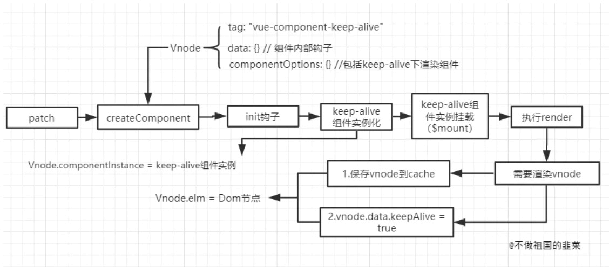
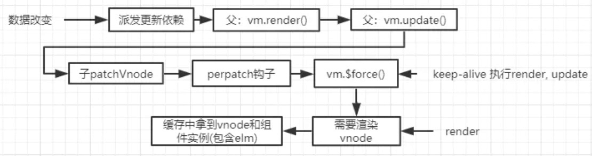

# keep-alive

它是我们日常开发中经常使用的组件，我们在不同组件间切换时，经常要求保持组件的状态，以避免重复渲染组件造成的性能损耗。

### 从模板编译到生成vnode

第一个疑问便是：内置组件和普通组件在编译过程有区别吗？答案是没有的，不管是内置的还是用户定义组件，本质上组件在模板编译成`render`函数的处理方式是一致的。

最终针对`keep-alive`的`render`函数的结果如下：

```js
with(this){···_c('keep-alive',{attrs:{"include":"child2"}},[_c(chooseTabs,{tag:"component"})],1)}
```

有了`render`函数，接下来从子开始到父会执行生成`Vnode`对象的过程，`_c('keep-alive'···)`的处理，会执行`createElement`生成组件`Vnode`,其中由于`keep-alive`是组件，所以会调用`createComponent`函数去创建子组件`Vnode`。

这个环节和创建普通组件`Vnode`不同之处在于，`keep-alive`的`Vnode`会剔除多余的属性内容，**由于`keep-alive`除了`slot`属性之外，其他属性在组件内部并没有意义，例如`class`样式，`<keep-alive clas="test"></keep-alive>`等，所以在`Vnode`层剔除掉多余的属性是有意义的。而`<keep-alive slot="test">`的写法在2.6以上的版本也已经被废弃。**

```js
// 创建子组件Vnode过程
function createComponent(Ctordata,context,children,tag) {
    // abstract是内置组件(抽象组件)的标志
    if (isTrue(Ctor.options.abstract)) {
        // 只保留slot属性，其他标签属性都被移除，在vnode对象上不再存在
        var slot = data.slot;
        data = {};
        if (slot) {
            data.slot = slot;
        }
    }
}
```

### 初次渲染

`keep-alive`之所以特别，是因为它不会重复渲染相同的组件，只会利用初次渲染保留的缓存去更新节点。所以为了全面了解它的实现原理，我们需要从`keep-alive`的首次渲染开始说起。

##### 流程图



和渲染普通组件相同的是，`Vue`会拿到前面生成的`Vnode`对象执行真实节点创建的过程，也就是熟悉的`patch`过程，`patch`执行阶段会调用`createElm`创建真实`dom`，在创建节点途中，`keep-alive`的`vnode`对象会被认定是一个组件`Vnode`，因此针对组件`Vnode`又会执行`createComponent`函数，它会对`keep-alive`组件进行初始化和实例化。

```js
function createComponent (vnode, insertedVnodeQueue, parentElm, refElm) {
      var i = vnode.data;
      if (isDef(i)) {
        // isReactivated用来判断组件是否缓存。
        // 存在组件实例，并且keepAlive返回为truthy
        var isReactivated = isDef(vnode.componentInstance) && i.keepAlive;
        if (isDef(i = i.hook) && isDef(i = i.init)) {
            // 执行组件初始化的内部钩子 init
          i(vnode, false /* hydrating */);
        }
        if (isDef(vnode.componentInstance)) {
          // 其中一个作用是保留真实dom到vnode中
          initComponent(vnode, insertedVnodeQueue);
          insert(parentElm, vnode.elm, refElm);
          // 如果存在缓存
          if (isTrue(isReactivated)) {
            reactivateComponent(vnode, insertedVnodeQueue, parentElm, refElm);
          }
          return true
        }
      }
    }
```

`keep-alive`组件会先调用内部钩子`init`方法进行初始化操作，我们先看看`init`过程做了什么操作。

```js
// 组件内部钩子
var componentVNodeHooks = {
    init: function init (vnode, hydrating) {
      if (
        vnode.componentInstance &&
        !vnode.componentInstance._isDestroyed &&
        vnode.data.keepAlive
      ) {
        // keep-alive components, treat as a patch
        var mountedNode = vnode; // work around flow
        componentVNodeHooks.prepatch(mountedNode, mountedNode);
      } else {
        // 将组件实例赋值给vnode的componentInstance属性
        var child = vnode.componentInstance = createComponentInstanceForVnode(
          vnode,
          activeInstance
        );
        child.$mount(hydrating ? vnode.elm : undefined, hydrating);
      }
    },
    // 后面分析
    prepatch： function() {}
}
```

第一次执行，很明显组件`vnode`没有`componentInstance`属性，`vnode.data.keepAlive`也没有值，所以会**调用`createComponentInstanceForVnode`方法进行组件实例化并将组件实例赋值给`vnode`的`componentInstance`属性，** 最终执行组件实例的`$mount`方法进行实例挂载。

`createComponentInstanceForVnode`就是组件实例化的过程，而组件实例化从系列的第一篇就开始说了，无非就是一系列选项合并，初始化事件，生命周期等初始化操作。

```js
function createComponentInstanceForVnode (vnode, parent) {
    var options = {
      _isComponent: true,
      _parentVnode: vnode,
      parent: parent
    };
    // 内联模板的处理，忽略这部分代码
    ···
    // 执行vue子组件实例化
    return new vnode.componentOptions.Ctor(options)
}
```

##### 内置组件选项

我们在使用组件的时候经常利用对象的形式定义组件选项，包括`data,method,computed`等，并在父组件或根组件中注册。`keep-alive`同样遵循这个道理，内置两字也说明了`keep-alive`是在`Vue`源码中内置好的选项配置，并且也已经注册到全局。

```js
// keepalive组件选项
  var KeepAlive = {
    name: 'keep-alive',
    // 抽象组件的标志
    abstract: true,
    // keep-alive允许使用的props
    props: {
      include: patternTypes,
      exclude: patternTypes,
      max: [String, Number]
    },

    created: function created () {
      // 缓存组件vnode
      this.cache = Object.create(null);
      // 缓存组件名
      this.keys = [];
    },

    destroyed: function destroyed () {
      for (var key in this.cache) {
        pruneCacheEntry(this.cache, key, this.keys);
      }
    },

    mounted: function mounted () {
      var this$1 = this;
      // 动态include和exclude
      // 对include exclue的监听
      this.$watch('include', function (val) {
        pruneCache(this$1, function (name) { return matches(val, name); });
      });
      this.$watch('exclude', function (val) {
        pruneCache(this$1, function (name) { return !matches(val, name); });
      });
    },
    // keep-alive的渲染函数
    render: function render () {
      // 拿到keep-alive下插槽的值
      var slot = this.$slots.default;
      // 第一个vnode节点
      var vnode = getFirstComponentChild(slot);
      // 拿到第一个组件实例
      var componentOptions = vnode && vnode.componentOptions;
      // keep-alive的第一个子组件实例存在
      if (componentOptions) {
        // check pattern
        //拿到第一个vnode节点的name
        // <keep-alive> 是用在其一个直属的子组件被开关的情形，要求只有一个子组件被渲染（除非条件渲染）
        var name = getComponentName(componentOptions);
        var ref = this;
        var include = ref.include;
        var exclude = ref.exclude;
        // 通过判断子组件是否满足缓存匹配
        if (
          // not included
          (include && (!name || !matches(include, name))) ||
          // excluded
          (exclude && name && matches(exclude, name))
        ) {
          // 不匹配缓存，或者匹配到了非缓存
          return vnode
        }

        var ref$1 = this;
        var cache = ref$1.cache;
        var keys = ref$1.keys; // 保存缓存的key
        var key = vnode.key == null
          ? componentOptions.Ctor.cid + (componentOptions.tag ? ("::" + (componentOptions.tag)) : '')
          : vnode.key;
          // 再次命中缓存
        if (cache[key]) {
          vnode.componentInstance = cache[key].componentInstance;
          // make current key freshest
          remove(keys, key);
          keys.push(key);
        } else {
        	// 初次渲染时，将vnode缓存
          cache[key] = vnode;
          keys.push(key);
          // prune oldest entry
          if (this.max && keys.length > parseInt(this.max)) {
            pruneCacheEntry(cache, keys[0], keys, this._vnode);
          }
        }
        // 为缓存组件打上标志
        vnode.data.keepAlive = true;
      }
      // 将渲染的vnode返回
      return vnode || (slot && slot[0])
    }
  };
```

`keep-alive`选项跟我们平时写的组件选项还是基本类似的，唯一的不同是`keep-ailve`组件没有用`template`而是使用`render`函数。`keep-alive`本质上只是存缓存和拿缓存的过程，并没有实际的节点渲染，所以使用`render`处理是最优的选择。

##### 缓存vnode

`keep-alive`在执行组件实例化之后会进行组件的挂载。而挂载`$mount`又回到`vm._render()`，`vm._update()`的过程。由于`keep-alive`拥有`render`函数，所以我们可以直接将焦点放在`render`函数的实现上。

首先是获取`keep-alive`下插槽的内容，也就是`keep-alive`需要渲染的子组件。例子中是`chil1 Vnode`对象，源码中对应`getFirstComponentChild`函数：

```js
  function getFirstComponentChild (children) {
    if (Array.isArray(children)) {
      for (var i = 0; i < children.length; i++) {
        var c = children[i];
        // 组件实例存在，则返回，理论上返回第一个组件vnode
        if (isDef(c) && (isDef(c.componentOptions) || isAsyncPlaceholder(c))) {
          return c
        }
      }
    }
  }
```

判断组件满足缓存的匹配条件，在`keep-alive`组件的使用过程中，`Vue`源码允许我们是用`include, exclude`来定义匹配条件，`include`规定了只有名称匹配的组件才会被缓存，`exclude`规定了任何名称匹配的组件都不会被缓存。

拿到子组件的实例后，我们需要先进行是否满足匹配条件的判断,**其中匹配的规则允许使用数组，字符串，正则的形式。**

```js
var include = ref.include;
var exclude = ref.exclude;
// 通过判断子组件是否满足缓存匹配
if (
    // not included
    (include && (!name || !matches(include, name))) ||
    // excluded
    (exclude && name && matches(exclude, name))
) {
    return vnode
}

// matches include和exclude支持数组，字符串和正则
function matches (pattern, name) {
    // 允许使用数组['child1', 'child2']
    if (Array.isArray(pattern)) {
        return pattern.indexOf(name) > -1
    } else if (typeof pattern === 'string') {
        // 允许使用字符串 child1,child2
        return pattern.split(',').indexOf(name) > -1
    } else if (isRegExp(pattern)) {
        // 允许使用正则 /^child{1,2}$/g
        return pattern.test(name)
    }
    /* istanbul ignore next */
    return false
}
```

如果组件不满足缓存的要求，则直接返回组件的`vnode`,不做任何处理，此时组件会进入正常的挂载环节。

`render`函数执行的关键一步是缓存`vnode`，由于是第一次执行`render`函数，选项中的`cache`和`keys`数据都没有值，其中`cache`是一个空对象，我们将用它来缓存`{ name: vnode }`枚举，而`keys`我们用来缓存组件名。 **因此我们在第一次渲染`keep-alive`时，会将需要渲染的子组件`vnode`进行缓存。**

```js
cache[key] = vnode;
keys.push(key);
```

将已经缓存的`vnode`打上标记, 并将子组件的`Vnode`返回： `vnode.data.keepAlive = true`

##### 真实节点的保存

我们再回到`createComponent`的逻辑，之前提到`createComponent`会先执行`keep-alive`组件的初始化流程，也包括了子组件的挂载。并且我们通过`componentInstance`拿到了`keep-alive`组件的实例，而接下来**重要的一步是将真实的`dom`保存再`vnode`中**。

```js
function createComponent(vnode, insertedVnodeQueue) {
    // ···
    if (isDef(vnode.componentInstance)) {
        // 其中一个作用是保留真实dom到vnode中
        initComponent(vnode, insertedVnodeQueue);
        // 将真实节点添加到父节点中
        insert(parentElm, vnode.elm, refElm);
        if (isTrue(isReactivated)) {
            reactivateComponent(vnode, insertedVnodeQueue, parentElm, refElm);
        }
        return true
    }
}
```

`insert`的源码不列举出来，它只是简单的调用操作`dom`的`api`,将子节点插入到父节点中，我们可以重点看看`initComponent`关键步骤的逻辑。

```js
function initComponent() {
    ···
    // vnode保留真实节点
    vnode.elm = vnode.componentInstance.$el;
    ···
}
```

为什么`keep-alive`需要一个`max`来限制缓存组件的数量。原因就是`keep-alive`缓存的组件数据除了包括`vnode`这一描述对象外，还保留着真实的`dom`节点,而我们知道真实节点对象是庞大的，所以大量保留缓存组件是耗费性能的。因此我们需要严格控制缓存的组件数量，而在缓存策略上也需要做优化

由于`isReactivated`为`false`,`reactivateComponent`函数也不会执行。至此`keep-alive`的初次渲染流程分析完毕。

**如果忽略步骤的分析，只对初次渲染流程做一个总结：内置的`keep-alive`组件，让子组件在第一次渲染的时候将`vnode`和真实的`elm`进行了缓存。**

### 抽象组件

这一节的最后顺便提一下上文提到的抽象组件的概念。`Vue`提供的内置组件都有一个描述组件类型的选项，这个选项就是`{ astract: true }`，它表明了该组件是抽象组件。

1. 抽象组件没有真实的节点，它在组件渲染阶段不会去解析渲染成真实的`dom`节点，而只是作为中间的数据过渡层处理，在`keep-alive`中是对组件缓存的处理。
2. 在我们介绍组件初始化的时候曾经说到父子组件会显式的建立一层关系，这层关系奠定了父子组件之间通信的基础。我们可以再次回顾一下`initLifecycle`的代码。

```js
Vue.prototype._init = function() {
    ···
    var vm = this;
    initLifecycle(vm)
}

function initLifecycle (vm) {
    var options = vm.$options;
    
    var parent = options.parent;
    if (parent && !options.abstract) {
      // 如果有abstract属性，一直往上层寻找，直到不是抽象组件
      while (parent.$options.abstract && parent.$parent) {
        parent = parent.$parent;
      }
      parent.$children.push(vm);
    }
    ···
}
```

子组件在注册阶段会把父实例挂载到自身选项的`parent`属性上，在`initLifecycle`过程中，会反向拿到`parent`上的父组件`vnode`,并为其`$children`属性添加该子组件`vnode`,如果在反向找父组件的过程中，父组件拥有`abstract`属性，即可判定该组件为抽象组件，此时利用`parent`的链条往上寻找，直到组件不是抽象组件为止。`initLifecycle`的处理，让每个组件都能找到上层的父组件以及下层的子组件，使得组件之间形成一个紧密的关系树。

`render`函数在初始渲染时，会将渲染的子`Vnode`进行缓存。同时**对应的子真实节点也会被缓存起来**。

## 再次渲染



### 流程分析

##### 重新渲染组件

```jsx
<!-- 模板 -->
<div id="app">
    <button @click="changeTabs('child1')">child1</button>
    <button @click="changeTabs('child2')">child2</button>
    <keep-alive>
      	<!-- 用 chooseTabs 控制切换显示 child1 和 child2 -->
        <component :is="chooseTabs">
        </component>
    </keep-alive>
</div>

var child1 = {
    template: '<div><button @click="add">add</button><p>{{num}}</p></div>',
    data() {
        return {
            num: 1
        }
    },
    methods: {
        add() {
            this.num++
        }
    },
    mounted() {
        console.log('child1 mounted')
    },
    activated() {
        console.log('child1 activated')
    },
    deactivated() {
        console.log('child1 deactivated')
    },
    destoryed() {
        console.log('child1 destoryed')
    }
}
var child2 = {
    template: '<div>child2</div>',
    mounted() {
        console.log('child2 mounted')
    },
    activated() {
        console.log('child2 activated')
    },
    deactivated() {
        console.log('child2 deactivated')
    },
    destoryed() {
        console.log('child2 destoryed')
    }
}

var vm = new Vue({
    el: '#app',
    components: {
        child1,
        child2,
    },
    data() {
        return {
            chooseTabs: 'child1',
        }
    },
    methods: {
        changeTabs(tab) {
            this.chooseTabs = tab;
        }
    }
})
```

在这个例子中，动态组件中`chooseTabs`数据的变化会引起依赖派发更新的过程。简单来说，在初始化阶段会收集使用到`chooseTabs`的相关依赖。当数据发生改变时，收集过的依赖会进行派发更新操作。

父组件中负责实例挂载子组件的过程会被当做更新，即执行父组件的`vm._update(vm._render(), hydrating);`。

`_render`和`_update`分别代表两个过程，其中`_render`函数会根据数据的变化为组件生成新的`Vnode`节点，而`_update`最终会为新的`Vnode`生成真实的节点。而在生成真实节点的过程中，会利用`vitrual dom`的`diff`算法对前后`vnode`节点进行对比，使之尽可能少的更改真实节点

`patch`是新旧`Vnode`节点对比的过程，而`patchVnode`是其中核心的步骤，我们忽略`patchVnode`其他的流程，关注到其中对子组件执行`prepatch`钩子的过程中。

```js
function patchVnode (oldVnode,vnode,insertedVnodeQueue,ownerArray,index,removeOnly) {
    ···
    // 新vnode  执行prepatch钩子
    if (isDef(data) && isDef(i = data.hook) && isDef(i = i.prepatch)) {
        i(oldVnode, vnode);
    }
    ···
}
```

执行`prepatch`钩子时会拿到新旧组件的实例并执行`updateChildComponent`函数。而`updateChildComponent`会对针对新的组件实例对旧实例进行状态的更新，包括`props,listeners`等，最终会**调用`vue`提供的全局`vm.$forceUpdate()`方法进行实例的重新渲染。**

```js
var componentVNodeHooks = {
    // 之前分析的init钩子 
    init: function() {
      // ...
    },
    prepatch: function prepatch (oldVnode, vnode) {
        // 新组件实例
      var options = vnode.componentOptions;
      // 旧组件实例
      var child = vnode.componentInstance = oldVnode.componentInstance;
      updateChildComponent(
        child,
        options.propsData, // updated props
        options.listeners, // updated listeners
        vnode, // new parent vnode
        options.children // new children
      );
    },
}

function updateChildComponent() {
    // 更新旧的状态，不分析这个过程
    ···
    // 迫使实例重新渲染。
    vm.$forceUpdate();
}
```

先看看`$forceUpdate`做了什么操作。`$forceUpdate`是源码对外暴露的一个api，他们迫使`Vue`实例重新渲染，本质上是执行实例所收集的依赖，在下面的例子中`watcher`对应的是`keep-alive`的`vm._update(vm._render(), hydrating);`过程。

```js
Vue.prototype.$forceUpdate = function () {
    var vm = this;
    if (vm._watcher) {
      vm._watcher.update();
    }
};
```

##### 重用缓存组件

由于`vm.$forceUpdate()`会强迫`keep-alive`组件进行重新渲染，因此`keep-alive`组件会再一次执行`render`过程。这一次由于第一次对`vnode`的缓存，`keep-alive`在实例的`cache`对象中找到了缓存的组件。

```js
// keepalive组件选项
var keepAlive = {
    name: 'keep-alive',
    abstract: true,
    render: function render () {
      // 拿到keep-alive下插槽的值
      var slot = this.$slots.default;
      // 第一个vnode节点
      var vnode = getFirstComponentChild(slot);
      // 拿到第一个组件实例
      var componentOptions = vnode && vnode.componentOptions;
      // keep-alive的第一个子组件实例存在
      if (componentOptions) {
        // check pattern
        //拿到第一个vnode节点的name
        var name = getComponentName(componentOptions);
        var ref = this;
        var include = ref.include;
        var exclude = ref.exclude;
        // 通过判断子组件是否满足缓存匹配
        if (
          // not included
          (include && (!name || !matches(include, name))) ||
          // excluded
          (exclude && name && matches(exclude, name))
        ) {
          return vnode
        }

        var ref$1 = this;
        var cache = ref$1.cache;
        var keys = ref$1.keys;
        var key = vnode.key == null ? componentOptions.Ctor.cid + (componentOptions.tag ? ("::" + (componentOptions.tag)) : '')
          : vnode.key;
          // ==== 关注点在这里 ====
        if (cache[key]) {
          // 直接取出缓存组件
          vnode.componentInstance = cache[key].componentInstance;
          // keys命中的组件名移到数组末端
          remove(keys, key);
          keys.push(key);
        } else {
        // 初次渲染时，将vnode缓存
          cache[key] = vnode;
          keys.push(key);
          // prune oldest entry
          if (this.max && keys.length > parseInt(this.max)) {
            pruneCacheEntry(cache, keys[0], keys, this._vnode);
          }
        }

        vnode.data.keepAlive = true;
      }
      return vnode || (slot && slot[0])
    }
}
```

由于`cache`对象中存储了再次使用的`vnode`对象，所以直接通过`cache[key]`取出缓存的组件实例并赋值给`vnode`的`componentInstance`属性。

##### 真实节点的替换

执行了`keep-alive`组件的`_render`过程，接下来是`_update`产生真实的节点，同样的，`keep-alive`下有`child1`子组件，所以`_update`过程会调用`createComponent`递归创建子组件`vnode`。

```js
function createComponent (vnode, insertedVnodeQueue, parentElm, refElm) {
    // vnode为缓存的vnode
    var i = vnode.data;
    if (isDef(i)) {
      // 此时isReactivated为true
      var isReactivated = isDef(vnode.componentInstance) && i.keepAlive;
      if (isDef(i = i.hook) && isDef(i = i.init)) {
        i(vnode, false /* hydrating */);
      }
      if (isDef(vnode.componentInstance)) {
          // 其中一个作用是保留真实dom到vnode中
          initComponent(vnode, insertedVnodeQueue);
          insert(parentElm, vnode.elm, refElm);
          if (isTrue(isReactivated)) {
            reactivateComponent(vnode, insertedVnodeQueue, parentElm, refElm);
          }
          return true
      }
   }
}
```

**此时的`vnode`是缓存取出的子组件`vnode`**，并且由于在第一次渲染时对组件进行了标记`vnode.data.keepAlive = true;，`所以`isReactivated`的值为`true`，`i.init`依旧会执行子组件的初始化过程。但是这个过程由于有缓存，所以执行过程也不完全相同。

```js
var componentVNodeHooks = {
    init: function init (vnode, hydrating) {
      if (
        vnode.componentInstance &&
        !vnode.componentInstance._isDestroyed &&
        vnode.data.keepAlive
      ) {
        // 当有keepAlive标志时，执行prepatch钩子
        var mountedNode = vnode; // work around flow
        componentVNodeHooks.prepatch(mountedNode, mountedNode);
      } else {
        var child = vnode.componentInstance = createComponentInstanceForVnode(
          vnode,
          activeInstance
        );
        child.$mount(hydrating ? vnode.elm : undefined, hydrating);
      }
    },
}
```

因为有`keepAlive`的标志，所以子组件不再走挂载流程，只是执行`prepatch`钩子对组件状态进行更新。并且很好的利用了缓存`vnode`之前保留的真实节点进行节点的替换。

### 生命周期

##### deactivated

我们先从组件的销毁开始说起，当`child1`切换到`child2`时，`child1`会执行`deactivated`钩子而不是`destoryed`钩子，这是为什么？ 前面分析`patch`过程会对新旧节点的改变进行对比，从而尽可能范围小的去操作真实节点，当完成`diff`算法并对节点操作完毕后，接下来还有一个重要的步骤是**对旧的组件执行销毁移除操作**。这一步的代码如下：

```js
function patch(···) {
  // 分析过的patchVnode过程
  // 销毁旧节点
  if (isDef(parentElm)) {
    removeVnodes(parentElm, [oldVnode], 0, 0);
  } else if (isDef(oldVnode.tag)) {
    invokeDestroyHook(oldVnode);
  }
}

function removeVnodes (parentElm, vnodes, startIdx, endIdx) {
  // startIdx,endIdx都为0
  for (; startIdx <= endIdx; ++startIdx) {
    // ch 会拿到需要销毁的组件
    var ch = vnodes[startIdx];
    if (isDef(ch)) {
      if (isDef(ch.tag)) {
        // 真实节点的移除操作
        removeAndInvokeRemoveHook(ch);
        invokeDestroyHook(ch);
      } else { // Text node
        removeNode(ch.elm);
      }
    }
  }
}
```

`removeAndInvokeRemoveHook`会对旧的节点进行移除操作，其中关键的一步是会将真实节点从父元素中删除，有兴趣可以自行查看这部分逻辑。`invokeDestroyHook`是执行销毁组件钩子的核心。如果该组件下存在子组件，会递归去调用`invokeDestroyHook`执行销毁操作。销毁过程会执行组件内部的`destory`钩子。

```js
function invokeDestroyHook (vnode) {
    var i, j;
    var data = vnode.data;
    if (isDef(data)) {
      if (isDef(i = data.hook) && isDef(i = i.destroy)) { i(vnode); }
      // 执行组件内部destroy钩子
      for (i = 0; i < cbs.destroy.length; ++i) { cbs.destroy[i](vnode); }
    }
    // 如果组件存在子组件，则遍历子组件去递归调用invokeDestoryHook执行钩子
    if (isDef(i = vnode.children)) {
      for (j = 0; j < vnode.children.length; ++j) {
        invokeDestroyHook(vnode.children[j]);
      }
    }
}
```

组件内部钩子前面已经介绍了`init`和`prepatch`钩子，而`destroy`钩子的逻辑更加简单。

```js
var componentVNodeHooks = {
  destroy: function destroy (vnode) {
    // 组件实例
    var componentInstance = vnode.componentInstance;
    // 如果实例还未被销毁
    if (!componentInstance._isDestroyed) {
      // 不是keep-alive组件则执行销毁操作
      if (!vnode.data.keepAlive) {
        componentInstance.$destroy();
      } else {
        // 如果是已经缓存的组件
        deactivateChildComponent(componentInstance, true /* direct */);
      }
    }
  }
}
```

当组件是`keep-alive`缓存过的组件，即已经用`keepAlive`标记过，则不会执行实例的销毁，即`componentInstance.$destroy()`的过程。`$destroy`过程会做一系列的组件销毁操作，其中的`beforeDestroy,destoryed`钩子也是在`$destory`过程中调用，而`deactivateChildComponent`的处理过程却完全不同。

```js
function deactivateChildComponent (vm, direct) {
  if (direct) {
    // 
    vm._directInactive = true;
    if (isInInactiveTree(vm)) {
      return
    }
  }
  if (!vm._inactive) {
    // 已被停用
    vm._inactive = true;
    // 对子组件同样会执行停用处理
    for (var i = 0; i < vm.$children.length; i++) {
      deactivateChildComponent(vm.$children[i]);
    }
    // 最终调用deactivated钩子
    callHook(vm, 'deactivated');
  }
}
```

`_directInactive`是用来标记这个被打上停用标签的组件是否是最顶层的组件。而`_inactive`是停用的标志，同样的子组件也需要递归去调用`deactivateChildComponent`，打上停用的标记。**最终会执行用户定义的`deactivated`钩子。**

##### activated

现在回过头看看`activated`的执行时机，同样是`patch`过程，在对旧节点移除并执行销毁或者停用的钩子后，对新节点也会执行相应的钩子。**这也是停用的钩子比启用的钩子先执行的原因。**

```js
function patch(···) {
  // patchVnode过程
  // 销毁旧节点
  {
    if (isDef(parentElm)) {
      removeVnodes(parentElm, [oldVnode], 0, 0);
    } else if (isDef(oldVnode.tag)) {
      invokeDestroyHook(oldVnode);
    }
  }
  // 执行组件内部的insert钩子
  invokeInsertHook(vnode, insertedVnodeQueue, isInitialPatch);
}

function invokeInsertHook (vnode, queue, initial) {
  // delay insert hooks for component root nodes, invoke them after the
  // 当节点已经被插入时，会延迟执行insert钩子
  if (isTrue(initial) && isDef(vnode.parent)) {
    vnode.parent.data.pendingInsert = queue;
  } else {
    for (var i = 0; i < queue.length; ++i) {
      queue[i].data.hook.insert(queue[i]);
    }
  }
}
```

同样的组件内部的`insert`钩子逻辑如下：

```js
  // 组件内部自带钩子
  var componentVNodeHooks = {
    insert: function insert (vnode) {
      var context = vnode.context;
      var componentInstance = vnode.componentInstance;
      // 实例已经被挂载
      if (!componentInstance._isMounted) {
        componentInstance._isMounted = true;
        callHook(componentInstance, 'mounted');
      }
      if (vnode.data.keepAlive) {
        if (context._isMounted) {
          // vue-router#1212
          // During updates, a kept-alive component's child components may
          // change, so directly walking the tree here may call activated hooks
          // on incorrect children. Instead we push them into a queue which will
          // be processed after the whole patch process ended.
          queueActivatedComponent(componentInstance);
        } else {
          activateChildComponent(componentInstance, true /* direct */);
        }
      }
    },
  }
```

当第一次实例化组件时，由于实例的`_isMounted`不存在，所以会调用`mounted`钩子，当我们从`child2`再次切回`child1`时，由于`child1`只是被停用而没有被销毁，所以不会再调用`mounted`钩子，此时会执行`activateChildComponent`函数对组件的状态进行处理。有了分析`deactivateChildComponent`的基础，`activateChildComponent`的逻辑也很好理解，同样的`_inactive`标记为已启用，并且对子组件递归调用`activateChildComponent`做状态处理。

```js
function activateChildComponent (vm, direct) {
  if (direct) {
    vm._directInactive = false;
    if (isInInactiveTree(vm)) {
      return
    }
  } else if (vm._directInactive) {
    return
  }
  if (vm._inactive || vm._inactive === null) {
    vm._inactive = false;
    for (var i = 0; i < vm.$children.length; i++) {
      activateChildComponent(vm.$children[i]);
    }
    callHook(vm, 'activated');
  }
}
```

### 缓存优化 - LRU

程序的内存空间是有限的，所以我们无法无节制的对数据进行存储，这时候需要有策略去淘汰不那么重要的数据，保持最大数据存储量的一致。这种类型的策略称为缓存优化策略，根据淘汰的机制不同，常用的有以下三类。

- **1. FIFO： 先进先出策略，我们通过记录数据使用的时间，当缓存大小即将溢出时，优先清除离当前时间最远的数据。**
- **2. LRU： 最近最少使用。LRU策略遵循的原则是，如果数据最近被访问(使用)过，那么将来被访问的几率会更高，如果以一个数组去记录数据，当有一数据被访问时，该数据会被移动到数组的末尾，表明最近被使用过，当缓存溢出时，会删除数组的头部数据，即将最不频繁使用的数据移除。**
- **3. LFU: 计数最少策略。用次数去标记数据使用频率，次数最少的会在缓存溢出时被淘汰。**

这三种缓存算法各有优劣，各自适用不同场景，而我们看`keep-alive`在缓存时的优化处理，很明显利用了`LRU`的缓存策略。

```js
var keepAlive = {
  render: function() {
    // ···
    if (cache[key]) {
      vnode.componentInstance = cache[key].componentInstance;
      remove(keys, key);
      keys.push(key);
    } else {
      cache[key] = vnode;
      keys.push(key);
      if (this.max && keys.length > parseInt(this.max)) {
        pruneCacheEntry(cache, keys[0], keys, this._vnode);
      }
    }
  }
}

function remove (arr, item) {
  // 删除头部不常用的key
  if (arr.length) {
    var index = arr.indexOf(item);
    if (index > -1) {
      return arr.splice(index, 1)
    }
  }
}
```

结合一个实际的例子分析缓存逻辑的实现：

1. 有三个组件`child1,child2,child3`,`keep-alive`的最大缓存个数设置为2

2. 用`cache`对象去存储组件`vnode`,`key`为组件名字，`value`为组件`vnode`对象，用`keys`数组去记录组件名字，由于是数组，所以`keys`为有序。

3. `child1,child2`组件依次访问，缓存结果为：

   ```JS
   keys = ['child1', 'child2']
   cache = {
     child1: child1Vnode,
     child2: child2Vnode
   }
   ```

4. 再次访问到`child1`组件，由于命中了缓存，会调用`remove`方法把`keys`中的`child1`删除，并通过数组的`push`方法将`child1`推到尾部。缓存结果修改为：

   ```js
   keys = ['child2', 'child1']
   cache = {
     child1: child1Vnode,
     child2: child2Vnode
   }
   ```

5. 访问到`child3`时，由于缓存个数限制，初次缓存会执行`pruneCacheEntry`方法对最少访问到的数据进行删除。`pruneCacheEntry`的定义如下：

   ```js
   function pruneCacheEntry (cache,key,keys,current) {
       var cached$$1 = cache[key];
       // 销毁实例
       if (cached$$1 && (!current || cached$$1.tag !== current.tag)) {
         cached$$1.componentInstance.$destroy();
       }
       cache[key] = null;
       remove(keys, key);
   }
   ```

6. 删除缓存时会把`keys[0]`代表的组件删除，由于之前的处理，最近被访问到的元素会位于数组的尾部，所以头部的数据往往是最少访问的，因此会优先删除头部的元素。并且会再次调用`remove`方法，将`keys`的首个元素删除。

