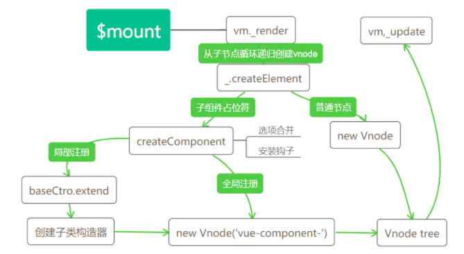

# 深入剖析Vue源码 - 组件基础

### 组件两种注册方式

##### 全局注册

```js
Vue.component('my-test', {
    template: '<div>{{test}}</div>',
    data () {
        return {
            test: 1212
        }
    }
})
var vm = new Vue({
    el: '#app',
    template: '<div id="app"><my-test><my-test/></div>'
})
```

**其中组件的全局注册需要在全局实例化Vue前调用**，注册之后可以用在任何新创建的`Vue`实例中调用。

##### 局部注册

```js
var myTest = {
    template: '<div>{{test}}</div>',
    data () {
        return {
            test: 1212
        }
    }
}
var vm = new Vue({
    el: '#app',
    component: {
        myTest
    }
})
```

当只需要在某个局部用到某个组件时，可以使用局部注册的方式进行组件注册，此时局部注册的组件只能在注册该组件内部使用。

##### 注册过程

来看注册过程到底发生了什么，我们以全局组件注册为例，它通过`Vue.component(name, {...})`进行组件注册，`Vue.component`是在`Vue`源码引入阶段定义的静态方法：

```js
/** src/core/global-api/index.js */
initUse(Vue)
initMixin(Vue)
initExtend(Vue)
// 初始化全局api
initAssetRegisters(Vue);

/** shared/constants */
var ASSET_TYPES = [
    'component',
    'directive',
    'filter'
];

/** vue/src/core/global-api/assets.js */
function initAssetRegisters(Vue){
    // 定义ASSET_TYPES中每个属性的方法，其中包括Vue.component
    ASSET_TYPES.forEach(function (type) {
    // type: component,directive,filter
      Vue[type] = function (id,definition) {
          if (!definition) {
            // 直接返回注册组件的构造函数
            // 返回组件实例options里对应名称的属性
            return this.options[type + 's'][id]
          }
          ...
          if (type === 'component') {
            // 验证component组件名字是否合法
            validateComponentName(id);
          }
          if (type === 'component' && isPlainObject(definition)) {
            // 组件名称设置
            definition.name = definition.name || id;
            // Vue.extend() 创建子组件，返回子类构造器
            definition = this.options._base.extend(definition);
          }
          // 为Vue.options 上的component属性添加将子类构造器
          this.options[type + 's'][id] = definition;
          return definition
        }
    });
}
```

`Vue.components`有两个参数，一个是需要注册组件的组件名，另一个是组件选项，如果第二个参数没有传递，则会直接返回注册过的组件选项。否则意味着需要对该组件进行注册，注册过程先会对组件名的合法性进行检测，要求组件名不允许出现非法的标签，包括`Vue`内置的组件名，如`slot, component`等。

```js
function validateComponentName(name) {
    if (!new RegExp(("^[a-zA-Z][\\-\\.0-9_" + (unicodeRegExp.source) + "]*$")).test(name)) {
      // 正则判断检测是否为非法的标签
      warn(
        'Invalid component name: "' + name + '". Component names ' +
        'should conform to valid custom element name in html5 specification.'
      );
    }
    // 不能使用Vue自身自定义的组件名，如slot, component,不能使用html的保留标签，如 h1, svg等
    if (isBuiltInTag(name) || config.isReservedTag(name)) {
      warn(
        'Do not use built-in or reserved HTML elements as component ' +
        'id: ' + name
      );
    }
  }
```

在经过组件名的合法性检测后，会调用`extend`方法为组件创建一个子类构造器，此时的`this.options._base`代表的就是`Vue`构造器。`extend` 会**基于父类去创建一个子类**，此时的父类是`Vue`，并且创建过程子类会继承父类的方法，并会和父类的选项进行合并，最终返回一个子类构造器。

代码处还有一个逻辑，`Vue.component()`默认会把第一个参数作为组件名称，但是如果组件选项有`name`属性时，`name`属性值会将组件名覆盖。

**总结起来，全局注册组件就是`Vue`实例化前创建一个基于`Vue`的子类构造器，并将组件的信息加载到实例`options.components`对象中。**

### 组件Vnode创建

该作者的上一篇文章（[作者掘金](https://juejin.cn/user/1574156379623774)）介绍过`Vue`将一个模板通过`_render`函数的转换，最终生成一个`Vnode tree`。在不包含组件的情况下，`_render`函数的最后一步是直接调用`new Vnode`去创建一个完整的`Vnode tree`。然而有一大部分的分支我们并没有分析，那就是遇到组件占位符的场景。执行阶段如果遇到组件，处理过程要比想像中复杂得多，我们通过一张流程图展开分析。

##### Vnode创建流程图



##### 具体流程分析

我们结合实际的例子对照着流程图分析一下这个过程：

- 场景

  ```js
  Vue.component('test', {
    template: '<span></span>'
  })
  var vm = new Vue({
    el: '#app',
    template: '<div><test></test></div>'
  })
  ```

- 父`render`函数

  ```js
  function() {
    with(this){return _c('div',[_c('test')],1)}
  }
  ```

  

- `Vue`根实例初始化会执行 `vm.$mount(vm.$options.el)`实例挂载的过程，按照之前的逻辑，完整流程会经历`render`函数生成`Vnode`,以及`Vnode`生成真实`DOM`的过程。

- `render`函数生成`Vnode`过程中，子会优先父执行生成`Vnode`过程,也就是`_c('test')`函数会先被执行。`'test'`会先判断是普通的`html`标签还是组件的占位符。

  如果为一般标签，会执行`new Vnode`过程；如果是组件的占位符，则会在判断组件已经被注册过的前提下进入`createComponent`创建子组件`Vnode`的过程。

- `createComponent`是创建组件`Vnode`的过程，创建过程会再次合并选项配置，并安装组件相关的内部钩子(后面文章会再次提到内部钩子的作用)，最后通过`new Vnode()`生成以`vue-component`开头的`Virtual DOM`

- `render`函数执行过程也是一个循环递归调用创建`Vnode`的过程，执行3，4步之后，完整的生成了一个包含各个子组件的`Vnode tree`


