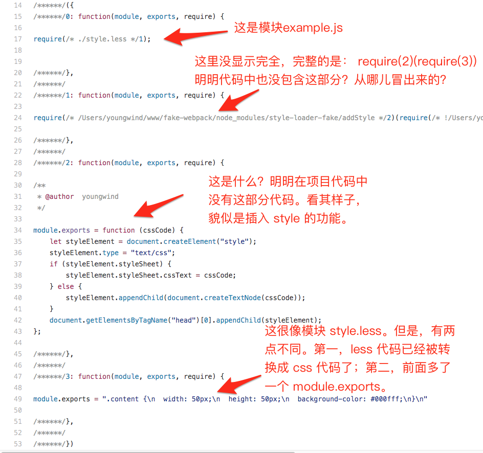

想要加载 less 文件，我们需要配置三个 loader：style-loader，css-loader，less-loader。

最终输出文件：

1. 最终 css 代码会被插入到 head 标签中，那么一定是模块2在起作用。但是，项目中并不包含这部分代码，经过排查，发现源自于 node-modules/style-loader/addStyle.js ，也就是说，是由 style-loader 引入的。
2. 观察模块3，那应该是 less 代码经过 less-loader 的转换之后，再包装一层 module.exports，成为一个 JS module。
3. css-loader 用来解决 **@import 和 url()**（我们实现的时候先不考虑 css-loader 的实现）
4. 观察模块1，`require(2)(require(3))`，很显然：”模块3的导出作为模块2的输入参数，执行模块2“，也就是说：“将模块3中的 css 代码插入到 head 标签中“。理解这个逻辑不难，难点在于：**webpack 如何知道应该拼接成 `require(2)(require(3))`，而不是别的什么。也就说，如何控制拼接出 `require(2)(require(3))`？**

