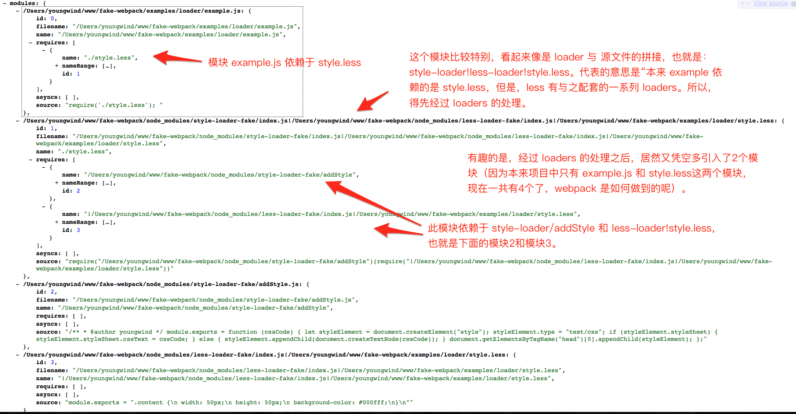

想要加载 less 文件，我们需要配置三个 loader：style-loader，css-loader，less-loader。

最终输出文件：


1. 最终 css 代码会被插入到 head 标签中，那么一定是模块2在起作用。但是，项目中并不包含这部分代码，经过排查，发现源自于 node-modules/style-loader/addStyle.js ，也就是说，是由 style-loader 引入的。
2. 观察模块3，那应该是 less 代码经过 less-loader 的转换之后，再包装一层 module.exports，成为一个 JS module。
3. css-loader 用来解决 **@import 和 url()**（我们实现的时候先不考虑 css-loader 的实现）
4. 观察模块1，`require(2)(require(3))`，很显然：”模块3的导出作为模块2的输入参数，执行模块2“，也就是说：“将模块3中的 css 代码插入到 head 标签中“。理解这个逻辑不难，难点在于：**webpack 如何知道应该拼接成 `require(2)(require(3))`，而不是别的什么。也就说，如何控制拼接出 `require(2)(require(3))`？**

只分析 output.js 还不足以理清，那么，让我们更进一步，观察 depTree（后缀`*-fake`表示是我们模拟的loader）：



问题在于：**为什么凭空多出来2个模块？到底是哪里起了作用呢？**

## style-loader 的再 require

```js
// style-loader/index.js
const path = require('path');
module.exports = function (content) { // content 的值为：/Users/youngwind/www/fake-webpack/node_modules/style-loader-fake/index.js!/Users/youngwind/www/fake-webpack/node_modules/less-loader-fake/index.js!/Users/youngwind/www/fake-webpack/examples/loader/style.less
    let loaderSign = this.request.indexOf("!");
    let rawCss = this.request.substr(loaderSign); // rawCss 的值为：/Users/youngwind/www/fake-webpack/node_modules/less-loader-fake/index.js!/Users/youngwind/www/fake-webpack/examples/loader/style.less
    return "require(" + JSON.stringify(path.join(__dirname, 'addStyle')) + ")" +
        "(require(" + JSON.stringify(rawCss) + "))";
};
```

观察源码，我们发现：style-loader **返回的字符串里面又包含了2个 require**，分别 require 了 addStyle 和 less-loader!style.less，由此，我们终于找到了突破口。loader 本质上是一个函数，输入参数是一个字符串，输出参数也是一个字符串。当然，输出的参数会被当成是 JS 代码，从而被 esprima 解析成 AST，触发进一步的依赖解析。 这就是多引入2个模块的原因。

## loaders 的拆解与运行

loaders 就像首尾相接的管道那样，**从右到左**地被依次运行。对应的代码如下：

```js
// buildDep.js
/**
 * 运算文件类型对应的 loaders，比如: less 文件对应 style-loader 和 less-loader
 * 这些 loaders 本质上是一些处理字符串的函数,输入是一个字符串,输出是另一个字符串,从右到左串行执行。
 * @param {string} request 相当于 filenamesWithLoader ,比如 /Users/youngwind/www/fake-webpack/node_modules/fake-style-loader/index.js!/Users/youngwind/www/fake-webpack/node_modules/fake-less-loader/index.js!/Users/youngwind/www/fake-webpack/examples/loader/style.less
 * @param {array} loaders 此类型文件对应的loaders
 * @param {string} content 文件内容
 * @param {object} options 选项
 * @returns {Promise}
 */
function execLoaders(request, loaders, content, options) {
    return new Promise((resolve, reject) => {
        // 当所有 loader 都执行完了，输出最终的字符串
        if (!loaders.length) {
            resolve(content);
            return;
        }

        let loaderFunctions = [];
        loaders.forEach(loaderName => {
            let loader = require(loaderName);
            // 每个loader 本质上是一个函数
            loaderFunctions.push(loader);
        });

        nextLoader(content);

        /***
         * 调用下一个 loader
         * @param {string} content 上一个loader的输出字符串
         */
        function nextLoader(content) {
            if (!loaderFunctions.length) {
                resolve(content);
                return;
            }
            // 请注意: loader有同步和异步两种类型。对于异步loader,如 less-loader,
            // 需要执行 async() 和 callback(),以修改标志位和回传字符串
            let async = false;
            let context = {
                request,
                async: () => {
                    async = true; // 假如传入的模块是异步loader，会执行这个async函数
                },
                callback: (content) => {
                    nextLoader(content);
                }
            };

            // 就是在这儿逐个调用 loader
            let ret = loaderFunctions.pop().call(context, content);
            if(!async) {
                // 递归调用下一个 loader
                nextLoader(ret);
            }
        }
    });

}
```

如上代码表示：将加载后的loader放入一个数组，然后递归执行loader。

请注意：**loader 也是分为同步和异步两种的，比如 style-loader 是同步的（看源码就知道，直接 return）；而 less-loader 却是异步的，为什么呢？**

## 异步的 less-loader

```js
// less-loader
const less = require('less');

module.exports = function (source) {
    // 声明此 loader 是异步的
    this.async();
    let resultCb = this.callback;
    less.render(source, (e, output) => {
        if (e) {
            throw `less解析出现错误: ${e}, ${e.stack}`;
        }
        resultCb("module.exports = " + JSON.stringify(output.css));
    });
}
```

less-loader 本质上只是调用了 less 本身的 render 方法，由于 less.render 是异步的，less-loader 肯定也得异步，所以需要通过回调函数来获取其解析之后的 css 代码。

## node-modules 的逐级查找

试想以下情景：webpack 检测到当前为 less 文件，需要找到 style-loader 和 less-loader 运行。但是，webpack 怎么知道这两个 loader 藏在哪个目录下面呢？他们可能藏在 example.js 所在目录的任意上层文件夹的 node-modules 中。

```js
// resolve.js
/**
 * 根据 loaders / 模块名,生成待查找的路径集合
 * @param {string} context 入口文件所在目录
 * @param {array} identifiers 可能是loader的集合,也可能是模块名
 * @returns {Array}
 */
function generateDirs(context, identifiers) {
    let dirs = [];
    for (let identifier of identifiers) {
        if (path.isAbsolute(identifier)) {
            // 绝对路径
            if (!path.extname(identifier)) {
                identifier += '.js';
            }
            dirs.push(identifier);
        } else if (identifier.startsWith('./') || identifier.startsWith('../')) {
            // 相对路径
            dirs.push(path.resolve(context, identifier));
        } else {
            // 模块名,需要逐级生成目录
            let ext = path.extname(identifier);
            if (!ext) {
                ext = '.js';
            }
            let paths = context.split(path.sep); // 兼容不同平台的分隔符，Windows 上是 '\'，POSIX 上是 '/'
            let tempPaths = paths.slice();
            for (let folder of tempPaths) {
                let newContext = paths.join(path.sep);
                dirs.push(path.resolve(newContext, './node_modules', `./${identifier}-loader-fake`, `index${ext}`));
                paths.pop();
            }
        }
    }
    return dirs;
}
```

程序按照顺序依次查找，直到找到为止或者最终找不到抛出错误。

