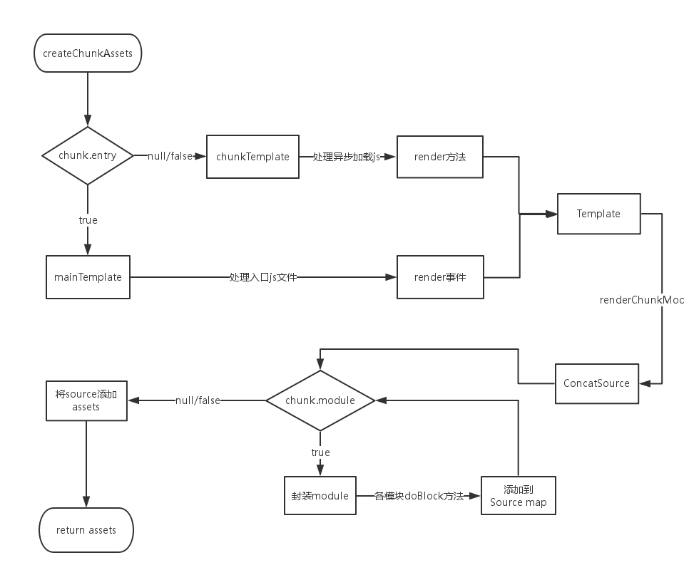

# webpack

### 准备工作

##### webstorm 中配置 webpack-webstorm-debugger-script

在开始了解之前，必须要能对 webpack 整个流程进行 debug ，配置过程比较简单。

先将 [webpack-webstorm-debugger-script](https://www.npmjs.com/package/webpack-webstorm-debugger-script) 中的 `webstorm-debugger.js` 置于`webpack.config.js` 的同一目录下，搭建好你的脚手架后就可以直接 Debug 这个 webstorm-debugger.js 文件了

webpack 的一些核心概念：

- **loader**：能转换各类资源，并处理成对应模块的加载器。loader 间可以串行使用。
- **chunk**：code splitting 后的产物，也就是按需加载的分块，装载了不同的 module。
- **plugin**：webpack 的插件实体

```js
function UglifyJsPlugin(options) {
  this.options = options;
}

module.exports = UglifyJsPlugin;

UglifyJsPlugin.prototype.apply = function(compiler) {
  compiler.plugin("compilation", function(compilation) {
    compilation.plugin("build-module", function(module) {
    });
    compilation.plugin("optimize-chunk-assets", function(chunks, callback) {
      // Uglify 逻辑
    });
    compilation.plugin("normal-module-loader", function(context) {
    });
  });
};
```

> **Tapable** 是一个类似于 Node.js 中的 EventEmitter的库，但更专注于自定义事件的触发和处理。webpack 通过 Tapable 将实现与流程解耦，所有具体实现通过插件的形式存在。
>
> Tapable就是一个事件对象，存储各种事件队列回调函数（这些回调就是plugin apply注册的函数）tapable可以通过applyPlugins，applyPluginsAsync来同步或者异步的回调这些函数。

### shell 与 config 解析

每次在命令行输入 webpack 后，操作系统都会去调用 `./node_modules/.bin/webpack` 这个 shell 脚本。这个脚本会去调用 `./node_modules/webpack/bin/webpack.js` 并追加输入的参数，如 -p , -w 。

在 webpack.js 这个文件中 webpack 通过 optimist 将用户配置的 webpack.config.js 和 shell 脚本传过来的参数整合成 options 对象传到了下一个流程的控制对象中。

##### optimist

和 commander 一样，optimist 实现了 node 命令行的解析，其 API 调用非常方便。

 ```js
 var optimist = require("optimist");
 
 optimist
   .boolean("json").alias("json", "j").describe("json")
   .boolean("colors").alias("colors", "c").describe("colors")
   .boolean("watch").alias("watch", "w").describe("watch")
 ```

获取到后缀参数后，optimist 分析参数并以键值对的形式把参数对象保存在 optimist.argv 中，来看看 argv 究竟有什么？

```js
// webpack --hot -w
{
  hot: true,
  profile: false,
  watch: true,
}
```

##### config 合并与插件加载

在加载插件之前，webpack 将 webpack.config.js 中的各个配置项拷贝到 options 对象中，并加载用户配置在 webpack.config.js 的 plugins 。接着 optimist.argv 会被传入到`./node_modules/webpack/bin/convert-argv.js` 中，通过判断 argv 中参数的值决定是否去加载对应插件。

```js
ifBooleanArg("hot", function() {
  ensureArray(options, "plugins");
  var HotModuleReplacementPlugin = require("../lib/HotModuleReplacementPlugin");
  options.plugins.push(new HotModuleReplacementPlugin());
});
...
return options;
```

`options` 作为最后返回结果，包含了之后构建阶段所需的重要信息。

```js
{
  entry: {}, //入口配置
  output: {}, //输出配置
  plugins: [], //插件集合(配置文件 + shell指令)
  module: {
    loaders: [ [Object] ]
  }, //模块配置
  context: //工程路径
  ...
}
```

这和 webpack.config.js 的配置非常相似，只是多了一些经 shell 传入的插件对象。

插件对象一初始化完毕， options 也就传入到了下个流程中。

```js
var webpack = require("../lib/webpack.js");
var compiler = webpack(options);
// 如果没有回调函数 webpack 只会生成 compiler 而不会运行 compiler
compiler.run(err => {
    if (err) {
        console.error(err)
        throw err;
    }
});
```

### 编译与构建流程

在加载配置文件和 shell 后缀参数申明的插件，并传入构建信息 options 对象后，开始整个 webpack 打包最漫长的一步。而这个时候，真正的 webpack 对象才刚被初始化，具体的初始化逻辑在 `lib/webpack.js` 中：

```js
function webpack(options) {
  var compiler = new Compiler();
  ...// 检查options,若watch字段为true,则开启watch线程
  return compiler;
}
...
```

webpack 的实际入口是 Compiler 中的 run 方法，run 一旦执行后，就开始了编译和构建流程 ，webpack构建生命周期的几个重要钩子：

- `compile` 开始编译
- `make` 从入口点分析模块及其依赖的模块，创建这些模块对象
- `build-module` 构建模块
- `after-compile` 完成构建
- `seal` 封装构建结果
- `emit` 把各个chunk输出到结果文件
- `after-emit` 完成输出

每一个webpack运行会创建一个 **compiler**  对象，compiler实际上一个Tapable的子类，它贯穿了整个webpack打包，控制着webpack的编译开始与资源生产结束 Compiler对象就是webpack的实体（是Tapable的实例），掌控者整个webpack的生命周期，他不执行具体的任务，只是进行一些调度工作（调兵遣将）。他创建了Compilation对象，Compilation任务执行完毕后会将最终的处理结果返回给Compiler。

##### 核心对象 Compilation

> Compilation是编译阶段的主要执行者，（是Tapable的实例），执行模块创建、依赖收集、分块、打包等主要任务的对象。compiler内创建compilation对象，并将this传入，compilation就**包含了对compiler的引用**;

compiler.run 后首先会触发 compile ，这一步会构建出 Compilation 对象：这个对象有两个作用，一是**负责组织整个打包过程**，包含了每个构建环节及输出环节所对应的方法，如 `addEntry()` , `_addModuleChain()` ,`buildModule()` , `seal()` , `createChunkAssets()` （在每一个节点都会触发 webpack 事件去调用各插件）。二是该对象内部存放着所有 module ，chunk，生成的 asset 以及用来生成最后打包文件的 template 的信息。

##### 编译与构建主流程

在创建 module 之前，Compiler 会触发 **make**，并调用 `Compilation.addEntry` 方法，通过 options 对象的 entry 字段找到我们的入口js文件。之后，在 addEntry 中调用私有方法`_addModuleChain` ，这个方法主要做了两件事情。一是根据模块的类型获取对应的模块工厂并创建模块，二是构建模块。

> **addEntry**根据入口的配置模式，分为单入口和多入口。该方法里边主要调用了`_addModuleChain()`。

### build-module

**构建模块**作为最耗时的一步，又可细化为三步：

- **调用各 loader 处理模块之间的依赖**

  将所有资源都整合成模块，需要 css-loader 等等让我们可以直接在源文件中引用各类资源。

  webpack 调用 `doBuild()` ，对每一个 `require()` 用对应的 loader 进行加工，最后生成一个 js module。

  ```ts
  /**
  * 创建module
  * 根据入口的不同，使用不同的模块工厂（从创建Compilation传入的参数中获取，包括ContextModuleFactory或NormalModuleFactory）的create方法创建模块
  * 获取模块相关的parser、loader、hash等数据信息。
  */
  Compilation.prototype._addModuleChain = function process(context, dependency, onModule, callback) {
    var start = this.profile && +new Date();
    ...
    // 根据模块的类型获取对应的模块工厂并创建模块
    var moduleFactory = this.dependencyFactories.get(dependency.constructor);
    ...
    moduleFactory.create(context, dependency, function(err, module) {
      // 将其加入module链当中
      var result = this.addModule(module);
      ...
      // buildModule内部是调用 module.build() 进行module构建。
      this.buildModule(module, function(err) {
        ...
        // 构建模块，添加依赖模块
      }.bind(this));
    }.bind(this));
  };
  ```

- 调用 [acorn](https://github.com/ternjs/acorn) 解析经 loader 处理后的源文件生成抽象语法树 AST

  ```js
  Parser.prototype.parse = function parse(source, initialState) {
    var ast;
    if (!ast) {
      // acorn 以 es6 的语法进行解析
      ast = acorn.parse(source, {
        ranges: true,
        locations: true,
        ecmaVersion: 6,
        sourceType: "module"
      });
    }
    ...
  };
  ```

- **遍历 AST，构建该模块所依赖的模块**

  对于当前模块，或许**存在着多个依赖模块**。当前模块会开辟一个依赖模块的数组，在遍历 AST 时，将 require() 中的模块通过 `addDependency()` 添加到数组中。当前模块构建完成后，webpack 调用 `processModuleDependencies` 开始递归处理依赖的 module，接着就会重复之前的构建步骤。

   ```js
   /** 构建成功之后，递归地获取依赖模块并构建 */
   Compilation.prototype.addModuleDependencies = function(module, dependencies, bail, cacheGroup, recursive, callback) {
     // 根据依赖数组(dependencies)创建依赖模块对象
     var factories = [];
     for (var i = 0; i < dependencies.length; i++) {
       var factory = _this.dependencyFactories.get(dependencies[i][0].constructor);
       factories[i] = [factory, dependencies[i]];
     }
     ...
     // 与当前模块构建步骤相同
   }
   ```

##### 构建细节

module 是 webpack 构建的核心实体，也是所有 module 的 父类，它有几种不同子类：`NormalModule` , `MultiModule` , `ContextModule` , `DelegatedModule` 等。但这些核心实体都是在构建中都会去调用对应方法，也就是 `build()` 。

```js
// 初始化module信息，如context,id,chunks,dependencies等。
NormalModule.prototype.build = function build(options, compilation, resolver, fs, callback) {
  this.buildTimestamp = new Date().getTime(); // 构建计时
  this.built = true;
  return this.doBuild(options, compilation, resolver, fs, function(err) {
    // 指定模块引用，不经acorn解析
    if (options.module && options.module.noParse) { // noParse 是 module 中的属性，表示不去解析属性值代表的库的依赖
      if (Array.isArray(options.module.noParse)) {
        if (options.module.noParse.some(function(regExp) {
            return typeof regExp === "string" ?
            this.request.indexOf(regExp) === 0 :
              regExp.test(this.request);
          }, this)
        ) {
          return callback();
        }
      } else if (typeof options.module.noParse === "string" ?
        this.request.indexOf(options.module.noParse) === 0 :
          options.module.noParse.test(this.request)) {
        return callback();
      }
    }
    
    /** 经由上方代码判断需要解析后，进行解析 */
    
    // 由acorn解析生成ast
    try {
      this.parser.parse(this._source.source(), {
        current: this,
        module: this,
        compilation: compilation,
        options: options
      });
    } catch (e) {
      var source = this._source.source();
      this._source = null;
      return callback(new ModuleParseError(this, source, e));
    }
    return callback();
  }.bind(this));
};
```

对于每一个 module ，它都会有这样一个构建方法。当然，它还包括了从构建到输出的一系列的有关 module 生命周期的函数。

### 打包输出

在所有模块及其依赖模块 build 完成后，webpack 会监听 `seal` 事件调用各插件对构建后的结果进行封装，要逐次对每个 module 和 chunk 进行整理，生成编译后的源码，合并，拆分，生成 hash 。 同时这是我们在开发时进行代码优化和功能添加的关键环节。

```js
/**
 * 主要完成了chunk的构建
 * 主要是收集 modules、chunks，使用 template（在Compilation的构建函里初始化了几种Template：MainTemplate、ChunkTemplate等）对chunk进行编译
 */
Compilation.prototype.seal = function seal(callback) {
  this.applyPlugins("seal"); // 触发插件的seal事件
  this.preparedChunks.sort(function(a, b) {
    if (a.name < b.name) {
      return -1;
    }
    if (a.name > b.name) {
      return 1;
    }
    return 0;
  });
  this.preparedChunks.forEach(function(preparedChunk) {
    var module = preparedChunk.module;
    var chunk = this.addChunk(preparedChunk.name, module);
    chunk.initial = chunk.entry = true;
    // 整理每个Module和chunk，每个chunk对应一个输出文件。
    chunk.addModule(module); // 将 module 装入 chunk
    module.addChunk(chunk);
  }, this);
  this.applyPluginsAsync("optimize-tree", this.chunks, this.modules, function(err) {
    if (err) {
      return callback(err);
    }
    ... // 触发插件的事件
    this.createChunkAssets(); // 生成最终assets
    ... // 触发插件的事件
  }.bind(this));
};
```

##### 生成最终 assets

在封装过程中，webpack 会调用 Compilation 中的 `createChunkAssets` 方法进行打包后代码的生成。 



- **不同的 Template**

  从上图可以看出通过判断是入口 js 还是需要异步加载的 js 来选择不同的模板对象进行封装，入口 js 会采用 webpack 事件流的 render 事件来触发 `Template类` 中的`renderChunkModules()` (异步加载的 js 会调用 chunkTemplate 中的 render 方法)。

  ```js
  if(chunk.entry) {
    source = this.mainTemplate.render(this.hash, chunk, this.moduleTemplate, this.dependencyTemplates);
  } else {
    source = this.chunkTemplate.render(chunk, this.moduleTemplate, this.dependencyTemplates);
  }
  ```

  在 webpack 中有四个 Template 的子类，分别是 `MainTemplate.js` ， `ChunkTemplate.js`，`ModuleTemplate.js` ， `HotUpdateChunkTemplate.js` ，而 ModuleTemplate 是对所有模块进行一个代码生成，HotUpdateChunkTemplate 是对热替换模块的一个处理。

- **模块封装**

  模块在封装的时候和它在构建时一样，都是调用各模块类中的方法。封装通过调用`module.source()` 来进行各操作，比如说 require() 的替换。

  ```js
  MainTemplate.prototype.requireFn = "__webpack_require__";
  MainTemplate.prototype.render = function(hash, chunk, moduleTemplate, dependencyTemplates) {
      var buf = [];
      // 每一个module都有一个moduleId,在最后会替换。
      buf.push("function " + this.requireFn + "(moduleId) {");
      buf.push(this.indent(this.applyPluginsWaterfall("require", "", chunk, hash)));
      buf.push("}");
      buf.push("");
      ... // 其余封装操作
  };
  ```

- **生成 assets**

  各模块进行 doBlock 后，把 module 的最终代码循环添加到 source 中。一个 source 对应着一个 asset 对象，该对象保存了单个文件的文件名（ name ）和最终代码（ value ）。

##### 输出

最后一步，webpack 调用 Compiler 中的 `emitAssets()` ，按照 output 中的配置项将文件输出到了对应的 path 中，从而 webpack 整个打包过程结束。要注意的是，**若想对结果进行处理，则需要在 `emit` 触发后对自定义插件进行扩展。**

### 总结

webpack 的整体流程主要还是依赖于 `compilation` 和 `module` 这两个对象，但其思想远不止这么简单。最开始也说过，webpack **本质是个插件集合**，并且由 `tapable` 控制各插件在 webpack 事件流上运行。

