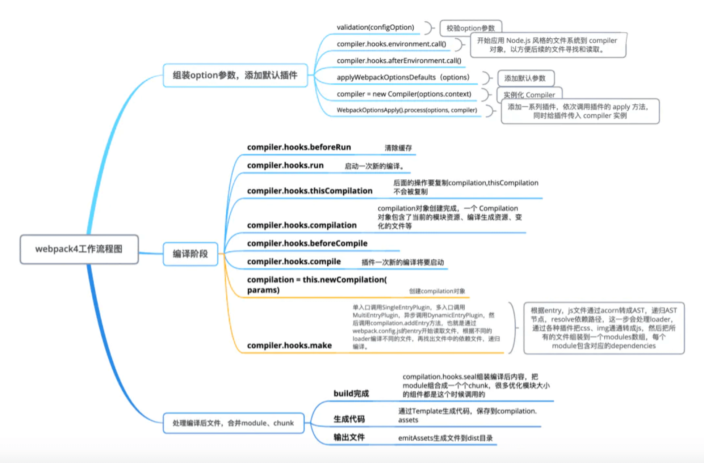
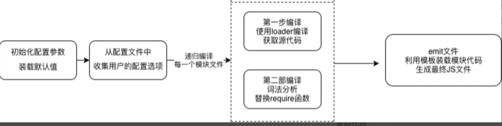
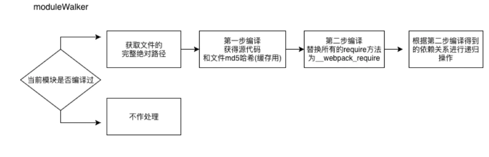
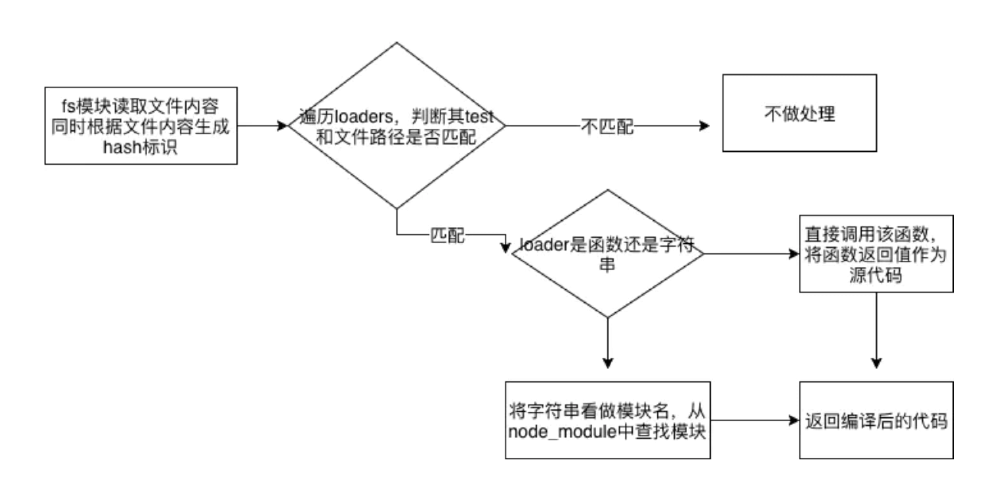
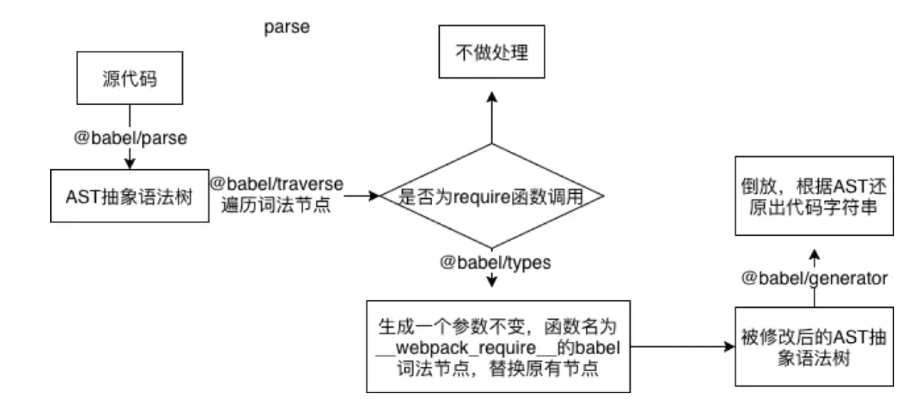

`Webpack` 迭代到4.x版本后，其源码已经十分庞大，对各种开发场景进行了高度抽象，阅读成本也愈发昂贵。但是为了了解其内部的工作原理，让我们尝试从一个最简单的 webpack 配置入手，从工具设计者的角度开发一款低配版的 `Webpack`。

## 示例

```jsx
// index.js 根组件
import React from 'react'
import ReactDom from 'react-dom'
import App from './App'
ReactDom.render(<App />, document.querySelector('#container'))

// Switch.js 按钮组件
import React from 'react'

export default function Switch({ handleToggle }) {
  return (
    <button onClick={handleToggle}>Toggle</button>
  )
}

// App.js 页面组件
import React from 'react'
import Switch from './Switch.js'
export default class App extends React.Component {
  constructor(props) {
    super(props)
    this.state = {
      toggle: false
    }
  }
  handleToggle() {
    this.setState(prev => ({
      toggle: !prev.toggle
    }))
  }
  render() {
    const { toggle } = this.state
    return (
      <div>
        <h1>Hello, { toggle ? 'NervJS' : 'O2 Team'}</h1>
        <Switch handleToggle={this.handleToggle.bind(this)} />
      </div>
    )
  }
}

```

**webpack.config.js**

```js
// webpack.config.js
const resolve = dir => require('path').join(__dirname, dir)

module.exports = {
  // 入口文件地址
  entry: './src/index.js',
  // 输出文件地址
  output: {
		path: resolve('dist'),
    fileName: 'bundle.js'
  },
  // loader
  module: {
    rules: [
      {
        test: /\.(js|jsx)$/,
        // 编译匹配include路径的文件
        include: [
          resolve('src')
        ],
        use: 'babel-loader'
      }
    ]
  },
  plugins: [
    new HtmlWebpackPlugin()
  ]
}
```

`plugin` ：这些插件可以将对编译结果的处理函数注册在 `Webpack` 的生命周期钩子上，在生成最终文件之前对编译的结果做一些处理。

webpack本身只认识 `.js` 、 `.json` 这两种类型的文件，有了loader就可以对css以及其他格式的文件进行识别和处理。而对于React文件而言，我们需要将JSX语法转换成纯JS语法，即 `React.createElement` 方法，代码才可能被浏览器所识别。而平常我们用来处理react代码的是 `babel-loader`并不能在 `Webpack` 包以外的场景被使用（因为这里是自己实现简易webpack）。

不过好在 `@babel/core` 和 `webpack` 并无联系，所以只能辛苦一下，再手写一个 loader 方法去解析 `JS` 和 `ES6` 的语法。

```js
const babel = require('@babel/core')

module.exports = function BabelLoader (source) {
  const res = babel.transform(source, {
    sourceType: 'module' // 编译ES6 import和export语法
  })
  return res.code
}
```

编译规则可以作为配置项传入，但是为了模拟真实的开发场景，我们需要配置一下 `babel.config.js`文件

```js
module.exports = function (api) {
  api.cache(true)
  return {
    "presets": [
      ['@babel/preset-env', {
        targets: {
          "ie": "8"
        },
      }],
      '@babel/preset-react', // 编译JSX
    ],
    "plugins": [
      ["@babel/plugin-transform-template-literals", {
        "loose": true
      }]
    ],
    "compact": true
  }
}
```

之前的React代码编译出来会是这个亚子

```js
"use strict";

Object.defineProperty(exports, "__esModule", {
  value: true
});
exports["default"] = Switch;

var _nervjs = _interopRequireDefault(__webpack_require__("./node_modules/nervjs/index.js"));

function _interopRequireDefault(obj) {
  return obj && obj.__esModule ? obj : {
    "default": obj
  };
}

function Switch(_ref) {
  var handleToggle = _ref.handleToggle;
  return _nervjs["default"].createElement("button", {
    onClick: handleToggle
  }, "Toggle");
}
```

Tips: 这个 `_interopRequireDefault` 的目的是为了兼容一些不符合 `babel` 规则的模块添加 `default` 属性并指向模块本身。防止在 `export default` 时出错。

## Webpack打包的流程



从 `Webpack` 的工作流程中可以看出，我们需要实现一个 `Compiler` 类，这个类需要收集开发者传入的所有配置信息，然后指挥整体的编译流程。

在了解了所有信息后它会调用另一个类 `Compilation` 生成实例，并且将所有的信息和工作流程托付给它。



首先我们新建了一个 `webpack` 函数作为对外暴露的方法，它接受两个参数，其中一个是配置项对象，另一个则是错误回调。

```js
const Compiler = require('./compiler')

function webpack(config, callback) {
  // 此处应有参数校验
  const compiler = new Compiler(config)
  // 开始编译
  compiler.run()
}

module.exports = webpack
```

### 构建配置信息

需要先在 `Compiler` 类的构造方法里面收集用户传入的信息：

```js
class Compiler {
  constructor(config, _callback) {
    const {
      entry,
      output,
      module,
      plugins
    } = config
    // 入口
    this.entryPath = entry
    // 输出文件路径
    this.distPath = output.path
    // 输出文件名称
    this.distName = output.fileName
    // 需要使用的loader
    this.loaders = module.rules
    // 需要挂载的plugin
    this.plugins = plugins
     // 根目录
    this.root = process.cwd()
     // 编译工具类Compilation
    this.compilation = {}
    // 入口文件在module中的相对路径，也是这个模块的id
    this.entryId = getRootPath(this.root, entry, this.root)
  }
}
```

在构造函数中将所有的 `plugin` 挂载到实例的 `hooks` 属性中去。`Webpack` 的生命周期管理基于一个叫做 `tapable` 的库，通过这个库，我们可以非常方便的创建一个**发布订阅模型**的钩子，然后通过将函数挂载到实例上（钩子事件的回调支持同步触发、异步触发甚至进行链式回调），在合适的时机触发对应事件的处理函数。

在 `hooks` 上声明一些生命周期钩子：

```js
const { AsyncSeriesHook } = require('tapable') // 此处我们创建了一些异步钩子
constructor(config, _callback) {
  ...
  this.hooks = {
    // 生命周期事件
    beforeRun: new AsyncSeriesHook(['compiler']), // compiler代表我们将向回调事件中传入一个compiler参数
    afterRun: new AsyncSeriesHook(['compiler']),
    beforeCompile: new AsyncSeriesHook(['compiler']),
    afterCompile: new AsyncSeriesHook(['compiler']),
    emit: new AsyncSeriesHook(['compiler']),
    failed: new AsyncSeriesHook(['compiler']),
  }
  this.mountPlugin()
}
// 注册所有的plugin
mountPlugin() {
  for(let i=0;i<this.plugins.length;i++) {
    const item = this.plugins[i]
    if ('apply' in item && typeof item.apply === 'function') {
      // 注册各生命周期钩子的发布订阅监听事件
      item.apply(this)
    }
  }
}
// 当运行run方法的逻辑之前
run() {
  // 在特定的生命周期发布消息，触发对应的订阅事件
  this.hooks.beforeRun.callAsync(this) // this作为参数传入，对应之前的compiler
  ...
}
```

每一个 `plugin Class` 都必须实现一个 `apply` 方法，这个方法接收 `compiler` 实例，然后将真正的钩子函数挂载到 `compiler.hook` 的某一个声明周期上。

如果我们声明了一个hook但是没有挂载任何方法，在 call 函数触发的时候是会报错的。但是实际上 `Webpack` 的每一个生命周期钩子除了挂载用户配置的 `plugin` ,都会挂载至少一个 `Webpack` 自己的 `plugin`，所以不会有这样的问题。

### 编译

接下来我们需要声明一个 `Compilation` 类，这个类主要是执行编译工作。在 `Compilation` 的构造函数中，接收来自 `Compiler` 下发的信息并且挂载在自身属性中：

```js
class Compilation {
  constructor(props) {
    const {
      entry,
      root,
      loaders,
      hooks
    } = props
    this.entry = entry
    this.root = root
    this.loaders = loaders
    this.hooks = hooks
  }
  // 开始编译
  async make() {
    await this.moduleWalker(this.entry)
  }
  // dfs遍历函数
  moduleWalker = async () => {}
}
```

因为我们需要将打包过程中引用过的文件都编译到最终的代码包里，所以需要声明一个深度遍历函数 `moduleWalker` （这个名字不是webpack官方取的，在文章中取得名字），顾名思义，这个方法将会从入口文件开始，依次对文件进行第一步和第二步编译，并且**收集引用到的其他模块，递归进行同样的处理**。

编译步骤分为两步：

1. 第一步是使用所有满足条件的 `loader` 对其进行编译并且返回编译之后的源代码
2. 第二步相当于是 `Webpack` 自己的编译步骤，目的是构建各个独立模块之间的依赖调用关系。我们需要做的是将所有的 `require` 方法替换成 `Webpack` 自己定义的 `__webpack_require__` 函数。因为所有被编译后的模块将被 `Webpack` 存储在一个闭包的对象 `moduleMap` 中，而 `__webpack_require__` 函数则是唯一一个有权限访问 `moduleMap` 的方法。

一句话解释 `__webpack_require__`的作用就是，将模块之间原本 `文件地址 -> 文件内容` 的关系替换成了 `对象的key -> 对象的value（文件内容)` 这样的关系。

在完成第二步编译的同时，会对当前模块内的引用进行收集，并且返回到 `Compilation` 中， 这样`moduleWalker` 才能对这些依赖模块进行递归的编译。当然其中大概率存在循环引用和重复引用，我们会根据引用文件的路径生成一个独一无二的 **key 值**，在 key 值重复时进行跳过。

### `moduleWalker` 遍历函数



```js
// 存放处理完毕的模块代码Map，在 webpack 源码中我们可以看到 moduleMap 是Map对象
moduleMap = {}

// 根据依赖将所有被引用过的文件都进行编译
async moduleWalker(sourcePath) {
  // 防止重复引入
  if (sourcePath in this.moduleMap) return
  // 在读取文件时，我们需要完整的以.js结尾的文件路径
  sourcePath = completeFilePath(sourcePath)
  const [ sourceCode, md5Hash ] = await this.loaderParse(sourcePath)
  const modulePath = getRootPath(this.root, sourcePath, this.root)
  // 获取模块编译后的代码和模块内的依赖数组
  const [ moduleCode, relyInModule ] = this.parse(sourceCode, path.dirname(modulePath))
  // 将模块代码放入ModuleMap
  this.moduleMap[modulePath] = moduleCode
  this.assets[modulePath] = md5Hash
  // 再依次对模块中的依赖项进行解析
  for(let i=0;i<relyInModule.length;i++) {
    await this.moduleWalker(relyInModule[i], path.dirname(relyInModule[i]))
  }
}
```

### 编译 `loaderParse`函数



```js
async loaderParse(entryPath) {
  // 用utf8格式读取文件内容
  let [ content, md5Hash ] = await readFileWithHash(entryPath)
  // 获取用户注入的loader
  const { loaders } = this
  // 依次遍历所有loader
  for(let i=0;i<loaders.length;i++) {
    const loader = loaders[i]
    const { test : reg, use } = loader
    if (entryPath.match(reg)) {
      // 判断是否满足正则或字符串要求
      // 如果该规则需要应用多个loader,从最后一个开始向前执行
      if (Array.isArray(use)) {
        while(use.length) {
          const cur = use.pop()
          const loaderHandler = 
            typeof cur.loader === 'string' 
            // loader也可能来源于package包例如babel-loader
              ? require(cur.loader)
              : (
                typeof cur.loader === 'function'
                ? cur.loader : _ => _
              )
          content = loaderHandler(content)
        }
      } else if (typeof use.loader === 'string') {
        const loaderHandler = require(use.loader)
        content = loaderHandler(content)
      } else if (typeof use.loader === 'function') {
        const loaderHandler = use.loader
        content = loaderHandler(content)
      }
    }
  }
  return [ content, md5Hash ]
}
```

于是，在获得了 `loader` 处理过的代码之后，理论上任何一个模块都已经可以在浏览器或者单元测试中直接使用了。但是我们的代码是一个整体，还需要一种合理的方式来组织代码之间互相引用的关系。

上面也解释了我们为什么要使用 `__webpack_require__` 函数。这里我们得到的代码仍然是字符串的形式，为了方便我们使用 `eval` 函数将字符串解析成直接可读的代码。当然这只是求快的方式，对于 JS 这种解释型语言，如果一个一个模块去解释编译的话，速度会非常慢。事实上真正的生产环境会将模块内容封装成一个 `IIFE`（立即自执行函数表达式）

总而言之，在第二步**编译 `parse` 函数**中我们需要做的事情其实很简单，就是将所有模块中的 `require` 方法的函数名称替换成 `__webpack_require__` 即可。

babel 分析代码的步骤主要分为两步，分别是词法分析和语法分析。简单来说，就是**对代码片段进行逐词分析，并且生成各个类型对应的 `babel-node`** (在词法分析中，所有的元素，即使是字符串也必须是babel封装过的类型)。然后进行语法分析，**根据上一个单词生成的语境，判断当前单词所起的作用**。

先借助 `@babel/parser` 对代码进行词法分析，将代码拆解为一棵由 `babelNode` 组成的AST抽象语法树。然后通过 `@babel/traverse` 对node进行遍历，通过这个库。我们能够在在遇到特定node类型的时候执行特定的方法，这里我们要做的就是将调用类型 `CallExpression` (函数调用表达式)且name为 `require` 的单词名称替换成name为 `__webpack_require__` 的节点，最后通过 `@babel/generator` 生成新的代码



还可以“顺便”搜集模块的依赖项数组一同返回（用于 dfs 递归）:

```js
const parser = require('@babel/parser')
const traverse = require('@babel/traverse').default
const types = require('@babel/types')
const generator = require('@babel/generator').default
// ...
// 解析源码，替换其中的require方法来构建ModuleMap
parse(source, dirpath) {
  const inst = this
  // 将代码解析成ast
  const ast = parser.parse(source)
  const relyInModule = [] // 获取文件依赖的所有模块
  traverse(ast, {
    // 检索所有的词法分析节点，当遇到函数调用表达式的时候执行，对ast树进行改写
    CallExpression(p) {
      // 有些require是被_interopRequireDefault包裹的
      // 所以需要先找到_interopRequireDefault节点
      if (p.node.callee && p.node.callee.name === '_interopRequireDefault') {
        const innerNode = p.node.arguments[0]
        if (innerNode.callee.name === 'require') {
          inst.convertNode(innerNode, dirpath, relyInModule)
        }
      } else if (p.node.callee.name === 'require') {
        inst.convertNode(p.node, dirpath, relyInModule)
      }
    }
  })
  // 将改写后的ast树重新组装成一份新的代码, 并且和依赖项一同返回
  const moduleCode = generator(ast).code
  return [ moduleCode, relyInModule ]
}
/**
 * 将某个节点的name和arguments转换成我们想要的新节点
 */
convertNode = (node, dirpath, relyInModule) => {
  node.callee.name = '__webpack_require__'
  // 参数字符串名称，例如'react', './MyName.js'
  let moduleName = node.arguments[0].value
  // 生成依赖模块相对【项目根目录】的路径
  let moduleKey = completeFilePath(getRootPath(dirpath, moduleName, this.root))
  // 收集module数组
  relyInModule.push(moduleKey)
  // 替换__webpack_require__的参数字符串，因为这个字符串也是对应模块的moduleKey，需要保持统一
  // 因为ast树中的每一个元素都是babel节点，所以需要使用'@babel/types'来进行生成
  node.arguments = [ types.stringLiteral(moduleKey) ]
}
```

### `emit` 生成bundle文件

执行到这一步， `compilation` 的使命其实就已经完成了。如果我们平时有去观察dist生成的文件的话，会发现打包出来的样子是一个立即执行函数，主函数体是一个闭包，闭包中缓存了已经加载的模块 `installedModules` ，以及定义了一个 `__webpack_require__` 函数，最终返回的是函数入口所对应的模块。而函数的参数则是各个模块的key-value所组成的对象。

在这里通过 `ejs` 模板去进行拼接，将之前收集到的 `moduleMap` 对象进行遍历，注入到ejs模板字符串中去。

```js
// template.ejs
(function(modules) { // webpackBootstrap
  // The module cache
  var installedModules = {};
  // The require function
  function __webpack_require__(moduleId) {
      // Check if module is in cache
      if(installedModules[moduleId]) {
          return installedModules[moduleId].exports;
      }
      // Create a new module (and put it into the cache)
      var module = installedModules[moduleId] = {
          i: moduleId,
          l: false,
          exports: {}
      };
      // Execute the module function
      modules[moduleId].call(module.exports, module, module.exports, __webpack_require__);
      // Flag the module as loaded
      module.l = true;
      // Return the exports of the module
      return module.exports;
  }
  // Load entry module and return exports
  return __webpack_require__(__webpack_require__.s = "<%-entryId%>");
})({
 <%for(let key in modules) {%>
     "<%-key%>":
         (function(module, exports, __webpack_require__) {
             eval(
                 `<%-modules[key]%>`
             );
         }),
     <%}%>
});
```

生成bundle.js

```js
/**
 * 发射文件,生成最终的bundle.js
 */
emitFile() { // 发射打包后的输出结果文件
  // 首先对比缓存判断文件是否变化
  const assets = this.compilation.assets
  const pastAssets = this.getStorageCache()
  if (loadsh.isEqual(assets, pastAssets)) {
    // 如果文件hash值没有变化，说明无需重写文件
    // 只需要依次判断每个对应的文件是否存在即可
    // 这一步省略！
  } else {
    // 缓存未能命中
    // 获取输出文件路径
    const outputFile = path.join(this.distPath, this.distName);
    // 获取输出文件模板
    // const templateStr = this.generateSourceCode(path.join(__dirname, '..', "bundleTemplate.ejs"));
    const templateStr = fs.readFileSync(path.join(__dirname, '..', "template.ejs"), 'utf-8');
    // 渲染输出文件模板
    const code = ejs.render(templateStr, {entryId: this.entryId, modules: this.compilation.moduleMap});

    this.assets = {};
    this.assets[outputFile] = code;
    // 将渲染后的代码写入输出文件中
    fs.writeFile(outputFile, this.assets[outputFile], function(e) {
      if (e) {
        console.log('[Error] ' + e)
      } else {
        console.log('[Success] 编译成功')
      }
    });
    // 将缓存信息写入缓存文件
    fs.writeFileSync(resolve(this.distPath, 'manifest.json'), JSON.stringify(assets, null, 2))
  }
}
```

在这一步中我们根据文件内容生成的Md5Hash去对比之前的缓存来加快打包速度，webpack每次打包都会生成一个缓存文件 `manifest.json`。


