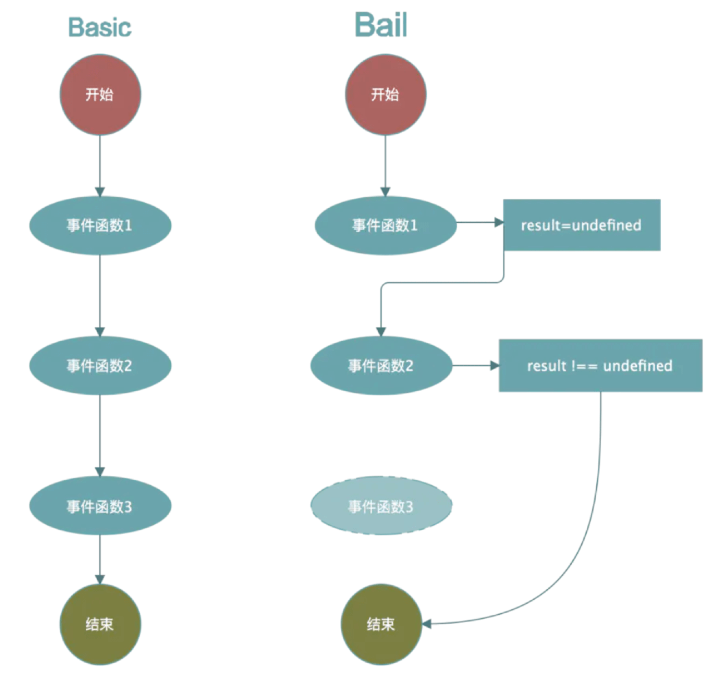
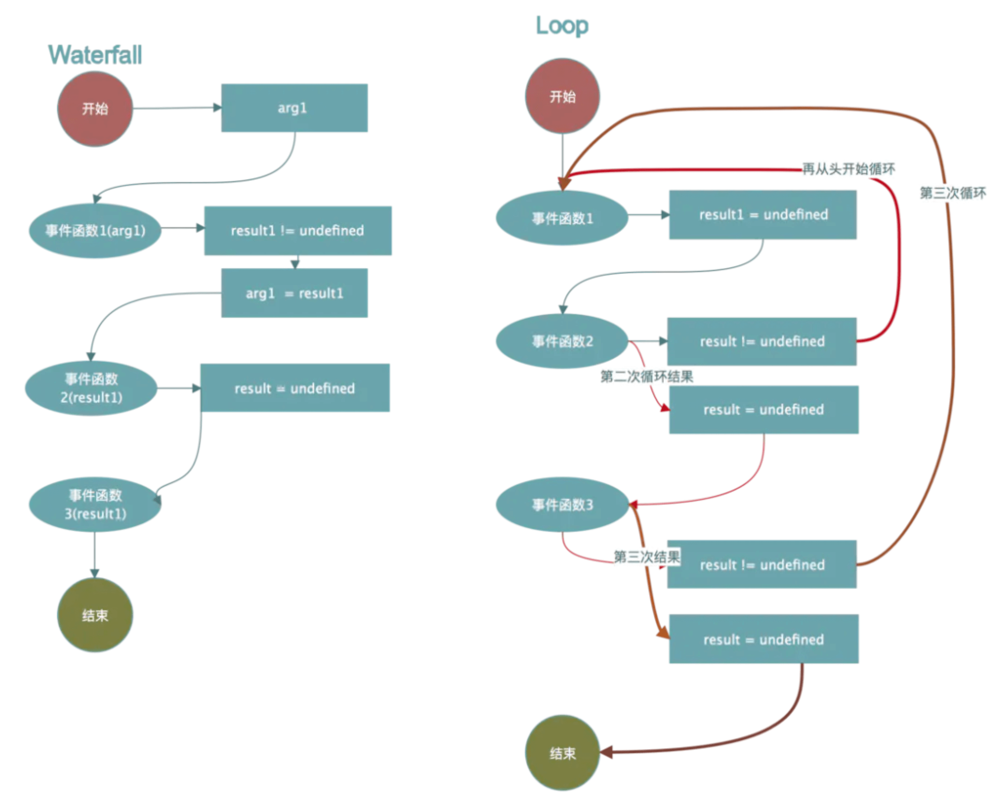

## Tapable

Webpack的插件机制依赖于一个核心的库， **Tapable**。

### Tapable是什么

tapable 是一个类似于nodejs 的EventEmitter 的库, 主要是**控制钩子函数的发布与订阅**。当然，tapable提供的hook机制比较全面，分为同步和异步两个大类(异步中又区分异步并行和异步串行)，而根据事件执行的终止条件的不同，由衍生出 Bail/Waterfall/Loop 类型。

### Tapable的使用

```js
const {
  SyncHook
} = require('tapable')

// 创建一个同步 Hook，指定参数
const hook = new SyncHook(['arg1', 'arg2']) // 根据源码，webpack的hooks其实都是 new SyncHook([...])

// 注册
hook.tap('a', function (arg1, arg2) {
	console.log('a')
})

hook.tap('b', function (arg1, arg2) {
	console.log('b')
})

hook.call(1, 2)
```

**钩子类型：**





**BasicHook**：执行每一个，不关心函数的返回值，有`SyncHook`、`AsyncParallelHook`、`AsyncSeriesHook`。

**BailHook**：顺序执行 Hook，遇到第一个结果`result!==undefined`则返回，不再继续执行。有：`SyncBailHook`、`AsyncSeriseBailHook`, `AsyncParallelBailHook`。

**WaterfallHook**：类似于 reduce，如果前一个 Hook 函数的结果 `result !== undefined`，则 result 会作为后一个 Hook 函数的第一个参数。既然是顺序执行，那么就只有 Sync 和 AsyncSeries 类中提供这个Hook：SyncWaterfallHook，AsyncSeriesWaterfallHook

**LoopHook**：不停的循环执行 Hook，直到所有函数结果 `result === undefined`。同样的，由于对串行性有依赖，所以只有 SyncLoopHook 和 AsyncSeriseLoopHook。

### Tapable的源码分析

Tapable 基本逻辑是，先通过类实例的 tap 方法注册对应 Hook 的处理函数， 这里直接分析sync同步钩子的主要流程，其他的异步钩子和拦截器等就不赘述了。

```js
const hook = new SyncHook(['arg1', 'arg2'])
```

```js
class SyncHook extends Hook {
  // 错误处理，防止调用者调用异步钩子
	tapAsync() {
		throw new Error("tapAsync is not supported on a SyncHook");
	}
  // 错误处理，防止调用者调用promise钩子
	tapPromise() {
		throw new Error("tapPromise is not supported on a SyncHook");
	}
  // 核心实现
	compile(options) {
		factory.setup(this, options);
		return factory.create(options);
	}
}
```

类SyncHook看到， 他是继承于一个**基类Hook**：

```js
// 变量的初始化
constructor(args) {
	if (!Array.isArray(args)) args = [];
	this._args = args;
	this.taps = [];
	this.interceptors = [];
	this.call = this._call;
	this.promise = this._promise;
	this.callAsync = this._callAsync;
	this._x = undefined;
}
```

初始化完成后， 通常会注册一个事件， 如：

```js
// 注册
hook.tap('a', function (arg1, arg2) {
	console.log('a')
})

hook.tap('b', function (arg1, arg2) {
	console.log('b')
})
```

```js
tap(options, fn) {
  // 参数处理: 区分string和object
	if (typeof options === "string") options = { name: options };
	if (typeof options !== "object" || options === null)
		throw new Error(
			"Invalid arguments to tap(options: Object, fn: function)"
		);
	options = Object.assign({ type: "sync", fn: fn }, options);
	if (typeof options.name !== "string" || options.name === "")
		throw new Error("Missing name for tap");
	// 执行拦截器的register函数，比较简单不分析
	options = this._runRegisterInterceptors(options);
	// 处理注册事件
	this._insert(options);
}
```

_insert方法是注册阶段的关键函数， 直接进入该方法内部：

```js
_insert(item) {
    // 重置所有的 调用 方法
	this._resetCompilation();
	// 将注册事件排序后放进taps数组
	let before;
	if (typeof item.before === "string") before = new Set([item.before]);
	else if (Array.isArray(item.before)) {
		before = new Set(item.before);
	}
	let stage = 0;
	if (typeof item.stage === "number") stage = item.stage;
	let i = this.taps.length;
	while (i > 0) {
		i--;
		const x = this.taps[i];
		this.taps[i + 1] = x;
		const xStage = x.stage || 0;
		if (before) {
      // 从后往前遍历，插入到 before 数组/字符串 前面
			if (before.has(x.name)) {
				before.delete(x.name);
				continue;
			}
			if (before.size > 0) {
				continue;
			}
		}
		if (xStage > stage) {
			continue;
		}
		i++;
		break;
	}
	this.taps[i] = item;
 }
}
```

_insert主要是排序tap并插入到taps数组里面， 排序的算法并不是特别复杂。

**触发阶段**

```js
hook.call(1, 2)  // 触发函数

this.call = this._call; 

Object.defineProperties(Hook.prototype, {
	_call: {
		value: createCompileDelegate("call", "sync"),
		configurable: true,
		writable: true
	},
	_promise: {
		value: createCompileDelegate("promise", "promise"),
		configurable: true,
		writable: true
	},
	_callAsync: {
		value: createCompileDelegate("callAsync", "async"),
		configurable: true,
		writable: true
	}
});
```

可以看出 _call 是由 createCompileDelegate 生成的：

```js
function createCompileDelegate(name, type) {
	return function lazyCompileHook(...args) {
		this[name] = this._createCall(type);
		return this[name](...args);
	};
}
```

createCompileDelegate 返回一个名为 lazyCompileHook 的函数，顾名思义，即懒编译， 直到调用call的时候， 才会编译出正在的call函数。

createCompileDelegate也是调用的_createCall， _createCall调用了Compier函数：

```js
_createCall(type) {
	return this.compile({
		taps: this.taps,
		interceptors: this.interceptors,
		args: this._args,
		type: type
	});
}

compile(options) {
	throw new Error("Abstract: should be overriden");
}
```

可以看到compiler必须由子类重写， 返回到syncHook的compile函数， 即我们一开始说的核心方法

```js
class SyncHookCodeFactory extends HookCodeFactory {
	content({ onError, onResult, onDone, rethrowIfPossible }) {
		return this.callTapsSeries({
			onError: (i, err) => onError(err),
			onDone,
			rethrowIfPossible
		});
	}
}

const factory = new SyncHookCodeFactory();

class SyncHook extends Hook {
  // ...
	compile(options) {
		factory.setup(this, options);
		return factory.create(options);
	}
}
```

关键就在于SyncHookCodeFactory和工厂类HookCodeFactory， 先看setup函数：

```js
setup(instance, options) {
  // 这里的instance 是syncHook 实例, 其实就是把tap进来的钩子数组给到钩子的_x属性里.
  instance._x = options.taps.map(t => t.fn);
}

/** 最后返回的fn，其实是一个new Function动态生成的函数 */
create(options) {
  // 初始化参数,保存options到本对象this.options,保存new Hook(["options"]) 传入的参数到 this._args
  this.init(options);
  let fn;
  // 动态构建钩子,这里是抽象层,分同步, 异步, promise
  switch (this.options.type) {
    // 先看同步
    case "sync":
      // 动态返回一个钩子函数
      fn = new Function(
        // 生成函数的参数,no before no after 返回参数字符串 xxx,xxx 在
        // 注意这里this.args返回的是一个字符串,
        // 在这个例子中是options
        this.args(),
        '"use strict";\n' +
          this.header() +
          this.content({
            onError: err => `throw ${err};\n`,
            onResult: result => `return ${result};\n`,
            onDone: () => "",
            rethrowIfPossible: true
          })
      );
      break;
    case "async":
      fn = new Function(
        this.args({
          after: "_callback"
        }),
        '"use strict";\n' +
          this.header() +
          // 这个 content 调用的是子类类的 content 函数,
          // 参数由子类传,实际返回的是 this.callTapsSeries() 返回的类容
          this.content({
            onError: err => `_callback(${err});\n`,
            onResult: result => `_callback(null, ${result});\n`,
            onDone: () => "_callback();\n"
          })
      );
      break;
    case "promise":
      let code = "";
      code += '"use strict";\n';
      code += "return new Promise((_resolve, _reject) => {\n";
      code += "var _sync = true;\n";
      code += this.header();
      code += this.content({
        onError: err => {
          let code = "";
          code += "if(_sync)\n";
          code += `_resolve(Promise.resolve().then(() => { throw ${err}; }));\n`;
          code += "else\n";
          code += `_reject(${err});\n`;
          return code;
        },
        onResult: result => `_resolve(${result});\n`,
        onDone: () => "_resolve();\n"
      });
      code += "_sync = false;\n";
      code += "});\n";
      fn = new Function(this.args(), code);
      break;
  }
  // 把刚才init赋的值初始化为undefined
  // this.options = undefined;
  // this._args = undefined;
  this.deinit();

  return fn;
}
```

最后生成的代码大致如下：

```js
"use strict";
function (options) {
  var _context;
  var _x = this._x;
  var _taps = this.taps;
  var _interterceptors = this.interceptors;
	// 我们只有一个拦截器所以下面的只会生成一个
  _interceptors[0].call(options);

  var _tap0 = _taps[0];
  _interceptors[0].tap(_tap0);
  var _fn0 = _x[0];
  _fn0(options);
  var _tap1 = _taps[1];
  _interceptors[1].tap(_tap1);
  var _fn1 = _x[1];
  _fn1(options);
  var _tap2 = _taps[2];
  _interceptors[2].tap(_tap2);
  var _fn2 = _x[2];
  _fn2(options);
  var _tap3 = _taps[3];
  _interceptors[3].tap(_tap3);
  var _fn3 = _x[3];
  _fn3(options);
}
```

## compile

**compiler 对象代表了完整的 webpack 环境配置**。这个对象在启动 webpack 时被一次性建立，并配置好所有可操作的设置，包括 options，loader 和 plugin。当在 webpack 环境中应用一个插件时，插件将收到此 compiler 对象的引用。可以使用 compiler 来访问 webpack 的主环境。

也就是说， compiler是webpack的整体环境。

### compile的内部实现

```js
class Compiler extends Tapable {
  constructor(context) {
    super();
    this.hooks = {
      /** @type {SyncBailHook<Compilation>} */
      shouldEmit: new SyncBailHook(["compilation"]),
      /** @type {AsyncSeriesHook<Stats>} */
      done: new AsyncSeriesHook(["stats"]),
      /** @type {AsyncSeriesHook<>} */
      additionalPass: new AsyncSeriesHook([]),
      /** @type {AsyncSeriesHook<Compiler>} */
      /**
      * ......
      * ......
      * some code
      */
    };
    /**
    * ......
    * ......
    * some code
    */
}
```

Compier继承了Tapable，并且在实例上绑定了一个hook对象， 使得Compier的实例compier可以像这样使用：

```js
compiler.hooks.compile.tapAsync(
  'afterCompile',
  (compilation, callback) => {
    console.log('This is an example plugin!');
    console.log('Here’s the `compilation` object which represents a single build of assets:', compilation);

    // 使用 webpack 提供的 plugin API 操作构建结果
    compilation.addModule(/* ... */);

    callback();
  }
);
```

## compilation

**compilation 对象代表了一次资源版本构建**。当运行 webpack 开发环境中间件时，每当检测到一个文件变化，就会创建一个新的 compilation，从而生成一组新的编译资源。一个 compilation 对象表现了当前的模块资源、编译生成资源、变化的文件、以及被跟踪依赖的状态信息。compilation 对象也提供了很多关键时机的回调，以供插件做自定义处理时选择使用。

```js
class Compilation extends Tapable {
	/**
	 * Creates an instance of Compilation.
	 * @param {Compiler} compiler the compiler which created the compilation
	 */
	constructor(compiler) {
		super();
		this.hooks = {
			/** @type {SyncHook<Module>} */
			buildModule: new SyncHook(["module"]),
			/** @type {SyncHook<Module>} */
			rebuildModule: new SyncHook(["module"]),
			/** @type {SyncHook<Module, Error>} */
			failedModule: new SyncHook(["module", "error"]),
			/** @type {SyncHook<Module>} */
			succeedModule: new SyncHook(["module"]),

			/** @type {SyncHook<Dependency, string>} */
			addEntry: new SyncHook(["entry", "name"]),
			/** @type {SyncHook<Dependency, string, Error>} */
		}
	}
}
```

## 编写一个插件

```js
class MyExampleWebpackPlugin {
  // 定义 `apply` 方法
  apply(compiler) {
    // 指定要追加的事件钩子函数
    compiler.hooks.compile.tapAsync(
      'afterCompile',
      (compilation, callback) => {
        console.log('This is an example plugin!');
        console.log('Here’s the `compilation` object which represents a single build of assets:', compilation);

        // 使用 webpack 提供的 plugin API 操作构建结果
        compilation.addModule(/* ... */);

        callback();
      }
    );
  }
}
```

可以看到其实就是在apply中传入一个Compiler实例， 然后基于该实例注册事件， compilation同理， 最后webpack会在各流程执行call方法。

## 重要的事件钩子

### compiler

| 事件钩子      | 触发时机                                            | 参数        | 类型              |
| ------------- | --------------------------------------------------- | ----------- | ----------------- |
| entry-option  | 初始化 option                                       | -           | SyncBailHook      |
| run           | 开始编译                                            | compiler    | AsyncSeriesHook   |
| compile       | 真正开始的编译，在创建 compilation 对象之前         | compilation | SyncHook          |
| compilation   | 生成好了 compilation 对象，可以操作这个对象啦       | compilation | SyncHook          |
| make          | 从 entry 开始递归分析依赖，准备对每个模块进行 build | compilation | AsyncParallelHook |
| after-compile | 编译 build 过程结束                                 | compilation | AsyncSeriesHook   |
| emit          | 在将内存中 assets 内容写到磁盘文件夹之前            | compilation | AsyncSeriesHook   |
| after-emit    | 在将内存中 assets 内容写到磁盘文件夹之后            | compilation | AsyncSeriesHook   |
| done          | 完成所有的编译过程                                  | stats       | AsyncSeriesHook   |
| failed        | 编译失败的时候                                      | error       | SyncHook          |

### compilation

| 事件钩子              | 触发时机                                                     | 参数                 | 类型            |
| --------------------- | ------------------------------------------------------------ | -------------------- | --------------- |
| normal-module-loader  | 普通模块 loader，真正（一个接一个地）加载模块图(graph)中所有模块的函数。 | loaderContext module | SyncHook        |
| seal                  | 编译(compilation)停止接收新模块时触发。                      | -                    | SyncHook        |
| optimize              | 优化阶段开始时触发。                                         | -                    | SyncHook        |
| optimize-modules      | 模块的优化                                                   | modules              | SyncBailHook    |
| optimize-chunks       | 优化 chunk                                                   | chunks               | SyncBailHook    |
| additional-assets     | 为编译(compilation)创建附加资源(asset)。                     | -                    | AsyncSeriesHook |
| optimize-chunk-assets | 优化所有 chunk 资源(asset)。                                 | chunks               | AsyncSeriesHook |
| optimize-assets       | 优化存储在 compilation.assets 中的所有资源(asset)            | assets               | AsyncSeriesHook |

