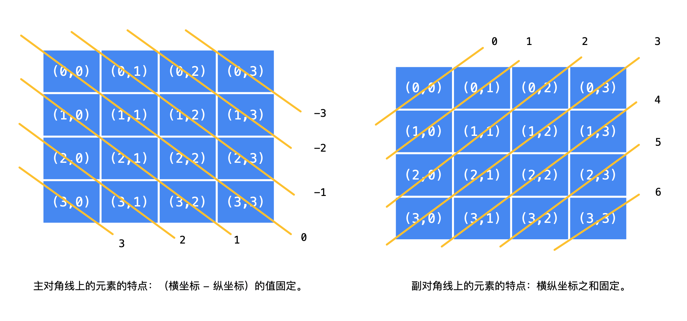

# 回溯算法与深度优先遍历

回溯算法是一种遍历算法，以 **深度优先遍历** 的方式尝试所有的可能性。有些教程上也叫「暴力搜索」。回溯算法是 **有方向地** 搜索，区别于多层循环实现的暴力法。

**回溯法**采用试错的思想，它尝试分步的去解决一个问题。在分步解决问题的过程中，当它通过尝试发现现有的分步答案不能得到有效的正确的解答的时候，它将取消上一步甚至是上几步的计算，再通过其它的可能的分步解答再次尝试寻找问题的答案。回溯法通常用最简单的**递归方法**来实现，在反复重复上述的步骤后可能出现两种情况：

- 找到一个可能存在的正确的答案；
- 在尝试了所有可能的分步方法后宣告该问题没有答案。

**深度优先搜索**算法（DFS）是一种用于遍历或搜索树或图的算法。这个算法会 尽可能深 的搜索树的分支。当结点 v 的所在边都己被探寻过，搜索将 回溯 到发现结点 v 的那条边的起始结点。这一过程一直进行到已发现从源结点可达的所有结点为止。如果还存在未被发现的结点，则选择其中一个作为源结点并重复以上过程，整个进程反复进行直到所有结点都被访问为止。

「回溯算法」强调了「深度优先遍历」思想的用途，用一个 不断变化 的变量，在尝试各种可能的过程中，搜索需要的结果。强调了 回退 操作对于搜索的合理性。而「深度优先遍历」强调一种遍历的思想，与之对应的遍历思想是「广度优先遍历」。

## 搜索与遍历

### 与动态规划的区别

**共同点**

用于求解多阶段决策问题。多阶段决策问题即：

- 求解一个问题分为很多步骤（阶段）；
- 每一个步骤（阶段）可以有多种选择。

**不同点**

- 动态规划只需要求我们评估最优解是多少，最优解对应的具体解是什么并不要求。因此很适合应用于评估一个方案的效果；

- 回溯算法可以搜索**得到所有的方案**（当然包括最优解），但是本质上它是一种遍历算法，时间复杂度很高。

## 从全排列问题开始理解回溯算法

我们尝试在纸上写 3 个数字、4 个数字、5 个数字的全排列（也就是数字的顺序组合），相信不难找到这样的方法。以数组 [1, 2, 3] 的全排列为例。

- 先写以 11 开头的全排列，它们是：[1, 2, 3], [1, 3, 2]，即 1 + [2, 3] 的全排列（注意：递归结构体现在这里）；
- 再写以 22 开头的全排列，它们是：[2, 1, 3], [2, 3, 1]，即 2 + [1, 3] 的全排列；
- 最后写以 33 开头的全排列，它们是：[3, 1, 2], [3, 2, 1]，即 3 + [1, 2] 的全排列。

总结搜索的方法：按顺序枚举每一位可能出现的情况，已经选择的数字在 **当前** 要选择的数字中不能出现。按照这种策略搜索就能够做到 不重不漏。这样的思路，**可以用一个树形结构表示**。


**说明：**

- 每一个结点表示了求解全排列问题的不同的阶段，这些阶段通过变量的「不同的值」体现，这些变量的不同的值，称之为「状态」；
- 使用深度优先遍历有「回头」的过程，在「回头」以后， **状态变量需要设置成为和先前一样** ，因此在回到上一层结点的过程中，需要撤销上一次的选择，这个操作称之为「状态重置」；
- 深度优先遍历，借助系统栈空间，保存所需要的状态变量，在编码中只需要注意遍历到相应的结点的时候，状态变量的值是正确的，具体的做法是：往下走一层的时候，path 变量在尾部追加，而往回走的时候，需要撤销上一次的选择，也是在尾部操作，因此 path 变量是一个栈；
- 深度优先遍历通过「回溯」操作，实现了全局使用一份状态变量的效果。

**设计状态变量**

- 首先这棵树除了根结点和叶子结点以外，每一个结点做的事情其实是一样的，即：在已经选择了一些数的前提下，在剩下的还没有选择的数中，依次选择一个数，这显然是一个 **递归** 结构；
- 递归的终止条件是： 一个排列中的数字已经选够了 ，因此我们需要一个变量来表示当前程序递归到第几层，我们把这个变量叫做 depth，或者命名为 index ，表示当前要确定的是某个全排列中下标为 index 的那个数是多少；
- 布尔数组 used，初始化的时候都为 false 表示这些数还没有被选择，当我们选定一个数的时候，就将这个数组的相应位置设置为 true ，这样在考虑下一个位置的时候，就能够以 O(1) 的时间复杂度判断这个数是否被选择过，这是一种「以空间换时间」的思想。

这些变量称为「状态变量」，它们表示了在求解一个问题的时候所处的阶段。需要根据问题的场景设计合适的状态变量。

**理解回溯**

从 [1, 2, 3] 到 [1, 3, 2] ，深度优先遍历是这样做的，从 [1, 2, 3] 回到 [1, 2] 的时候，需要撤销刚刚已经选择的数 3，因为在这一层只有一个数 3 我们已经尝试过了，因此程序回到上一层，需要撤销对 2 的选择，好让后面的程序知道，选择 3 了以后还能够选择 2。

执行深度优先遍历，从较深层的结点返回到较浅层结点的时候，需要做「状态重置」，即「回到过去」、「恢复现场」。

```ts
const nums: number[] = [1, 2, 3]
const list = permute(nums)
console.log('输出：' + JSON.stringify(list))

function permute(nums: number[]) {
  const len = nums.length
  const res: Array<number[]> = []
  if (len === 0) {
    return res
  }
  
  // 判断是否被选择过
  const used: boolean[] = []
  // 记录路径
  const path = []
  dfs(nums, len, 0, path, used, res)
  
  return res
}

function dfs(nums: number[], len: number, depth: number, path: number[], used: boolean[], res: Array<number[]>) {
  if (depth === len) {
    res.push([...path])
    return
  }
  
  for (let i = 0; i < len; i++) {
    if (!used[i]) {
      path.push(nums[i])
      used[i] = true
      
      console.log("  递归之前 => " + path)
      
      // 递归直到完全到达尾部
      dfs(nums, len, depth + 1, path, used, res)
      // 开始回溯，因为dfs递归调用，会一层层的往上pop
      used[i] = false
      path.pop()
      
      console.log("  递归之后 => " + path)
    }
  }
}
```

## 几点说明帮助理解「回溯算法」

### 每一次尝试都「复制」，则不需要回溯

为什么需要回溯？因为我们在dfs里面操作的 path 都是同一个数组，所以上述代码 dfs 退出的时候需要`res.push([...path])`，也就是使用扩展运算符复制里面的内容到结果里面，否则结果数组里保存的都是同一个结果。所以**回溯的原因是，我们在每次搜索的时候操作的是同一个对象**。在一些字符串的搜索问题中，有时不需要回溯的原因是这样的：字符串变量在拼接的过程中会产生新的对象。

如果在每一个 非叶子结点 分支的尝试，都创建 新的变量 表示状态，那么

- 在回到上一层结点的时候不需要「回溯」；
- 在递归终止的时候也不需要做拷贝。
- 这样的做法虽然可以得到解，但也会创建很多中间变量，这些中间变量很多时候是我们不需要的，会有一定空间和时间上的消耗。

```ts
const nums: number[] = [1, 2, 3]
const list = permute(nums)
console.log('输出：' + JSON.stringify(list))

function permute(nums: number[]) {
  const len = nums.length
  const res: Array<number[]> = []
  if (len === 0) {
    return res
  }
  
  // 判断是否被选择过
  const used: boolean[] = []
  // 记录路径
  const path = []
  dfs(nums, len, 0, path, used, res)
  
  return res
}

function dfs(nums: number[], len: number, depth: number, path: number[], used: boolean[], res: Array<number[]>) {
  if (depth === len) {
    // 不用拷贝，因为每一层传递下来的 path 变量都是新建的
    res.push(path)
    return
  }
  
  for (let i = 0; i < len; i++) {
    if (!used[i]) {
      // 每一次尝试都创建新的变量表示当前的"状态"
      const newPath = [...path]
      newPath.push(nums[i])
      const newUsed = used.slice(0, len)
      newUsed[i] = true
      
      dfs(nums, len, depth + 1, newPath, newUsed, res)
      // 无需回溯
    }
  }
}
```

### 为什么不是广度优先遍历

- 首先是正确性，只有遍历状态空间，才能得到所有符合条件的解，这一点 BFS 和 DFS 其实都可以；
- 在深度优先遍历的时候，不同状态之间的切换很容易；如上代码，我们只需要 push 和 pop 就能向上回溯。
- 如果使用广度优先遍历，从浅层转到深层，状态的变化就很大，此时我们不得不在每一个状态都新建变量去保存它，从性能来说是不划算的；
- 如果使用广度优先遍历就得使用队列，然后编写结点类。队列中需要存储每一步的状态信息，需要存储的数据很大，真正能用到的很少 。
- 使用深度优先遍历，直接使用了系统栈，系统栈帮助我们保存了每一个结点的状态信息。我们不用编写结点类，不必手动编写栈完成深度优先遍历。

### 不回溯可不可以

可以。搜索问题的状态空间一般很大，如果每一个状态都去创建新的变量，时间复杂度是 O(N) 。在候选数比较多的时候，在非叶子结点上创建新的状态变量的性能消耗就很严重。

最后，由于回溯算法的时间复杂度很高，因此在遍历的时候，如果能够提前知道这一条分支不能搜索到满意的结果，就可以提前结束，这一步操作称为 **剪枝**。

> 提示：剪枝是一种技巧，通常需要根据不同问题场景采用不同的剪枝策略，需要在做题的过程中不断总结。

# N皇后问题

以4皇后为例，其他的N皇后问题以此类推。所谓4皇后问题就是求解如何在4×4的棋盘上无冲突的摆放4个皇后棋子。在国际象棋中，皇后的移动方式为横竖交叉的，因此在任意一个皇后所在位置的水平、竖直、以及45度斜线上都不能出现皇后的棋子。

N皇后其实就是普通的回溯问题加上可以排除多余的验证。

### 剪枝

「剪枝」的依据是：「N 皇后」 的摆放规则：1、不在同一行；2、不在同一列；3、不在同一主对角线方向上；4、不在同一副对角线方向上。

#### 小技巧：记住已经摆放的皇后的位置

简单地使用 visited 布尔数组。放置的规则是：一行一行考虑皇后可以放置在哪一个位置上，某一行在考虑某一列是否可以放置皇后的时候，需要根据前面已经放置的皇后的位置。

由于是**一行一行考虑放置皇后，摆放的这些皇后肯定不在同一行，为了避免它们在同一列**，需要一个长度为 N 的布尔数组 cols，已经放置的皇后占据的列，就需要在对应的列的位置标注为 True。

#### 考虑对角线（找规律）



如图所示对角线只需要用两个一维数组就可以表示了，把被选中的皇后的对角线标记为true，后面选择的时候就可以直接排除具有相同对角线的元素了。

为了保证至少两个皇后不同时出现在 **同一主对角线方向**（从左到右） 或者 **同一副对角线方向**（从右到左）。检查策略是，只要「检测」到新摆放的「皇后」与已经摆放好的「皇后」冲突，就尝试摆放同一行的下一个位置，到行尾还不能放置皇后，就退回到上一行。

可以像全排列 used 数组那样，再为 「主对角线（Main diagonal）」 和 「副对角线（Sub diagonal）」 设置相应的 布尔数组变量，只要排定一个 「皇后」 的位置，就需要占住对应的位置。

```ts
function permute(n: number) {
  const res: Array<any[]> = []
  if (n === 0) {
    return res
  }
  
  // 判断列是否被选择过
  const col: boolean[] = []
  // 判断主对角线是否被选中了
  const main: boolean[] = []
  // 判断副对角线是否被选中了
  const sub: boolean[] = []
  const path: string[] = []
  dfs(n, 0, path, col, main, sub, res)
  
  return res
}

function dfs(n: number, row: number, path: string[], col: boolean[], main: boolean[], sub: boolean[], res: Array<any[]>) {
  if (row === n) {
    res.push([...path])
    return
  }
  
  for (let i = 0; i < n; i++) {
    if (!col[i] && !main[row - i + n - 1] && !sub[row + i]) {
      // row - i 之后需要加上 n - 1，否则数组的index为负数
      path.push(row + ',' + i)
      col[i] = true
      main[row - i + n - 1] = true
      sub[row + i] = true

      dfs(n, row + 1, path, col, main, sub, res)
      
      path.pop()
      col[i] = false
      main[row - i + n - 1] = false
      sub[row + i] = false
    }
  }
}
```

