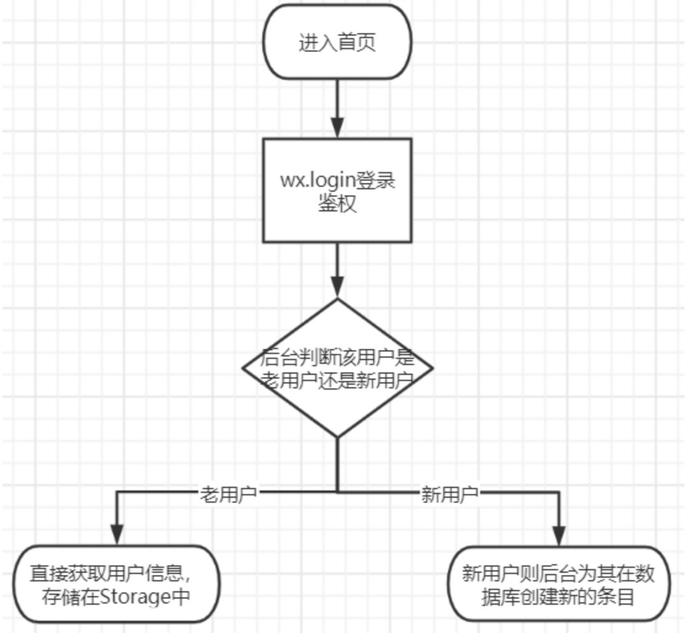
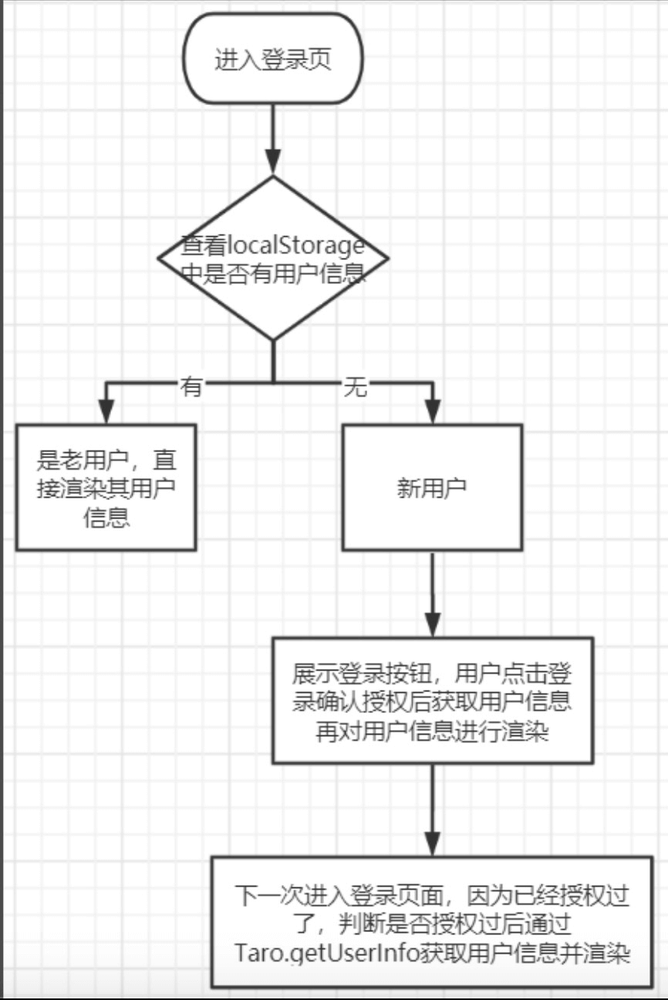

# 微信小程序授权登录

整个流程简单来说分为以下7步：

1. 前端调用`wx.login()`获取临时登录凭证`code`，并回传到开发者服务器。
2. 服务器调用 `auth.code2Session` 换取**用户唯一标识OpenID和会话密钥session_key**。
3. 服务器端根据`OpenID`或`session_key`生成自定义登录态（可以理解为是`token`），将`token`响应给前端。
4. 前端将`token`存入`Storage`中。
5. 当前端之后向后端发起请求时，就会带上`token`。
6. 后台通过`token`（或者其他类型密钥），解密获取`OpenID`，判断是哪个用户的行为，做出响应的逻辑处理（比如操作数据库等）。
7. 后台响应数据给前端。

这个是小程序登录的流程，但是**小程序登录和小程序获取用户信息并不是一回事**。小程序登录的`API`是`wx.login`，可以获取用户的`openID`，`openID`是用户的唯一标识，是比较隐私的数据，一般不会返回给前端。小程序获取用户信息的`API`是`wx.getUserInfo`，它可以获取用户的一些基本信息，比如`nickName`、`avatarUrl`等。两者不要弄混。

微信对开发的建议是：

1. 当用户打开小程序时访问第一个页面时，先通过` wx.login`，获取用户 `openID` 。这时无需弹框授权，开发者拿到 `openID` 可以建立自身的帐号` ID`。
2. 在第一步中，拿到 `openID` 后，判断是新用户还是老用户。如果是老用户，可以直接登录；如果是新用户，可先在小程序首页展示你的信息服务，让用户对这个小程序有大概的了解，再引导用户进行下一步的操作。
3. 当需要获取用户头像昵称的时候，对用户展示一个登录页面，这个页面只有一个最重要的操作，引导用户进行登录。

## step1: 前端调用`wx.login()`获取临时登录凭证`code`

```jsx
		Taro.login({})
      .then((res) => {
        if (res.code) {
          // 将code发送到后台，以获取token
          getToken(res.code)
            .then((res: any) => {
              const { token, userExist } = res;

              // 将token存储到Storage中
              Taro.setStorageSync('token', token);

              // 如果是老用户，获取用户信息
              if(userExist) {
                const { userInfo } = res;
                Taro.setStorageSync('userInfo', userInfo);
              }
            })
            .catch((err) => {
              console.error(err);
            });
        } else {
          console.log('登录失败! ' + res.errMsg);
        }
      })
      .catch((err) => {
        console.error(err);
      });
```

## step2: 服务端调用 auth.code2Session 换取openid和session_key

服务端调用外部接口需要使用`egg.js`中的一个`api`：`this.ctx.curl`，因为是异步请求，所以需要加上`await`：

```js
// app/controller/home.js
// login接口
async login() {
    const { ctx } = this;
    const { code } = ctx.request.body;
    // 服务器根据客户端传来的code向微信接口服务获取session_key和openid
    const res = await ctx.curl(
        `https://api.weixin.qq.com/sns/jscode2session?		
    appid=wx6936c18b38186cf3&secret=d11f77fb7d5a959b6ba46c30dbd4da95&js_code=${code}&grant_type=authorization_code`,
        {
        	dataType: 'json',
        }
    );
    const { openid } = res.data;  // 获取到openid
}
```

## step3: 根据`openid`生成自定义登录态token，响应给前端

因为`openid`是用户的唯一标识，根据它生成token，响应给前端后，前端每次发请求带上token，后台解密请求中的token，获取到`openid`，便能识别这是哪个用户的请求行为。

这里我们使用`jwt`来生成自定义登录态`token`，使用`jwt-simple`库来生成`jwt`：

```javascript
const jwt = require('jwt-simple');
const SECRET = 'zhuoran'; // 自定义

async login() {
    ...
    const { openid } = res.data;  // 获取到openid
    
    // 根据用户的openid生成token
    const token = jwt.encode(openid, SECRET);
    
    // 将token返回
    ctx.body = {
      token: token,
      ...
    };
    ...
}
```

## step4: 前端将token存入storage

```javascript
// 将token存储到Storage中
Taro.setStorageSync('token', token);
```

并在每次请求时带上`token`，将`token`放在请求头的`Authorization`字段里面：

```js
const option = {
    url: BASE_URL + url,
    data: data,
    method: method,
    header: {
        'content-type': contentType,
        Authorization: Taro.getStorageSync('token'),
    },
};
Taro.request(option);
```

## step5: 后台解密token获取openid

在后台解密token获取openid之后，便能知道这是哪个用户的请求，执行响应的操作：

```js
async request() {
    const { ctx } = this;

    // 从请求头的authorization字段获取token
    const token = ctx.get('authorization');

    // 对token进行解密获取其中的openid
    const openid = jwt.decode(token, SECRET);

    // 根据openid查找用户信息
    const res = await ctx.model.User.findAll({
      where: {
        openid: openid,
      },
    });

    // 之后注意要将openid属性去掉，私密属性不传回给客户端
    ctx.body = res;
}
```

## 额外需要注意的点

保存用户登录态，一直以来都有两种解决方案：前端保存和后端保存。

- 后端保存：在后端设定并存储当前token的过期时间，定期通知小程序前端重新登录
- 前端保存：因为session_key存在时效性（因为通过session_key我们可以查看敏感信息，所以必定会有一定的时效性），而小程序前端可以通过`wx.checkSession()`来检查`session_key`是否过期。我们可以自定义登录态，并考虑以session_key有效期作为自身登录态有效期（也就是以session_key的到期时间作为自定义登录态的到期时间，两者实际上并没有实质联系）。这个也是小程序文档中推荐的方法。

## 前端拦截器

这里会使用到`Taro`拦截器`API`：`Taro.addInterceptor(callback)`。拦截器允许我们在请求发出前或发出后做一些额外操作。

```js
const interceptor = function (chain) {
  // 拦截请求发出前做一些额外操作
  const requestParams = chain.requestParams
  const { method, data, url } = requestParams
  
  console.log(`http ${method || 'GET'} --> ${url} data: `, data)

  return chain.proceed(requestParams)
    .then(res => {
      // 拦截请求发出后做一些额外操作
      console.log(`http <-- ${url} result:`, res)
      return res
    })
  }
Taro.addInterceptor(interceptor)
```

所以，我们可以将`checkSession`步骤写在前端拦截器里，在请求每次发出之前判断`session_key`是否有过期，如果过期了，则重新调用`login`方法，更新token，如果没有过期，则正常发起请求：

```js
// login方法
const login = () => {
  Taro.login({})
    .then((res) => {
      if (res.code) {
        console.log('code为' + res.code);

        // 将code和userInfo发送到后台，以获取token
        getToken(res.code)
          .then((token) => {
            console.log('获取token');
            console.log(token);

            // 将token存储到Storage中
            Taro.setStorageSync('token', token);
          })
          .catch((err) => {
            console.error(err);
          });
      } else {
        console.log('登录失败! ' + res.errMsg);
      }
    })
    .catch((err) => {
      console.error(err);
    });
};

// 自定义拦截器
const customInterceptor = (chain) => {
  const requestParams = chain.requestParams;

  // 获取token
  const loginFlag = Taro.getStorageSync('token');

  // 检查session是否过期
  Taro.checkSession({})
    .then((res) => {
      console.log(res);
      console.log('session没过期，不用重新登录');
      console.log('token为' + loginFlag);
    })
    .catch((err) => {
      console.log(err);
      console.log('session已过期，要重新登录');

      // 重新登录
      login();
    });

  return chain.proceed(requestParams).then((res) => {
    // 只要请求成功，不管返回什么状态码，都走这个回调
    switch (res.statusCode) {
      case HTTP_STATUS.NOT_FOUND:
        return Promise.reject('请求资源不存在');
      case HTTP_STATUS.BAD_GATEWAY:
        return Promise.reject('服务端出现了问题');
      case HTTP_STATUS.FORBIDDEN: {
        Taro.setStorageSync('Authorization', '');
        // pageToLogin();
        // TODO 根据自身业务修改
        return Promise.reject('没有权限访问');
      }
      case HTTP_STATUS.AUTHENTICATE: {
        Taro.setStorageSync('Authorization', '');
        // pageToLogin();
        return Promise.reject('需要鉴权');
      }
      case HTTP_STATUS.SUCCESS:
        return res.data;
    }
  });
};

// Taro 提供了两个内置拦截器
// logInterceptor - 用于打印请求的相关信息
// timeoutInterceptor - 在请求超时时抛出错误。
const interceptors = [
  customInterceptor,
  Taro.interceptors.logInterceptor,
];

export default interceptors;
```

## 后端中间件

我们在 egg Node.js 后端项目中定义校验token的中间件：

```js
// app/middleware/auth.js
let jwt = require('jwt-simple');
const SECRET = 'zhuoran';

module.exports = (options) => {
  return async function auth(ctx, next) {
    const token = ctx.get('authorization');

    if (token) {
      console.log('请求带有token');

      try {
        const openid = jwt.decode(token, SECRET);
        await next();
      } catch (err) {
        ctx.body = {
          code: 401,
          msg: 'token有误',
        };
      }
    } else {
      console.log('请求没有带token');
      ctx.body = {
        code: 401,
        msg: '您没有登录',
      };
    }
  };
};
```

因为小程序中，有些功能不强制要求用户登录之后才能使用，所以有些请求操作不需要后台校验是否有token，那么这个`auth.js`中间件就不能够全局配置，而是放在需要校验token的路由下：

```js
module.exports = (app) => {
  const { router, controller, middleware } = app;
  const auth = middleware.auth();

  router.get('/', controller.home.index);
  router.get('/request', auth, controller.home.request); // 将middleware放在中间
  router.post('/login', controller.home.login);
  router.post('/userInfo', controller.home.userInfo);
};
```

## 登录流程图



## 获取用户信息



