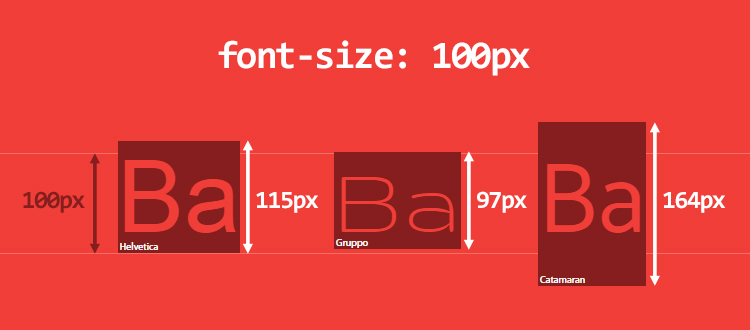
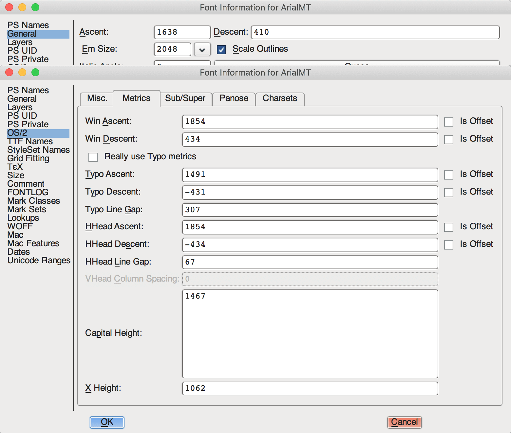

## 在移动端中使用line-height=height实现文字垂直居中时，在安卓手机会发现文字偏上！

### 网上的解释：

这个问题通过css是无法解决的，即使解决了也是一种通过微调来实现的hack方法，因为文字在content-area内部渲染的时候已经偏移了，而css的居中方案都是控制的整个content-area的居中。

导致这个问题的本质原因可能是Android在排版计算的时候参考了 primyfont 字体的相关属性（即 HHead Ascent 、HHead Descent 等），而 primyfont 的查找是看`font-family`里哪个字体在fonts.xml里第一个匹配上，而原生Android下中文字体是没有family name的，导致匹配上的始终不是中文字体，所以解决这个问题就要在`font-family`里显式申明中文，或者通过什么方法保证所有字符都fallback到中文字体。根据这2个思路，目前我找到了2个解决方案：针对Android 7.0+设备：`<html>`上设置 lang 属性：`<html lang="zh-cmn-Hans">`，同时font-family不指定英文，如 font-family: sans-serif 。这个方法是利用了浏览器的字体fallback机制，让英文也使用中文字体来展示，blink早期的内核在 fallback 机制上存在问题，Android 7.0+才能ok，早期的内核下会导致英文fallback到Noto Sans Myanmar，这个字体非常丑。针对MIUI 8.0+设备：设置 `font-family: miui` 。这个方案就是显式申明中文的方案，MIUI在8.0+上内置了小米兰亭，同时在`fonts.xml` 里给这个字体指定了`family name：miui`，所以我们可以直接设置。

### 解决：

利用flex布局中的垂直居中属性实现垂直居中（**实践**：在支付宝小程序里使用这个方法的确能解决这个问题），但是 content-area 里不居中该怎么办呢？

我们知道 line-height 的值为数字时，表示的相对于 font-size 的倍数，但问题在于，`font-size:100px` 对应的文字在不同字体里的高度是不一样的！例如：



> 如图，字号并非设置了文字实际显示的大小。

实际上fony-size设置的是字体中字符框的高度；实际的字符字形可能比这些框高或矮（通常会矮）。上面说 line-height 的值为数字时，表示的相对于 font-size 的倍数。而 normal 的值取决于用户端，桌面浏览器（包括Firefox）使用默认值，约为`1.2`，这取决于元素的 `font-family`。

**font-size 相同，font-family 不同，得到的 span 元素的高度也不同！**

首先我们需要了解字体相关的概念：

##### 西文字体的相关概念

首先一个字体会有一个 **EM Square**（也被称为 UPM、em、em size），这个值最初在排版中表示一个字体中**大写 M 的宽度**，以这个值构成一个正方形，那么所有字母都可以被容纳进去，此时这个值实际反映的就成了字体容器的高度。在金属活字中，这个容器就是每个字符的金属块，在一种字体里，它们的高度都是统一的，这样每个字模都可以放入印刷工具中并进行排印。在数码排印中，em 是一个被设置了大小的方格，计量单位是一种相对单位，会根据实际字体大小缩放，例如 1000 单位的字体设置了 16pt 的字号，那么这里 1000 单位的大小就是 16pt。Em 在 OpenType 字体中通常为 1000 ，在 TrueType 字体中通常为 1024 或 2048（2 的 n 次幂）。

##### 字体度量

字体度量是指对于指定字号的某种字体，在度量方面的各种属性，其描述的参数包括：

- **baseline：**字符基线
- **ascender (text-top):** 字符最高点到baseline的距离
- **descender (text-bottom):** 字符最低点到baseline的距离
- **linegap:** Line gap 表示 descent 底部到下一行 ascent 顶部的距离。**这个值不是行距（leading），行距表示两行文字的基线间的距离。**
- **capitalHeight:** 大写字母顶部到baseline的距离
- **x height：**（x字高）表示基线上小写字母 x 的高度。




在 FontForge 软件里看看这些值的取值，在 General 菜单中得到了 ascent 和 descent 的取值，但是这个值应该仅用于字体的设计，它们的和永远为 em size；而计算机在实际进行渲染的时候是按照 OS/2 菜单中对应的值来计算，一般操作系统会使用 hhea（Horizontal Header Table）表的 HHead Ascent 和 HHead Descent，而 Windows 是个特例，会使用 Win Ascent 和 Win Descent。

通常来说，实际用于渲染的 ascent 和 descent 取值要比用于字体设计的大，这是因为多出来的区域通常会留给注音符号或用来控制行间距。

后面提到的 ascent 和 descent 均是 OS/2 选项中读取到的用于渲染的 ascent 和 descent 值，同时我们将 ascent + descent 的值叫做 content-area。

> (font-size / em-square) * (ascent + descent) = content-area
>
> (font-size / em-square) * (ascent + descent + line-gap) = line-height

CSS 中的 `font-size` 设置的值就是一个字体 em size 对应的大小；而文字在设置了 `line-height: normal` 时，行高的取值则为 content-area + line-gap，即文本实际撑起来的高度。

> 对于一个行内元素，鼠标拉取的 selection 高度为当前行 `line-height` 最高的元素值。如果是块状元素，当 `line-height` 的值为大于 content-area 时，selection 高度为 `line-height`，当其小于等于 content-area 时，其高度为 content-area 的高度。

**使用 `line-height` 来给文字进行垂直居中，那么 `line-height` 实际是以字体的哪个部分的中点进行计算呢？**

在浏览器进行渲染时，em square 总是相对于 content-area 垂直居中。

对于中文字体，本身的设计上没有基线、升部、降部等说法，每个字都在一个方形盒子中。但是在计算机上显示时，也在一定程度上沿用了西文字体的概念，通常来说，中文字体的方形盒子中文字体底端在 baseline 和 descender 之间，顶端超出一点 ascender，而标点符号正好在 baseline 上。

**最终解决方案**

```css
display: inline-flex;
align-items: center;
justify-content: center;
font-size: 24px;
/** 最好声明为normal，否则可能继承父级line-height达不到效果 */
line-height: normal;
```

- **flex**： 将对象作为弹性伸缩盒显示

- **inline-flex**：将对象作为内联块级弹性伸缩盒显示，父级是变成行内块元素，他的子元素也是行内块元素，并且自动换行，会根据子元素所有的div大小自适应宽度和高度

**其他方法**

1. 父容器不要设置高度，line-height不设置具体数值，通过padding调整内边框。

   ```css
   line-height: normol;
   padding: 8px 0;
   display:inline-block;
   ```

   

2. 把字体大小、定位、间距、高度和边框线整体都放大2倍，然后再缩小一倍

   ```css
   transform: scale(0.5);
   transform-origin: 0 0;
   ```

3. 自适应垂直布局：

   ```css
   display: table-cell;
   text-align: center;
   vertical-align: middle;
   ```

**vertical-align**

通过设置 `vertical-align:middle` 对文字进行垂直居中时，父元素需要设置 `font-size: 0`，因为 `vertical-align:middle` 是将子元素的中点与父元素的 `baseline + x-height / 2` 的位置进行对齐的，设置字号为 0 可以保证让这些线的位置都重合在中点。


**拓展阅读**

> https://www.cnblogs.com/wfeicherish/p/8884903.html

