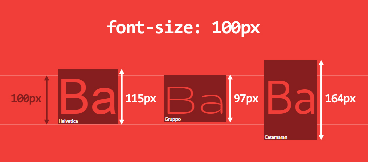

## 在移动端中使用line-height=height实现文字垂直居中时，在安卓手机会发现文字偏上！

### 网上的解释：

这个问题通过css是无法解决的，即使解决了也是一种通过微调来实现的hack方法，因为文字在content-area内部渲染的时候已经偏移了，而css的居中方案都是控制的整个content-area的居中。

导致这个问题的本质原因可能是Android在排版计算的时候参考了 primyfont 字体的相关属性（即 HHead Ascent 、HHead Descent 等），而 primyfont 的查找是看`font-family`里哪个字体在fonts.xml里第一个匹配上，而原生Android下中文字体是没有family name的，导致匹配上的始终不是中文字体，所以解决这个问题就要在`font-family`里显式申明中文，或者通过什么方法保证所有字符都fallback到中文字体。根据这2个思路，目前我找到了2个解决方案：针对Android 7.0+设备：`<html>`上设置 lang 属性：`<html lang="zh-cmn-Hans">`，同时font-family不指定英文，如 font-family: sans-serif 。这个方法是利用了浏览器的字体fallback机制，让英文也使用中文字体来展示，blink早期的内核在 fallback 机制上存在问题，Android 7.0+才能ok，早期的内核下会导致英文fallback到Noto Sans Myanmar，这个字体非常丑。针对MIUI 8.0+设备：设置 `font-family: miui` 。这个方案就是显式申明中文的方案，MIUI在8.0+上内置了小米兰亭，同时在`fonts.xml` 里给这个字体指定了`family name：miui`，所以我们可以直接设置。

### 解决：

利用flex布局中的垂直居中属性实现垂直居中（**实践**：在支付宝小程序里使用这个方法的确能解决这个问题），但是 content-area 里不居中该怎么办呢？

我们知道 line-height 的值为数字时，表示的相对于 font-size 的倍数，但问题在于，`font-size:100px` 对应的文字在不同字体里的高度是不一样的！例如：



**font-size 相同，font-family 不同，得到的 span 元素的高度也不同！**

原因在于字体本身，这是字体的原理：

- 一款字体会定义一个 **em-square**，它是用来盛放字符的金属容器。这个 em-square 一般被设定为宽高均为 1000 相对单位，不过也可以是 1024、2048 相对单位。字体度量里面的值是允许相对于 em-square 出血（bleed outside）的，可以理解为超出 em-square
- **line-box 的高度是由它所有子元素 inline-box 的高度计算得出的**。浏览器会计算这一行里每个子元素的高度，再得出 line-box 的高度（具体来说就是从子元素的最高点到最低点的高度），所以默认情况下，一个 line-box 总是有足够的高度来容纳它的子元素。
- content-area 的**高度是由字体度量决定的**，而line-box 的高度是根据子元素的高度计算出来的。对于一个内联元素，它有两个高度：content-area（内容区高度）和 vitual-area（实际高度），实际高度就是 line-height，这个高度用于计算 line-box 的高度，line-height 并非表示两个 baseline 之间的距离。
- virtual-area 和 content-area 高度的差异叫做 **leading**。leading 的一半会被加到 content-area 顶部，另一半会被加到底部。因此 content-area 总是处于 virtual-area 的中间。

### 字体度量相关概念：

　　字体度量是指对于指定字号的某种字体，在度量方面的各种属性，其描述的参数包括：

- **em-square：**相对单位
- **baseline：**字符基线
- **ascender:** 字符最高点到baseline的距离
- **descender:** 字符最低点到baseline的距离
- **linegap(leading):** line-height为normal时的字符实际高度与content-area的差
- **capitalHeight:** 大写字母顶部到baseline的距离

　　

　　 

**最终解决方案**

```css
display: inline-flex;
align-items: center;
justify-content: center;
font-size: 24px;
/** 最好声明为normal，否则可能继承父级line-height达不到效果 */
line-height: normal;
```

- **flex**： 将对象作为弹性伸缩盒显示

- **inline-flex**：将对象作为内联块级弹性伸缩盒显示，父级是变成行内块元素，他的子元素也是行内块元素，并且自动换行，会根据子元素所有的div大小自适应宽度和高度

**其他方法**

1. 父容器不要设置高度，line-height不设置具体数值，通过padding调整内边框。

   ```css
   line-height: normol;
   padding: 8px 0;
   display:inline-block;
   ```

   

2. 把字体大小、定位、间距、高度和边框线整体都放大2倍，然后再缩小一倍

   ```css
   transform: scale(0.5);
   transform-origin: 0 0;
   ```

3. 自适应垂直布局：

   ```css
   display: table-cell;
   text-align: center;
   vertical-align: middle;
   ```


**拓展阅读**

> https://www.cnblogs.com/wfeicherish/p/8884903.html

