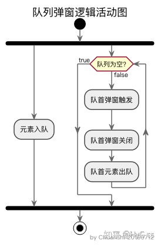

# 队列在前端弹窗中的应用

前端开发中，如果遇到复杂的交互逻辑，数据结构的知识将帮助你理清思路，抽象逻辑，完成稳定可靠的逻辑代码。

其实在复杂交互中，特别是互动类的界面中，很容易就会有超过 10 个弹窗对话框，万一同时被触发时，逻辑就会混乱，我们希望一个接一个的方式弹出，这里就需要队列了。

## 什么是队列

**队列（Queue）** 是先进先出（FIFO, First-In-First-Out）的线性表。在具体应用中**通常用链表或者数组来实现**。

队列只允许在尾部进行插入操作（入队 enqueue），在头部进行删除操作（出队 dequeue）。

## JavaScript 实现队列

一个队列数据结构要包含以下 api

- 入队
- 出队
- 获取头部元素
- 获取尾部元素
- 队列是否为空

使用 JavaScript/TypeScript 数组可以模拟出这些 api：

```js
class Queue {
  private dataStore: any[]

  constructor() {
    this.dataStore = []
  }

  public enqueue(e: any): void {
    this.dataStore.push(e)
  }

  public dequeue() {
    this.dataStore.shift()
  }

  public front() {
    return this.dataStore[0]
  }

  public back() {
    return this.dataStore[this.dataStore.length - 1]
  }

  public isEmpty(): boolean {
    if (this.dataStore.length === 0) {
      return true
    }
    return false
  }

  public toString() {
    return this.dataStore.join(',')
  }
}

export default Queue
```

## 对话框弹窗（Dialog）与队列的结合

弹窗被触发唤起会有以下3种情况：

1. 同一时间段只有一个 Dialog 被触发
2. 同一时间段有2个 Dialog 同时被触发
3. Dialog 正在展示时，又触发了另一个 Dialog

为了满足以上3种情况，需要在主逻辑和弹窗展示之间加一个队列控制逻辑



当空队列的第一个元素入队后，上图的右侧循环部分开始启动，同时依然可以有元素入队，直到右侧循环逻辑将队列所有元素出队后，整个活动停止。

```js
import Queue from './Queues'

const queue = new Queue() // 实例化上文写好的队列类

/**
 * 将弹窗事件名推入队列
 */
const push = (eventName: globalEventName) => {
  if (queue.isEmpty()) {
    queue.enqueue(eventName)
    openDialog() // 启动出队逻辑
  } else {
    queue.enqueue(eventName) // 循环中依然可以同时入队新的元素
  }
}

/**
 * 打开弹窗，递归，循环出队
 */
const openDialog = () => {
  // 打开弹窗
  document.dispatchEvent(new Event(queue.front()))

  // 监听弹窗关闭
  document.addEventListener(`${queue.front()}Close`, () => {
    queue.dequeue() // 出队
    if (!queue.isEmpty()) { // 队列不为空时，递归
      openDialog()
    }
  })
}

export default {
  push,
}


/** 调用代码 */
DialogQueue.push(globalEventName.dialogReceiveCoinsDaily)
setTimeout(() => {
  DialogQueue.push(globalEventName.dialogWinLottery)
}, 1000)
setTimeout(() => {
  DialogQueue.push(globalEventName.dialogReceiveCoinsDaily)
}, 1500)
setTimeout(() => {
  DialogQueue.push(globalEventName.dialogWinLottery)
}, 2000
```

## Toast 与队列的结合

与 Dialog 类似，为了避免多次触发导致的 Toast 堆叠，把每一个要弹出的 Toast 内容入队，每次弹出队首的 Toast，每个 Toast 完成时，出队，并递归调用展示，直到队列内容为空。这里不展开说明了。